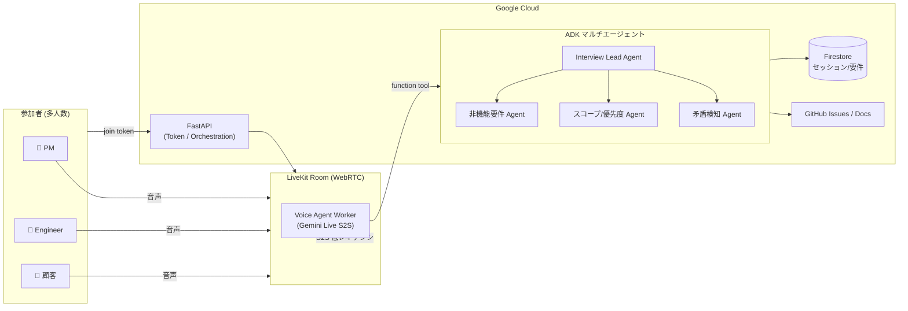

# SANBA — 解像度高く、要件を生み出す音声マルチエージェント

> _解像度高く、生み出す。_
> 「動くもの」ではなく「届くもの」を。AIに丸投げするのではなく、**人とAIの協働で、聞く・話す・描く・見るを重ねながら要件の解像度を上げていく**ための音声インタビュー・エージェント。
> 要件はテキスト・画像・動画など様々な形をとり、所作を重ねるたびに少しずつ明確になる。SANBA はその「誕生」に立ち会う。
> 名前の由来は、相手の中にある答えを問いで引き出す「産婆術（Socratic maieutics）」。

**DevOps × AI Agent Hackathon 2026** 応募プロジェクト（Findy 主催 / Google Cloud Japan 協賛）。

---

## 🎯 何を解決するか

生成AIによって「コードを書く時間」は劇的に短くなりました。ボトルネックは**要件定義**に移っています（Findy CTO 佐藤将高氏「インテリジェント開発時代」）。
しかし要件定義は、

- 聞くべきことを聞き漏らす（暗黙の前提・エッジケース・やめた選択肢）
- 関係者が増える（PM・エンジニア・デザイナー・顧客）ほど認識がズレる
- ヒアリングの議事録・要件ドキュメント化が属人的で重い

という問題を抱えています。

OSS のAIスキル [`grill-me`](https://github.com/stevegsax/grill-me)（一問一答で要件を相手から引き出す「容赦ないインタビュアー」）が話題になりました。SANBA はこの発想を、

1. **音声 speech-to-speech 化**（Gemini Live + LiveKit）でレイテンシを下げ、自然な対話で
2. **多対多**（複数の専門エージェント × 複数の参加者）に拡張し
3. **DevOpsサイクル全体**（つくる・まわす・とどける）で本番運用品質に仕上げる

ことを目指します。

## 🧑‍🤝‍🧑 ペルソナ / ユースケース

- **受託・SES の要件ヒアリング**: 顧客とエンジニアが同席するキックオフで、エージェントが司会・深掘り質問・抜け漏れ検知・要件ドキュメント化をリアルタイムで行う。
- **社内の機能企画**: PM・エンジニア・デザイナーの三者会議で、論点を整理し合意形成を支援する。
- **個人開発者の壁打ち**: 1人の開発者を相手に `grill-me` 同様、一問一答で要件を引き出す（Phase 1 のMVP）。

## 🤖 なぜ「エージェント」でなければならないか

単発のLLM呼び出しではなく、**自律的に複数ステップを判断・実行**する必然性があります。

- 会話の流れを読んで**次に聞くべき問い**を自律的に決定する（質問計画）
- 回答の**矛盾・抜け・曖昧さ**を検知して掘り下げる（自己検証ループ）
- 専門領域（非機能要件・セキュリティ・コスト・UX）ごとの**専門サブエージェント**が協調する（マルチエージェント）
- 確定した要件を**構造化ドキュメント / Issue** として外部に書き出す（Tool Use）

## 🏗️ アーキテクチャ概要



詳細は [`docs/architecture.md`](docs/architecture.md) を参照。

## ⚙️ 技術スタック（ハッカソン評価軸に最適化）

| レイヤー | 採用技術 | 評価上の狙い |
|---|---|---|
| 音声 I/O | **Gemini Live API** (speech-to-speech) + **LiveKit Agents**（LiveKit Cloud） | 低レイテンシ・自然な多人数対話（ADR-0006） |
| エージェント | **Google ADK**（root + subagent + agent-as-a-tool） | 「エージェントの必然性」「マルチエージェント協調」 |
| LLM | **Gemini 2.x**（Vertex AI / Gemini API） | 必須AI技術 |
| バックエンド | **FastAPI**（Python） | LiveKit トークン発行・オーケストレーション |
| フロント | **Next.js** + LiveKit React Components | 本番品質UX（Cloud Run） |
| 永続化 | **Firestore**（セッション/要件）+ Cloud Storage（アーティファクト） | 運用想定の状態管理 |
| 検索/RAG | **Elasticsearch**（BM25 + ベクトルのハイブリッド） | 根拠付け・過去セッション検索（佐藤一憲氏 Agentic RAG） |
| 実行基盤 | **Cloud Run**（必須・GKE は見送り） | スケーラブルな本番デプロイ（ADR-0006） |
| IaC | **Terraform** | 再現可能なインフラ |
| CI/CD | **GitHub Actions** + Cloud Build | 「まわす」軸 |
| 可観測性 | **OpenTelemetry** → Cloud Trace/Logging + **Grafana / Prometheus / Loki / Tempo** | Observability |
| LLMOps | **Langfuse**（トレース・評価・プロンプト管理） | プロンプト改善サイクル |
| 開発生産性 | **Four Keys / DORA メトリクス** | Findy ドメイン直撃 |

選定理由・捨てた選択肢は [`docs/adr/`](docs/adr/) に記録。

## 🚀 クイックスタート（ローカル）

```bash
just setup             # 初回のみ: .env を用意し全依存をインストール (uv sync / npm install)
                       #   └ GOOGLE_API_KEY / LIVEKIT_* を .env に設定（空でも最小構成は起動する）
just up                # アプリ最小構成 (web/api/agent/livekit/firestore/elasticsearch)
just verify            # 各コンポーネントの疎通スモークテスト
open http://localhost:3000          # Web クライアント

# ↑ をまとめて一発で: `just init`（= setup → up）

just up-full           # 補助スタックも重ねて全部入り (+ observability / langfuse / four-keys)
just verify-full
open http://localhost:3001          # Grafana
open http://localhost:3030          # Langfuse
```

> **二層構成**: アプリ必須スタックは `docker-compose.yml`、「必須ではないが あったら便利」な
> 可観測性・LLMOps・DORA は `docker-compose.tools.yml`（overlay）に分離しています（ADR-0009）。
> `just up` は最小構成、`just up-full` は全部入り。Rancher Desktop (dockerd) を想定。
>
> タスクランナーは [`just`](https://github.com/casey/just)（`justfile`）が単一の正です。
> `Makefile` は `just` へ委譲する薄い互換シムで、`just` 未導入の環境では `make` が
> `uv tool install rust-just` で just を用意してから同じターゲットを実行します（`make setup` / `make up` 等）。

詳細は [`docs/local-dev.md`](docs/local-dev.md) / [`docs/devops.md`](docs/devops.md)。

## 🗺️ ロードマップ（段階的に多対多へ）

1. **Phase 1 — 1:1 完成**: 1人の参加者 × 1エージェントの音声要件インタビューMVP。
2. **Phase 2 — 多人数**: 複数参加者の発話を識別し、司会・要約・合意形成。
3. **Phase 3 — 多エージェント協調**: 専門サブエージェントが並行して論点を深掘り。

詳細は [`docs/roadmap.md`](docs/roadmap.md)。

## 📁 リポジトリ構成

```
apps/
  agent/   LiveKit + Gemini Live + ADK 音声エージェント (Python)
  api/     FastAPI: LiveKit トークン発行・セッション/要件オーケストレーション
  web/     Next.js LiveKit クライアント
infra/
  terraform/      Cloud Run / Firestore などの IaC
  observability/  OTel Collector / Prometheus / Grafana / Loki / Tempo
  four-keys/      DORA メトリクス収集
docs/             設計・DevOps・ロードマップ・ADR・ハッカソン戦略
.github/workflows/ CI/CD
```

## 🧭 開発の作法

AIコーディングのルールは [`CLAUDE.md`](CLAUDE.md) / [`AGENTS.md`](AGENTS.md) に集約。
「自動化できるところは自動化し、**成果物の品質に責任を持つのは人間**」という原則で進めます。
