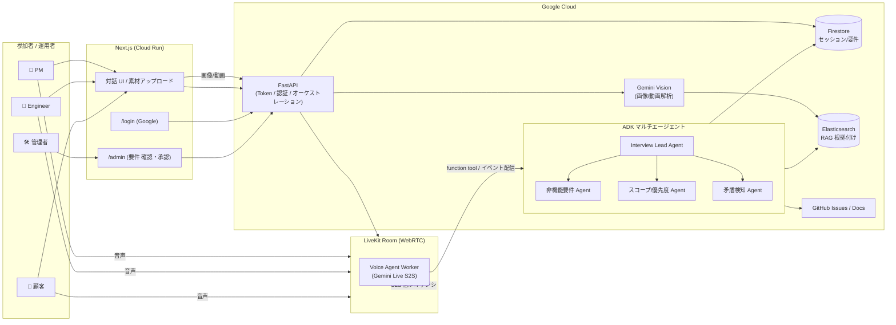

# SANBA — 解像度高く、要件を生み出す音声マルチエージェント

> _解像度高く、生み出す。_
> 「動くもの」ではなく「届くもの」を。AIに丸投げするのではなく、**人とAIの協働で、聞く・話す・描く・見るを重ねながら要件の解像度を上げていく**ための音声インタビュー・エージェント。
> 要件はテキスト・画像・動画など様々な形をとり、所作を重ねるたびに少しずつ明確になる。SANBA はその「誕生」に立ち会う。
> 名前の由来は、相手の中にある答えを問いで引き出す「産婆術（Socratic maieutics）」。

**DevOps × AI Agent Hackathon 2026** 応募プロジェクト（Findy 主催 / Google Cloud Japan 協賛）。

<!-- CI / セキュリティ -->
[](https://github.com/godhuu0505/sanba/actions/workflows/ci.yml)
[](https://github.com/godhuu0505/sanba/actions/workflows/codeql.yml)
[](https://github.com/godhuu0505/sanba/actions/workflows/security.yml)
[](https://securityscorecards.dev/viewer/?uri=github.com/godhuu0505/sanba)

<!-- 技術スタック -->


---

## 目次

- [何を解決するか](#-何を解決するか)
- [デモ](#-デモ)
- [ペルソナ / ユースケース](#-ペルソナ--ユースケース)
- [なぜ「エージェント」でなければならないか](#-なぜエージェントでなければならないか)
- [アーキテクチャ概要](#architecture)
- [技術スタック](#tech-stack)
- [クイックスタート](#-クイックスタートローカル)
- [ロードマップ](#roadmap)
- [リポジトリ構成](#-リポジトリ構成)
- [ドキュメント](#-ドキュメント)
- [コントリビューション](#-コントリビューション)

---

## 🎯 何を解決するか

生成AIによって「コードを書く時間」は劇的に短くなりました。ボトルネックは**要件定義**に移っています（Findy CTO 佐藤将高氏「インテリジェント開発時代」）。
しかし要件定義は、

- 聞くべきことを聞き漏らす（暗黙の前提・エッジケース・やめた選択肢）
- 関係者が増える（PM・エンジニア・デザイナー・顧客）ほど認識がズレる
- ヒアリングの議事録・要件ドキュメント化が属人的で重い

という問題を抱えています。

OSS のAIスキル [`grill-me`](https://github.com/stevegsax/grill-me)（一問一答で要件を相手から引き出す「容赦ないインタビュアー」）が話題になりました。SANBA はこの発想を、

1. **音声 speech-to-speech 化**（Gemini Live + LiveKit）でレイテンシを下げ、自然な対話で
2. **多対多**（複数の専門エージェント × 複数の参加者）に拡張し
3. **DevOpsサイクル全体**（つくる・まわす・とどける）で本番運用品質に仕上げる

ことを目指します。

## 🎬 デモ

> 🚧 1 分のデモ動画（Before/After）は提出フェーズ（Phase 4）で追加予定です。[ロードマップ](#roadmap)参照。
> それまではローカルで動かせます → [クイックスタート](#-クイックスタートローカル)。

**🌐 公開 URL**: <https://youken.sanba.net>（Cloud Run + Global LB / Managed SSL）。デプロイ手順は [`docs/how-to/deploy-gcp.md`](docs/how-to/deploy-gcp.md)。

## 🧑‍🤝‍🧑 ペルソナ / ユースケース

- **受託・SES の要件ヒアリング**: 顧客とエンジニアが同席するキックオフで、エージェントが司会・深掘り質問・抜け漏れ検知・要件ドキュメント化をリアルタイムで行う。
- **社内の機能企画**: PM・エンジニア・デザイナーの三者会議で、論点を整理し合意形成を支援する。
- **個人開発者の壁打ち**: 1人の開発者を相手に `grill-me` 同様、一問一答で要件を引き出す（Phase 1 のMVP）。

**利用者ペルソナ（拡張）**: 上記はいずれも「セッションを準備する人＝話す人」という開発者側のペルソナだが、PdM が発行した深掘りリンクを**アプリの利用者**が開くだけで対話が始まる経路を追加している（ADR-0031/0032）。これは PdM が現場の声を集約するための**道具の拡張**であり、開発者向け要件深掘りというコンセプトの置き換えではない。準備する人（PdM）と話す人（利用者）が分離し、利用者はリポジトリや技術用語を知らなくても、アプリの画面に出てくる言葉だけで困りごとを語れる。詳細は [`docs/explanation/personas-and-use-cases.md`](docs/explanation/personas-and-use-cases.md) §1。

## 🤖 なぜ「エージェント」でなければならないか

単発のLLM呼び出しではなく、**自律的に複数ステップを判断・実行**する必然性があります。

- 会話の流れを読んで**次に聞くべき問い**を自律的に決定する（質問計画）
- 回答の**矛盾・抜け・曖昧さ**を検知して掘り下げる（自己検証ループ）
- 専門領域（非機能要件・セキュリティ・コスト・UX）ごとの**専門サブエージェント**が協調する（マルチエージェント）
- 確定した要件を**構造化ドキュメント / Issue** として外部に書き出す（Tool Use）

<a id="architecture"></a>

## 🏗️ アーキテクチャ概要



詳細は [`docs/reference/architecture.md`](docs/reference/architecture.md) を参照。

<a id="tech-stack"></a>

## ⚙️ 技術スタック（ハッカソン評価軸に最適化）

| レイヤー | 採用技術 | 評価上の狙い |
|---|---|---|
| 音声 I/O | **Gemini Live API** (speech-to-speech) + **LiveKit Agents**（LiveKit Cloud） | 低レイテンシ・自然な多人数対話（ADR-0006） |
| エージェント | **Google ADK**（root + subagent + agent-as-a-tool） | 「エージェントの必然性」「マルチエージェント協調」 |
| LLM | **Gemini 2.x**（Vertex AI / Gemini API） | 必須AI技術 |
| マルチモーダル | **Gemini Vision**（画像/動画から観察抽出）+ Cloud Storage | 言葉×画の矛盾検知（ADR-0004） |
| バックエンド | **FastAPI**（Python） | LiveKit トークン発行・認証・オーケストレーション |
| 認証 / 運用 | **Google OIDC ログイン** + 管理画面（要件 確認・承認） | 本人確認・運用 UI（ADR-0012 / 0014） |
| フロント | **Next.js** + LiveKit React Components + Tailwind/shadcn | 本番品質UX（Cloud Run） |
| 永続化 | **Firestore**（セッション/要件）+ Cloud Storage（アーティファクト） | 運用想定の状態管理 |
| 検索/RAG | **Elasticsearch**（BM25 + ベクトルのハイブリッド） | 根拠付け・過去セッション検索（佐藤一憲氏 Agentic RAG） |
| 実行基盤 | **Cloud Run**（必須・GKE は見送り） | スケーラブルな本番デプロイ（ADR-0006） |
| IaC | **Terraform** | 再現可能なインフラ |
| CI/CD | **GitHub Actions** + Cloud Build | 「まわす」軸 |
| 可観測性 | **OpenTelemetry** → Cloud Trace/Logging + **Grafana / Prometheus / Loki / Tempo** | Observability |
| LLMOps | **Cloud Monitoring**（品質スコアのダッシュボード）+ CI 回帰評価（Gemini judge） | プロンプト改善サイクル（ADR-0051） |
| 開発生産性 | **Four Keys / DORA メトリクス** | Findy ドメイン直撃 |

選定理由・捨てた選択肢は [`docs/adr/`](docs/adr) に記録。

## 🚀 クイックスタート（ローカル）

```bash
just setup             # 初回のみ: .env.local を用意し全依存をインストール (uv sync / npm install)
                       #   └ .env.example のローカル既定値がそのまま入るので空でも最小構成は起動する
                       #   └ GOOGLE_API_KEY / LIVEKIT_* は必要に応じて .env.local に設定
just up                # アプリ最小構成 (web/api/agent/livekit/firestore/elasticsearch)
just verify            # 各コンポーネントの疎通スモークテスト
open http://localhost:3000          # Web クライアント（対話 UI）
open http://localhost:3000/login    # ログイン（dev は「開発用ログイン」で素通し）
open http://localhost:3000/admin    # 管理画面（要件の確認・承認）

# ↑ をまとめて一発で: `just init`（= setup → up）

just up-full           # 補助スタックも重ねて全部入り (+ observability / four-keys)
just verify-full
open http://localhost:3001          # Grafana
```

> **二層構成**: アプリ必須スタックは `docker-compose.yml`、「必須ではないが あったら便利」な
> 可観測性・LLMOps・DORA は `docker-compose.tools.yml`（overlay）に分離しています（ADR-0009）。
> `just up` は最小構成、`just up-full` は全部入り。Rancher Desktop (dockerd) を想定。
>
> タスクランナーは [`just`](https://github.com/casey/just)（`justfile`）が単一の正で、
> 唯一のエントリポイントです。未導入なら `uv tool install rust-just`（本リポジトリは `uv` 管理。
> brew / cargo / mise でも可）で入れてください。Claude Code on the web では SessionStart hook が
> 自動で用意します。

`just up` は配線確認まで。**音声会話 / 画像・動画解析 / 要件サンバ / ログイン・管理**を本物の
経路で動かす設定（`GOOGLE_API_KEY`・`GOOGLE_OAUTH_CLIENT_ID`・`ADMIN_EMAILS` 等）は
機能別に [`docs/how-to/local-dev.md#5-機能別フル構築-本物の経路を通す`](docs/how-to/local-dev.md) を参照。
全体の詳細は [`docs/how-to/local-dev.md`](docs/how-to/local-dev.md) / [`docs/how-to/devops.md`](docs/how-to/devops.md)。

`just --list` でタスクを `setup` / `run` / `dev` / `verify` / `ops` のカテゴリ別に確認できます。

<a id="roadmap"></a>

## 🗺️ ロードマップ（段階的に多対多へ）

1. **Phase 1 — 1:1 完成**: 1人の参加者 × 1エージェントの音声要件インタビューMVP。
2. **Phase 2 — 多人数**: 複数参加者の発話を識別し、司会・要約・合意形成。
3. **Phase 3 — 多エージェント協調**: 専門サブエージェントが並行して論点を深掘り。

詳細は [`docs/explanation/roadmap.md`](docs/explanation/roadmap.md)。

## 📁 リポジトリ構成

```
apps/
  agent/   LiveKit + Gemini Live + ADK 音声エージェント (Python) — README あり
  api/     FastAPI: トークン発行・認証・セッション/要件・画像解析・GitHub 起票 — README あり
  web/     Next.js クライアント (対話 UI / ログイン / 管理画面) — README あり
  worker/  アップロード動画の非同期解析ワーカー (Python / FastAPI, ADR-0040) — README あり
packages/
  sanba_shared/   セッション/要件モデルと永続化を agent・api・worker で共有 (ADR-0014)
infra/
  terraform/      Cloud Run / Firestore などの IaC
  observability/  OTel Collector / Prometheus / Grafana / Loki / Tempo
  four-keys/      DORA メトリクス収集
docs/             設計・DevOps・ロードマップ・ADR・ハッカソン戦略（docs/README.md が入口）
.github/          CI/CD ワークフロー・Issue/PR テンプレート・CODEOWNERS
CONTRIBUTING.md   貢献ガイド / CODE_OF_CONDUCT.md / SECURITY.md
CLAUDE.md         AI コーディング規約（AGENTS.md は CLAUDE.md への symlink＝同一実体）
```

各アプリの詳細はサブ README を参照：
[`apps/agent`](apps/agent/README.md) / [`apps/api`](apps/api/README.md) / [`apps/web`](apps/web/README.md) / [`apps/worker`](apps/worker/README.md)。

## 📚 ドキュメント

ドキュメントは [Diátaxis](https://diataxis.fr/) で「目的別」に整理しています。入口は [`docs/README.md`](docs/README.md)。

| 区分 | 主な文書 |
|---|---|
| 🎓 学ぶ | [クイックスタート](#-クイックスタートローカル) |
| 🔧 課題を解く | [ローカル開発](docs/how-to/local-dev.md)・[DevOps サイクル](docs/how-to/devops.md) |
| 📖 確認する | [アーキテクチャ](docs/reference/architecture.md)・[セキュリティ](docs/reference/security.md)・アプリ別 README |
| 💡 理解する | [ロードマップ](docs/explanation/roadmap.md)・[ADR（設計判断記録）](docs/adr) |

## 🤝 コントリビューション

歓迎します。まず [`CONTRIBUTING.md`](CONTRIBUTING.md) を読んでください（環境構築・検証・PR の流れ）。

- 行動規範: [`CODE_OF_CONDUCT.md`](CODE_OF_CONDUCT.md)
- 脆弱性報告: [`SECURITY.md`](SECURITY.md)（公開 Issue に書かない）
- AI コーディング規約: [`CLAUDE.md`](CLAUDE.md) / [`AGENTS.md`](AGENTS.md)

開発の基本原則は「自動化できるところは自動化し、**成果物の品質に責任を持つのは人間**」。
提出前に `just lint` / `just test` を通し、新しい処理にはトレース/ログ/メトリクスを通してください。

## 📄 ライセンス

[MIT License](LICENSE) で公開しています。
