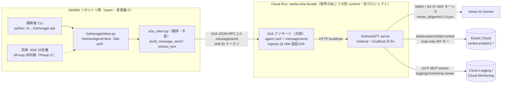
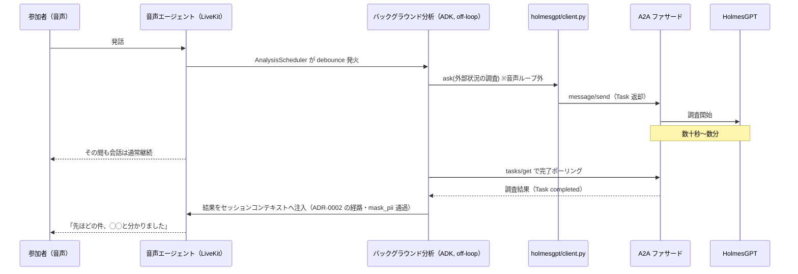

# ADR-0069: HolmesGPT を external-agents の A2A 実証初弾に据える（汎用 A2A ファサード・read-only・別プロジェクト配置）

- ステータス: Proposed
- 日付: 2026-07-12
- 関連: [ADR-0063](0063-elastic-agent-builder-a2a-boundary.md)（external-agents 境界 — 本 ADR が決定5・7 の初弾選定を改訂。境界設計・seam・flag 方針は維持）/
  [ADR-0002](0002-multi-agent-topology.md)（マルチエージェント・トポロジ / コンテキスト還流経路）/
  [ADR-0037](0037-background-prefetch-and-injection-policy.md)・[ADR-0046](0046-decouple-analysis-from-voice-worker.md)（off-loop 分析 — セッション中委譲の土台）/
  [ADR-0051](0051-google-native-observability-and-llmops.md)（観測性の統一規律）/
  [ADR-0061](0061-session-ai-cost-kpi-analytics.md)（Gemini (Vertex AI) 統一・コスト計上）
- きっかけ: オーナー方針（2026-07-10）「A2A 実証の初弾を HolmesGPT に昇格する。開発者利用・read-only 限定。
  A2A ファサードは汎用化する」。

## コンテキスト

### ADR-0063 からの状況変化

ADR-0063 は external-agents 境界（プロバイダー非依存の A2A/MCP seam + プロバイダー固有アダプタ）を
確立し、初弾エンジンに Elastic Agent Builder、初弾エージェントに「外部コンテキスト・エージェント」を
据えた（決定5・7）。ただし Agent Builder には **9.3+ / Enterprise ティア**という前提コストがあり、
採否判断は Phase 1 に持ち越されていた。

その後の検討で分かった事実:

- **HolmesGPT**（CNCF Sandbox の OSS SRE エージェント、旧 robusta-dev）は、CLI / HTTP API サーバ /
  Python SDK を持ち、litellm 経由で LLM プロバイダー非依存（Vertex AI Gemini 対応）。ツールセットに
  Elasticsearch/OpenSearch（8.x 互換・read-only キーで最小化可）と GCP（MCP 経由、Cloud Logging /
  Monitoring 閲覧）を持つ。**追加ライセンス費用ゼロ**で、既存の ES・GCP ログにそのまま接続できる。
- HolmesGPT は **A2A サーバをネイティブには持たない**（2026-07 時点のドキュメントに記載なし）。
  seam の結合面を A2A 標準に保つには変換層が要る。
- 本番 Elasticsearch の保持期間設計（`docs/reference/security.md`）は serverless 前提の記述
  （data stream lifecycle）を含む。**Elastic Cloud Serverless はバージョンレスなので、Agent Builder の
  「9.3+ アップグレード障壁」は本番には実質存在しない可能性がある**（残る論点はティア/費用のみ）。
  したがって HolmesGPT 昇格の根拠はアップグレード障壁ではなく、費用ゼロ・GCP ログ横断・
  開発者ユースケース適合に置く。
- 開発者には「sess-ID から GCP ログ / ES / Firestore を横断して本番セッションを復元する」定型の
  デバッグ手順が既にあり、HolmesGPT のエージェンティック調査はこれをそのまま自動化する
  具体的ユースケースになる（Agent Builder 初弾案の「A2A 疎通のためのサンプル知識エージェント」より
  実利が近い）。初弾スコープ（Phase 0.5〜1'）の対象データは GCP ログ / ES に限定する。Firestore は
  HolmesGPT 標準ツールセットに対応ツールがなく別途カスタム MCP サーバが要るため、Phase 1' の
  品質評価を経てから接続要否を判断する（`実装前に確定する事項` の確認項目として追加）。

### 実証としての位置づけ

狙いは ADR-0063 と同じ「**分離された境界の向こうのエージェントと A2A で会話できることの実証**」。
HolmesGPT は別 runtime・別フレームワーク（非 ADK）・別 GCP プロジェクト（後述）で動くため、
プロジェクト境界 + IAM 境界 + runtime 境界を A2A 標準で跨ぐ実証になる。Elastic Cloud のような
「別組織の管理環境」との越境は Phase 2 以降に Agent Builder で後追いできる。

## 決定

### 1. A2A 実証の初弾エージェントを HolmesGPT に変更する（ADR-0063 決定5・7 の改訂）

ADR-0063 の境界設計 — `external-agents/` bounded context、プロバイダー非依存 seam（`a2a_client.py`）、
プロバイダー固有アダプタの隔離、既定 OFF フラグと no-op 縮退、音声クリティカルパス非接触 — は
**すべて維持**する。変更するのは初弾のエンジン/エージェント選定のみ。Elastic Agent Builder と
外部コンテキスト・エージェントは Phase 2 以降の第2プロバイダー候補として残す（seam 不変なので
差し替え自由。serverless なら費用のみが論点)。

### 2. 汎用 A2A ファサードを新設し、結合面を A2A 標準に保つ

HolmesGPT は A2A 非対応のため、**A2A サーバの顔を与える薄いプロトコル変換層**を
`a2a-facade/`（独立 uv パッケージ `sanba-a2a-facade`・Cloud Run デプロイ対象）として新設する。
HolmesGPT 専用にせず、バックエンドを Protocol 1 枚で差し替え可能にする:

```python
class AgentBackend(Protocol):
    name: str
    description: str
    def skills(self) -> list[dict]: ...
    def ask(self, text: str, *, timeout: float = 300.0) -> str: ...
    def submit(self, text: str) -> str: ...
    def poll(self, task_id: str) -> tuple[str, str | None]: ...
```

`ask()` は開発者 CLI の同期パス（Phase 0・タイムアウト 300 秒）、`submit()` / `poll()` は
Task ベース非同期パス（Phase 3'・ファサードの `message/send` が Task を返し `tasks/get` と対応）。
HolmesGPT の Phase 0 実装は `ask()` のみ実装し、`submit()` / `poll()` は `raise NotImplementedError`。

- 公開エンドポイントは A2A 標準のみ: agent card（`GET /.well-known/agent-card.json`）と
  JSON-RPC 2.0 `message/send`（`POST /a2a/{agent_id}`、初弾は同期）。書き込み系メソッドは実装しない。
- HolmesGPT server は同一 Cloud Run サービスの sidecar として localhost に閉じ、生 HTTP API を
  境界に露出しない。公式イメージを digest 固定で使い、エージェント runtime は自作しない
  （ADR-0063 の「薄いエージェント禁止・車輪の再発明回避」を踏襲）。
- SANBA 側は `elastic/` と同階層に `holmesgpt/` アダプタ（`contract.py` / `config.py` /
  `client.py` / 開発者 CLI `ask.py`）を追加する。`a2a_client.py` は変更しない。
- HolmesGPT が将来ネイティブ A2A 対応（upstream コントリビュートも中期候補）した場合は
  `holmesgpt/contract.py` の向き先変更だけでファサードを退役できる。



### 3. 利用者は開発者・権限は read-only の多層防御

| 層 | 対策 |
|---|---|
| プロトコル | ファサードは `message/send`（+ 後に `tasks/get`）のみ受理 |
| HolmesGPT 設定 | read-only ツールセットのみ有効化。`bash`・kubernetes・remediation 系は明示 OFF |
| GCP MCP | `holmes-mcp-integrations` の observability サーバのみ有効（gcloud・storage サーバは明示 OFF）。commit pin 運用。許可ツールの最終リストは Phase 0.5 実機確認で確定する（汎用 gcloud-mcp は不採用） |
| ES 認証 | 専用 API キーを `sanba-analytics-*` への read + view_index_metadata のみで発行（Secret Manager 管理）。grounding 索引は初弾スコープ外（ベクトル前提で相性が悪く、外せば越境データも減る） |
| GCP IAM | holmes 用 SA に `roles/logging.viewer`（本番プロジェクトへ cross-project 付与）・`roles/monitoring.viewer`・`roles/aiplatform.user` のみ。`roles/aiplatform.user` にはモデル推論以外の作成・削除系権限も含まれるため、Phase 1' 実装時にカスタムロール（`aiplatform.endpoints.predict` 等の推論系のみ）への限定を評価する |
| ingress | Cloud Run は IAM 認証必須（非公開）。`roles/run.invoker` は本番ログ閲覧権限（`roles/logging.viewer`・`roles/monitoring.viewer`）を既に保有する開発者グループにのみ付与する（ファサード経由のデータアクセスは holmes SA 権限で行われるため、invoker と本番閲覧権限を必ず連動させる） |
| PII | 閲覧できるのは既に本番アクセス権を持つ開発者のみ。会話還流（Phase 3'）では既存 `mask_pii` 経路を必須にする |

**残余リスク（明記して受容）**: 調査対象ログには参加者発話＝ユーザー生成コンテンツが含まれ、
ログ経由の間接プロンプトインジェクションで調査の誤誘導・可視範囲内のデータ列挙があり得る。
緩和は read-only + 外部送信ツールなし + 利用者は当該データの閲覧権限を既に持つ開発者のみ、の 3 点。
Phase 3' では「外部エージェント出力は信頼しないデータとして扱う（ツール実行のトリガーにしない・
`mask_pii` 通過）」を設計要件にする。

### 4. 配置は専用 GCP プロジェクト（例: sanba-ops）

判断の核心は **Vertex AI クォータ/レート枠の隔離**。本番の音声対話も HolmesGPT も同じ
Vertex Gemini を叩くため（ADR-0061）、本番同居は「開発者の調査が本番の推論枠を食う」構造を作る。
read-only IAM で書き込み事故は防げても**クォータ競合は IAM では防げない**。副次効果として、
プロジェクト請求＝エージェント実験費でコスト帰属が自明になり、開発者ツールと本番 runtime の
運用境界（ADR-0063「同じプロセス・同じ権限に混ぜない」の延長）が明確になり、A2A「越境」実証の
説得力も上がる。本番ログは cross-project の `roles/logging.viewer` 付与で読め、ES はどのみち
外部（Elastic Cloud）なので配置差は出ない。

### 5. LLM は Vertex AI Gemini（ADR-0061 準拠）

`vertex_ai/gemini-2.5-pro`（開発者向け・off-loop のためレイテンシより調査精度を優先。費用次第で
flash を評価）。認証は SA の ADC（キーレス）で API キーの Secret 管理を持ち込まない。litellm 経由
なので、tool-calling 精度が不足した場合は Claude on Vertex AI へ env 変更で切り替えられる
（その際は ADR-0061 からの逸脱として記録する）。

### 6. 音声クリティカルパスに載せない。セッション中は off-loop 非同期 + Task 化のみ

ADR-0063 決定4 を踏襲する。HolmesGPT の調査は数十秒〜数分オーダーで、同期呼び出しを音声ループ
（往復 < 1.5s、ADR-0002）に載せることはできない。セッション進行中に使う場合は、既存の
バックグラウンド分析経路（`AnalysisScheduler`、ADR-0037/0046）から fire し、完了時に
コンテキスト還流経路（ADR-0002）で注入する。ワーカーが同期 send を数分保持するのは brittle
なので、その段階でファサードに A2A 標準の Task（`message/send` が `Task(working)` を返し
`tasks/get` でポーリング）を追加する。開発者 CLI は同期（タイムアウト 300 秒。`elastic/` の
30 秒既定では調査時間に必ず不足する）でよい。



ただし「要件インタビュー中に SRE 調査結果を返す」場面は限定的で、Phase 3' は経路の技術実証と
位置づける。会話プロダクトへの組み込み可否は別途判断する。

### 7. Cloud Run 化の前にローカル CLI スパイクで価値検証する（Phase 0.5）

ファサード・Terraform を作る前に、HolmesGPT を手元にインストールし ES read キー + 個人 ADC +
`vertex_ai/gemini-2.5-pro` で実在セッションを 2〜3 件調査する（半日想定）。ツールセット構成の実際・
調査品質・所要時間・1 調査あたりのトークン費を実測し、「A2A 化する価値がある調査品質か」の
Go/No-Go を判断してから器を作る。会話 API のスキーマ確認もここで行う。

## 検討したが採用しなかった選択肢

- **ADR-0063 の初弾（Agent Builder + 外部コンテキスト・エージェント）を維持**: ティア費用の
  経営判断が未解決のままブロックが続く。HolmesGPT は費用ゼロで同じ A2A 実証を先に通せ、
  開発者への実利も近い。Agent Builder は Phase 2 の第2プロバイダー候補として残す。
- **ローカル CLI のみで終える（ファサードを作らない）**: 開発者ツールとしての価値の大半は出るが、
  A2A 越境実証・資格情報の集中管理・観測性が得られない。スパイク（Phase 0.5）としてのみ採用。
- **HolmesGPT の生 HTTP API を contract.py で直接叩く**: 結合面が A2A/MCP 標準から外れ
  ADR-0063 決定2 に反する。却下。
- **ファサード内で HolmesGPT を Python SDK として import（単一コンテナ）**: 運用部品は減るが、
  重い依存ツリーを自イメージに丸抱えして供給網管理（pip-audit / Trivy）が重くなる。公式イメージ
  digest 固定 + sidecar の方が境界も供給網も明瞭で、「HTTP API を持つ任意の OSS エージェント」への
  汎用性も保てる。却下。
- **公式 a2a-sdk でファサード実装**: 当初は「受理メソッドが少ない初弾には過剰依存」として
  最小 JSON-RPC 自前ハンドラで始める判断だったが、issue #547 の実装時に**採用へ改訂**した
  （下記「実装時の決定改訂」）。プロトコル準拠・Task ライフサイクル・agent card 配信・
  v0.3 互換を SDK に委ねる方が、自作 JSON-RPC の保守・仕様追従コストより軽いと判断した。
- **ファサードを HolmesGPT 専用にする**: 次の A2A 非対応 OSS エージェントでラッパーが増殖する。
  バックエンド Protocol 1 枚の差で汎用化コストは小さい。却下。
- **本番プロジェクト（sanba-prd）同居**: 一回コストは最小だが、Vertex クォータを本番音声と共有する
  構造的リスクが残る（決定4）。却下。
- **HolmesGPT ネイティブ A2A 対応を待つ / upstream コントリビュートしてから使う**: 待ちは実証を
  止める。ファサードは upstream 対応後に退役できる構造にしたうえで、コントリビュートは並行の
  中期候補とする。

## 影響

- **新ディレクトリ**: `external-agents/src/sanba_external_agents/holmesgpt/`（SANBA 側アダプタ）と
  `a2a-facade/`（独立 uv パッケージ・Cloud Run デプロイ対象）。CI（`ci.yml` lint+test・
  `quality-gate` needs・`security.yml` pip-audit matrix）と `justfile` に配線する。ファサード
  イメージと HolmesGPT 公式イメージ（digest 固定）を Trivy スキャン対象に追加する。
- **IaC**: 専用 GCP プロジェクト用の Terraform ルート（例: `infra/terraform-ops/`）を新設
  （Cloud Run 1 サービス + SA + cross-project logging viewer + 課金アラートの最小構成）。
  CD 配線は恒常運用が決まるまで保留し、`terraform apply` + デプロイコマンドを justfile 化する
  （IaC は最初から書き、手作業デプロイはしない）。
- **設定**: `.env.example` に `HOLMESGPT_AGENT_ENABLED`（既定 OFF）/ `HOLMESGPT_AGENT_BASE_URL` /
  `HOLMESGPT_AGENT_ID` / `HOLMESGPT_AGENT_TIMEOUT_SECONDS`（既定 300）を追記。未設定は
  `DelegationResult(delegated=False)` の no-op 縮退（ADR-0063 決定3 の型）。
- **観測性**: ファサードに Cloud Trace span（`a2a.facade.message_send`）と委譲の成否・レイテンシ・
  バックエンド名のメトリクス、SANBA 側クライアントに fail-soft + structlog warning（ADR-0051 の型。
  実装は flag ON にする Phase 1' と同時）。LLM 費用は専用プロジェクトの Vertex 請求で追い、
  Phase 0.5 の実測値を本 ADR の判断材料として記録する。
- **テスト**: seam の純粋ロジック（URL 契約・JSON-RPC 生成/解析・agent card 生成・no-op 縮退・
  バックエンド差し替え）をネットワーク非依存で単体テスト（ADR-0063 と同じ方針）。
- **段階実装**: Phase 0.5（ローカルスパイク・Go/No-Go）→ Phase 0'（アダプタ + ファサードの
  スケルトン、flag OFF、CI 緑のまま）→ Phase 1'（専用プロジェクト新設・Cloud Run デプロイ・
  A2A 疎通実証・観測性）→ Phase 2'（デバッグ playbook のプロンプト化、Agent Builder 再評価）→
  Phase 3'（Task 追加・ADK off-loop 統合・PR #445 との統合）。
- **実装前に確定する事項**: (1) 本番 Elastic Cloud が serverless か（Agent Builder 再評価の前提）
  → **Phase 0.5 で serverless と確定**、(2) HolmesGPT 会話 API の正確なスキーマ（Phase 0.5 で
  実機確認）、(3) 公式イメージの取得元と digest、(4) `holmes-mcp-integrations` observability
  サーバの有効ツール一覧と read-only 範囲（不足なら YAML 定義の read-only カスタムツールセットで
  代替）、(5) 専用プロジェクトの命名・課金アラート閾値、(6) Firestore read-only 接続の要否
  （Phase 0.5 の調査品質評価後に判断。対応する場合は Firestore 向けカスタム MCP サーバと
  `roles/datastore.viewer` を追加設計する）。

### 実装時の決定改訂（2026-07-13、issue #547）

Phase 1'/3' を先取りする形で音声セッションからの委譲を実装するにあたり、決定2・4 の一部を改訂した。

- **A2A プロトコル実装は公式 `a2a-sdk`（v1.1）を採用**（「最小 JSON-RPC 自前ハンドラ」を撤回）。
  ファサードは `HolmesAgentExecutor`（同期 `AgentBackend.ask()` を `asyncio.to_thread` で回し
  Task の artifact として返す）+ `DefaultRequestHandler` + `InMemoryTaskStore` + FastAPI ルート
  （`add_a2a_routes_to_fastapi`）で構成する。agent card は proto 型で組み、`/.well-known/agent-card.json`
  は SDK が配信する。JSON-RPC は SDK ネイティブの `SendMessage`（proto）に加え、v0.3 互換の
  `message/send` も受ける。自作の `jsonrpc.py` は撤去した。SANBA 側クライアントも
  `a2a-sdk` の client（`create_client` + `ClientConfig(httpx_client=...)`）に置き換え、認証は
  impersonation で発行した ID トークンを httpx の Authorization ヘッダに載せる。`AgentBackend`
  Protocol の `submit()` / `poll()` は Task ライフサイクルを SDK が担うため不要になり、
  同期 `ask()` に一本化した。
- **結合面を「音声セッション中の operator 委譲（off-loop）」に拡張**（当初の開発者 CLI 単独から）。
  `apps/agent` に `delegate_investigation` ツールと `HolmesDelegator` を追加。ゲートは
  flag（`HOLMESGPT_AGENT_ENABLED`）× operator（`ADMIN_EMAILS`）× 非 end_user の三重で、通過時のみ
  音声ループ外のバックグラウンドタスクで委譲を実行し、結果は untrusted fence（ADR-0043）で囲って
  会話へ後注入する（`inject_video_analysis` と同じ穏当注入・reinject で再起動耐性）。委譲は 1 件に
  絞り（`claim_investigation`）、多重呼び出しは抑止する。
- **委譲の監査**: ファサードは委譲レコード（question / status / result / 所要）を sanba-ops Firestore へ
  冪等 upsert する（RUNNING → DONE/ERROR。doc id は task_id、書き込み失敗は fail-soft）。
  ロールは専用最小 SA（`holmes-invoker`・prod）を新設し ops ファサードの `run.invoker` を付与、
  ファサード SA には `roles/datastore.user` を付ける。
- **観測性・設定**: SANBA 側は `delegate_investigation_accepted/denied`・`investigation_injected`・
  `holmes_delegation_failed` 等を structlog で構造化出力。`.env.example` に `ADMIN_EMAILS` /
  `HOLMESGPT_INVOKER_SA` / `HOLMESGPT_AUDIENCE` を追記（タイムアウト env は
  `HOLMESGPT_TIMEOUT_SECONDS` に統一）。
- **テスト**: 「JSON-RPC 生成/解析の純ロジック」テストは SDK 採用で不要になり、代わりに
  executor（Task 完了・監査 RUNNING→DONE/ERROR・fail-soft）、agent card、ゲート真理表、
  off-loop 注入（fence・release・失敗時の一言）、および `a2a-sdk` client の実往復（httpx
  `MockTransport` / ファサード app への in-process 結合）で固める。

### Phase 0.5 実施結果（2026-07-12、判定: 条件付き Go）

HolmesGPT 0.35.0 をローカル CLI（`uvx`）+ Vertex AI Gemini 2.5 Pro（個人 ADC）+
`sanba-analytics-*` read-only API キー（7 日期限）で実測した。

- **集計・探索型の調査は実用品質**: 「直近 7 日のコスト上位 3 セッション特定 + 内訳 + 原因仮説」を
  79 秒 / $0.107 / ツール 9 回で完遂し、手動 ES 集計の ground truth と全数値が一致（幻覚ゼロ）。
  1 調査 $0.03〜0.11 で費用は開発者ツールとして無視できる。権限不足時は幻覚せず不足権限を
  正確に報告する。
- **深掘り型に偽陰性**: セッション ID 指定の検索で実在イベント（110 件）を「データ無し」と
  誤断言（2/2 再現）。対策として、宣言的エージェント定義に索引スキーマ
  （data stream `sanba-analytics-events`、`session_id` keyword、`payload.ai_usd` 等）と
  クエリ実例を焼き込み、Phase 0' で再測定する。改善しなければ Claude on Vertex AI で再測定 →
  それでも不安定なら Agent Builder 再評価へ退避（決定5 の逃げ道）。
- **本番 ES は Elastic Cloud Serverless と確定**（`_cluster/health` が 410
  `api_not_available_exception`）。Agent Builder の「9.3+ 障壁」は本番に存在せず、Phase 2' の
  再評価は費用/ティアのみが論点になる。
- **上流バグ 4 件を発見**（upstream コントリビュート候補。①は 1 行修正で解決を実証済み）:
  (バグ①) ヘルスチェックが `_cluster/health` 固定で serverless 非互換 → `_resolve/index/*` へ
  差し替えるローカルパッチで解消を確認、(バグ②) 410 エラー文字列中の `[...]` を Rich が
  マークアップ解釈し `toolset refresh` がクラッシュ、(バグ③) ステータスキャッシュ経路で
  config 有効化したツールセットが LLM に渡らない（実行前キャッシュ削除で回避）、
  (バグ④) 最終応答 None（モデルが TodoWrite ツール呼び出しで手番を終えるケース）で CLI が
  TypeError クラッシュ。server モードでは HTTP 500 として現れる（プロセスは落ちない）。
- **server モード実機確認（同日実施）**: `POST /api/chat` のスキーマを確定
  （リクエスト `ask` / `additional_system_prompt` / `behavior_controls` / `model` / `stream`、
  応答 `analysis` / `tool_calls` / `conversation_history`）。serverless パッチ適用下で
  `elasticsearch/data` が有効化され `elasticsearch_search` が実行されることを確認。バグ②は
  server では発生しない（ツールセットのエラーは応答本文に fail-soft で報告される）。バグ④は
  `behavior_controls: {"todowrite_instructions": false}` で回避できる。**偽陰性対策の実証**:
  `additional_system_prompt` に索引スキーマと term クエリ実例を注入 + TodoWrite 無効化で、
  CLI で 2/2 失敗した深掘り調査が ground truth と完全一致（110 イベント・$0.76・エラー 0 件、
  39 秒）。ファサードはこの 2 つの per-request ノブをエージェント定義から注入する設計とする。
- Phase 1' の運用条件: serverless パッチがマージされるまで fork ビルド（digest 固定イメージ +
  パッチ適用）で運用する。ES キーには `elasticsearch_list_indices` が要求する
  monitor 権限を付けない（read + view_index_metadata のみで search/mappings は動作する）。
