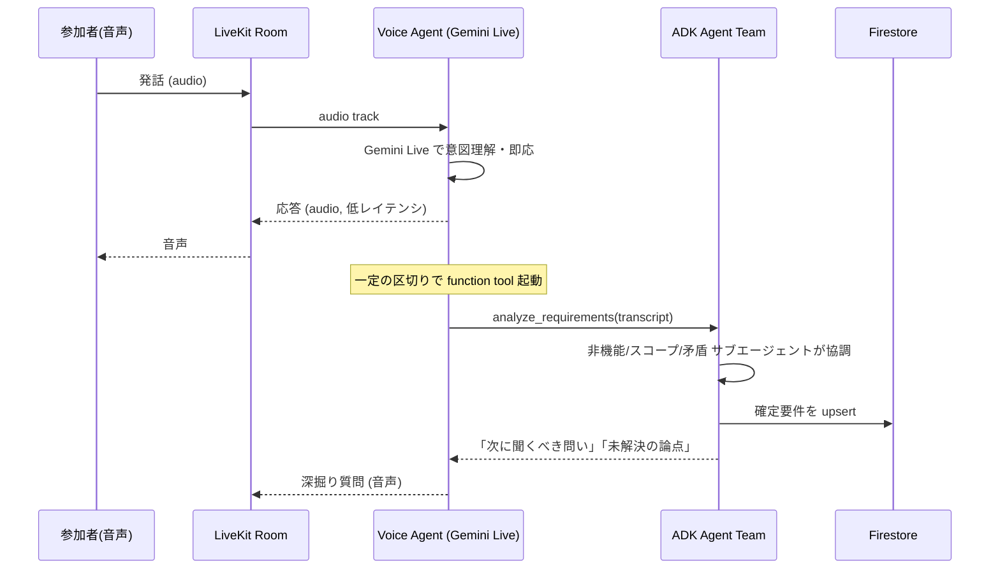
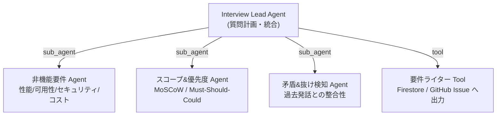

# アーキテクチャ設計 — SANBA

> 本書は「つくる」軸の設計判断を記録する。実装が進むにつれ更新する。

## 1. 設計原則

1. **低レイテンシの音声対話**と**多段の自律推論**は要件が異なるため層を分ける。
   - 会話の即応性 → **Gemini Live (speech-to-speech)**。STT→LLM→TTS のパイプラインを介さず往復遅延を最小化。
   - 抜け漏れ検知・矛盾検知・専門深掘り → **ADK マルチエージェント**（多少のレイテンシ許容、品質重視）。
2. 状態（セッション・確定要件）は**外部に永続化**し、ワーカーはステートレスに保つ（Cloud Run でスケール可能に）。
3. すべての処理を **OpenTelemetry** で計測し、LLM 入出力は **Langfuse** にトレースする。
4. 実行基盤は **Cloud Run**（GKE は見送り）、リアルタイム音声は **LiveKit Cloud**（自前 SFU を回避）。判断根拠は ADR-0006。

## 2. コンポーネント

| コンポーネント | 役割 | 技術 |
|---|---|---|
| **Web Client** | ルーム参加・音声送受・要件の可視化 | Next.js + LiveKit Components |
| **API** | LiveKit 参加トークン発行・セッション CRUD・成果物書き出し | FastAPI |
| **Voice Agent Worker** | LiveKit ルームに「参加」し、Gemini Live で対話する司会者。画面共有/モック映像も受け取る（マルチモーダル, ADR-0004） | LiveKit Agents + `google.beta.realtime` |
| **Video Analysis Worker** | アップロード動画を Cloud Tasks 経由で非同期解析し、grounding 索引に投入（ADR-0040） | FastAPI（Cloud Tasks push 受け口） |
| **Evaluation** | セッションを LLM-as-a-judge で採点（オンライン）＋ CI 回帰（ADR-0005） | Gemini + Langfuse |
| **ADK Agent Team** | 要件の構造化・矛盾検知・専門深掘り | Google ADK |
| **Firestore** | セッション状態・確定要件・発話ログ | Firestore (emulator in dev) |
| **Elasticsearch** | RAG 根拠付け・過去セッション検索（BM25 + kNN ハイブリッド） | Elasticsearch 8.x |
| **Observability** | トレース（**現状 OTLP で送るのはこれのみ**）／メトリクス・ログ（下記） | トレース→OTel Collector→Tempo（ローカル）/ Cloud Trace（本番）。メトリクスは MeterProvider 未設定で現状 no-op、ログは structlog→stdout→Cloud Logging（Collector の Prometheus/Loki 受け口は用意済みだが未配線）。実態の詳細は [architecture-analysis.md §10](architecture-analysis.md) |
| **Langfuse** | プロンプト管理・LLM評価・回帰テスト | Langfuse |

> 本章はコンポーネントの**設計上の役割**を述べる。実装で「いまどこまで配線されているか（AS-IS）」と
> 利用中の Google Cloud / 外部サービスの配置・タイミングは [`architecture-analysis.md`](architecture-analysis.md) に
> 図つきで網羅する。両者がズレたら analysis 側を一次情報とする。

## 3. 音声対話と推論の二層構造



**設計判断**: Live agent は「対話の主」、ADK は「分析の頭脳」。中井悦司氏の言う *subagent*（協調的切替）と佐藤一憲氏の言う *agent-as-a-tool*（道具としての呼び出し）を**両方**使い分ける —
ADK チーム内部は subagent 協調、Live agent から ADK を呼ぶ箇所は agent-as-a-tool。判断の根拠は [ADR-0002](adr/0002-multi-agent-topology.md)。

## 4. ADK マルチエージェント・トポロジ



- **Interview Lead Agent**: 会話履歴と確定要件から「次に深掘りすべき1問」を決める（grill-me の核）。
  Elasticsearch の知識ベースを `search_grounding` で参照し、問いに**引用元つきの根拠**を持たせる。
  過去セッションも検索し「以前似た議論がありました」と能動的に呼び戻す（ADR-0003）。
- **非機能要件 Agent**: 機能要件に偏りがちな会話で、非機能（SLO・セキュリティ・コスト）を補完。
- **スコープ&優先度 Agent**: MoSCoW で要件を分類し、過剰スコープを警告。
- **矛盾&抜け検知 Agent**: 過去の発話と矛盾する回答や、未回答の必須項目を検出。

## 5. 多対多のモデル化（段階的）

| Phase | 参加者 | エージェント | 識別 |
|---|---|---|---|
| 1 (MVP) | 1 | 1 (Lead のみ) | 話者識別ロジックは不要だが、participant identity の出所メタは配線（ADR-0008） |
| 2 | N | 1 | 話者識別（LiveKit participant identity + 声紋/トラック単位） |
| 3 | N | M (専門 sub-agent が並行) | 役割割当・発話の宛先制御 |

MVP（1:1）でも「誰の発話か」を participant identity として発話・確定要件に配線し（出所メタ）、内部設計が N:M 前提であることを示す（ADR-0008）。多人数では同じ出所メタを声紋/トラック単位の話者識別へ拡張し、要件の出所をトレースできるようにする。多エージェントでは、各専門エージェントが**特定の論点が出たときだけ**割り込む（割り込みポリシーは ADR で定義予定）。

## 6. データモデル（Firestore）

```
sessions/{sessionId}
  ├─ title, status, createdAt, participants[]
  ├─ utterances/{utteranceId}   # 発話ログ (speaker, text, ts, audioRef)
  └─ requirements/{reqId}       # 確定要件 (category, statement, priority, source, confidence)
artifacts/{sessionId}           # 生成された要件ドキュメント (Cloud Storage ref) ※計画
```

> **AS-IS 注記**: 上記は目標とするデータモデル。実装済みの実体はこれより広く、`sessions/{id}` 配下に
> `detections`・`questions/current`・`materials` のサブコレクションを持ち、`utterances`/`requirements`/`questions`
> は `expireAt` の TTL で自動失効する（[architecture-analysis.md §11](architecture-analysis.md)）。また
> `products/{id}`（＋`invites` サブコレクション / ADR-0031）と、メンバー管理のトップレベル
> コレクション `product_members` / `member_invites`（ADR-0036）を持つ。一方
> **`artifacts` コレクションと Cloud Storage 連携は未実装**（成果物の現在の出力は GitHub Issue 起票で、
> Cloud Storage の素材バケットも現 Terraform では未プロビジョニング）。Cloud Storage 保存はこの計画の TO-BE。

## 7. 非機能要件（自分たちの dogfooding）

- **レイテンシ**: 音声往復 < 1.5s (P95)。Live API の barge-in 対応。
- **可用性**: Cloud Run マルチリージョン想定。ワーカーはステートレス。
- **コスト**: トークン/分課金を Langfuse + Cloud Billing で可視化。
- **セキュリティ**: 会話に PII が含まれうるため、Secret Manager・最小権限 SA・保存時暗号化。

詳細な DevOps サイクルは [`devops.md`](devops.md)。
