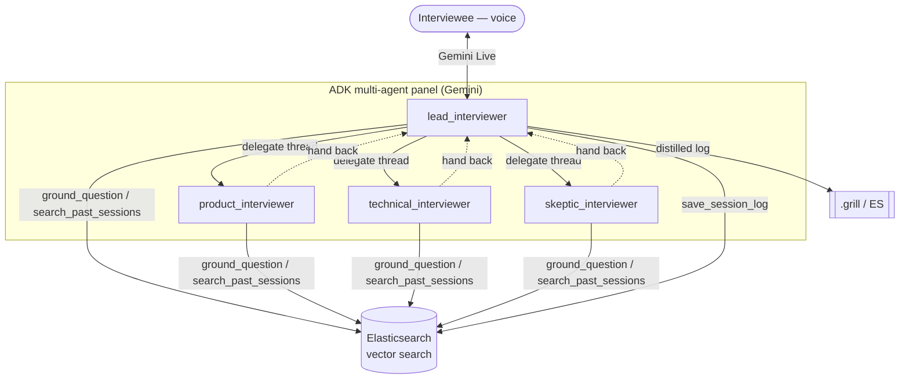

# Architecture

## The idea

A spoken requirements interview run by a **panel of specialist agents** rather
than one chatbot. The discipline comes from grill-me (ask one question at a
time, attach a strawman answer, drill one thread to the bottom before branching,
probe vague answers, converge only when truly understood). The autonomy comes
from ADK multi-agent + Tool Use.

## Components (all Google Cloud + Elasticsearch)

| Component | Tech | Responsibility |
|---|---|---|
| Lead interviewer | **ADK `LlmAgent` (Gemini via Vertex AI)** | Runs the interview, delegates threads, distils the log |
| Persona sub-agents | **ADK `sub_agents`** | product / technical / skeptic specialists, each drilling its lens |
| Voice path | **Gemini Live** (`run_live`, WebSocket) | Bidirectional audio + transcription |
| Text/eval path | **ADK REST** (`get_fast_api_app`) / `adk web` | Multi-agent debugging, regression evals |
| `ground_question` | **Elasticsearch kNN** + Gemini embeddings | Agentic RAG: ground questions in domain knowledge |
| `search_past_sessions` | **Elasticsearch kNN** | Recall similar prior interviews |
| `save_session_log` | Elasticsearch + `./.grill` | Distil + persist + index the outcome |
| Runtime | **Cloud Run** | Serves everything; autoscales 0→N |
| Observability | **Cloud Logging / Trace** | Structured logs (stdout) + traces |

## Why multi-agent (the "necessity" the judges want)

The lead delegates each thread to the specialist whose lens fits best, the
specialist drills it, then hands the floor back — one coherent conversation, no
two questions at once. This is ADK's recommended **sub-agent delegation** pattern
(auto-transfer between agents), the design senior Google Cloud judges call out as
"more advanced than a single tool call".

## Voice path (Gemini Live)

`main.py` exposes `/ws/voice`. Per the ADK Live toolkit:

- `RunConfig(streaming_mode=BIDI, response_modalities=["AUDIO"], input/output
  transcription)` with `runner.run_live(...)`.
- Client streams PCM16 @16 kHz as base64; `LiveRequestQueue.send_realtime` feeds
  it in. Agent audio + transcripts come back as ADK events.

Live + sub-agent transfer is an evolving area in ADK; the lead handles the live
session, and the full panel delegation is exercised on the text path and in
`adk web`. See `docs/roadmap.md`.

## Agentic RAG with Elasticsearch

Before asking, an agent calls `ground_question(topic, focus)`: the query is
embedded (Gemini/Vertex `text-embedding-005`) and kNN-searched against the
knowledge index, so the next question is informed by domain pitfalls/best
practices instead of generic. `search_past_sessions` does the same against an
index of prior distilled logs — recall, not just retrieval. Both degrade
gracefully (clear status, empty results) when Elasticsearch is unset, so the
agent always runs.

## Designed for many-to-many

The data model is participant-aware (`interviewer/types.py`: every `Turn` has a
`speaker_id`/`speaker_role`; participants are `human` or `agent` with a
`persona`). Two growth axes, neither reshaping data:

- **More agents** — already here: the persona panel is the "N agents" axis.
- **More humans** — a room/diarisation layer tags each transcript with the
  speaking participant before it reaches the panel, plus a floor-control policy.
  See `docs/roadmap.md`.
