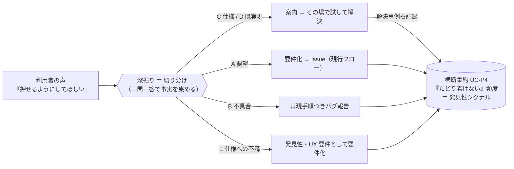
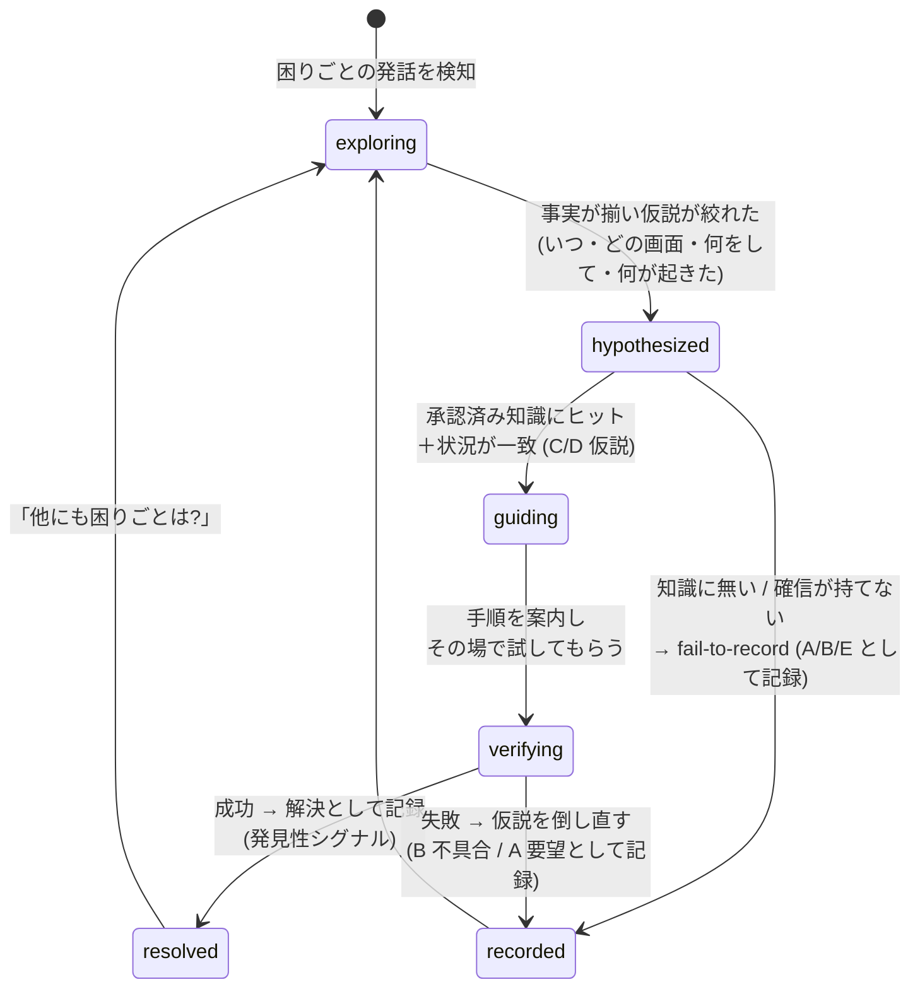
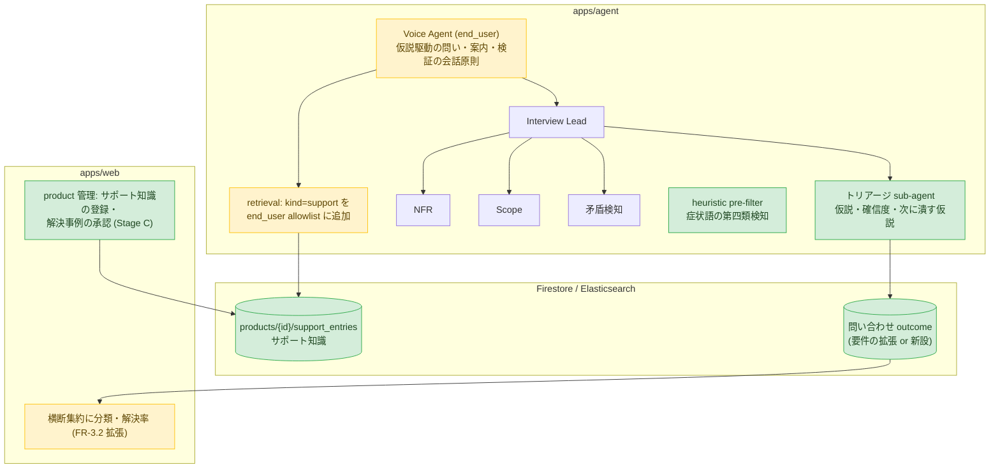

# 問い合わせトリアージ — 「要件を作らないこと」も価値にする

> 状態: **Draft（探索中・未決定）**。本書は課題定義と解決の骨格であり、設計判断はまだ ADR にしていない。
> 決定が必要な論点は [§8](#8-adr-に切り出すべき決定) に列挙する。
> 関連: [personas-and-use-cases.md](personas-and-use-cases.md)（利用者ペルソナ）/
> [要件定義](product-enduser-requirements.md)（FR-2.x / FR-3.x）/
> ADR-0032（ゲスト入場と利用者モード）/ ADR-0024（grill-me ペルソナ）/
> ADR-0003・0028（grounding / repo 索引）/ ADR-0002（マルチエージェント・トポロジ）/
> ADR-0005（LLM 評価ループ）。

## 1. 出発点 — 利用者の発話の「正体」は一つではない

利用者セッション（end_user モード）に届く声は、すべて「要望」の顔をしてやってくる。
しかしその正体は少なくとも 5 種類ある。

> 例:「ボタンが押せないんだけど、押せるようにしてほしい」
> — 実際には、特定のチェックボックスにチェックが入っていないとボタンが押せない**仕様**だった。

| # | 正体 | 例（上のボタンの場合） | あるべき出口 |
|---|---|---|---|
| A | **要望**（機能が存在しない） | そもそも一括操作機能が無い | 要件化（現行フロー） |
| B | **不具合**（仕様どおり動いていない） | チェック済みなのに押せない | 再現手順つきバグ報告 |
| C | **仕様**（意図してできない） | 未チェック時は押せない設計 | 前提の案内 → その場で解決 |
| D | **既実現**（別の方法でできる） | 別画面に同じ機能がある | 手順の案内 → その場で解決 |
| E | **仕様への不満**（できるが体験が悪い） | チェックが必要なこと自体が分かりにくい | **発見性・UX の要件**として要件化 |

現行の SANBA はこの全部を A（要望）として深掘り・要件化する。C・D を A として要件化すると
開発者は「すでにあるもの」の Issue を受け取り、利用者は解決できたはずの困りごとを抱えたまま
セッションを終える。逆に C・D をその場で解決できれば、**要件を 1 つも作らないセッションが
利用者への直接の価値提供になる**。

これは産婆術の趣旨から外れない。ソクラテスの問答は「引き出す」だけでなく
**吟味（エレンコス）**を含む — 「本当にそれは存在しないのか」を問いで検証し、
思い込みを棄却させる過程そのものである。トリアージは要件を減らす機能ではなく、
**要件の純度を上げる機能**として位置づける。

## 2. 課題定義 — なぜ難しいか

### 2.1 分類は入力ではなく出力である

利用者は自分の声が要望なのか不具合なのか仕様の誤解なのか**分からない**（分かるなら
サポート窓口で足りる）。したがって「まず分類してから対応を分岐する」IVR 型のフローは
成立しない。分類は会話の冒頭では決められず、事実が集まるにつれて**遷移する仮説**である。
「押せない」は最初 A/B/C/D/E すべての可能性を持ち、「どの画面か」「そのとき画面に
何が見えていたか」「何をした直後か」が埋まるごとに絞られていく。

ここで重要なのは、end_user モードの深掘り軸（いつ・どの画面で・何をしようとして・
何に困ったか — ADR-0032 決定7 / `END_USER_VOICE_AGENT_INSTRUCTIONS`）が、
**そのまま切り分けに必要な事実収集と一致している**こと。トリアージは新しい会話フローではなく、
既存の深掘りに「いま何の仮説が立っていて、次の一問はどの仮説を潰すか」という
**仮説管理を足したもの**として設計できる。

### 2.2 「正解」を知るにはアプリの実挙動の知識が要る — しかし生の repo grounding は使えない

「それは仕様で、チェックを入れれば押せます」と言うには、アプリが実際にどう動くかの
グラウンドトゥルースが要る。既存の知識源は repo 索引（ADR-0028）だが、これをそのまま
案内に使う案は**二重に不可**:

1. **漏洩**: ADR-0032 決定8 は end_user モードで repo 由来 passage を出力から機械的に遮断する
   （`search_grounding` の kind allowlist・fail-closed）。音声は事後フィルタできないため
   「本文は渡すが引用は禁止」というプロンプト頼みの緩和はすでに却下済み。
2. **幻覚**: README やコード片から「できるはず」を推論して案内すると、存在しない手順を
   自信をもって話すリスクがある。誤った案内は誤った要件化より深刻（§2.3）。

つまりこの課題の本丸は分類器ではなく、**「利用者に話してよい」と保証された知識源を
どう用意するか**である（§3.2）。

### 2.3 誤りコストは非対称 — 迷ったら記録する（fail-to-record）

| 誤り | 何が起きるか | 回復可能性 |
|---|---|---|
| 誤って「できます」と案内（実は不具合/未実装） | 利用者が試して失敗。信頼を失い、しかも**声が要件として記録されずに消える** | ほぼ不可逆（利用者は去る） |
| 誤って要望として記録（実は既実現） | 開発者が受け取り時のトリアージで「既存機能」と気づき閉じる | 回収可能・コスト小 |

したがって既定の倒し方は常に「記録する」側。案内は確信できる条件（承認済み知識のヒット
＋状況の一致確認）を満たすときだけ行い、**案内した場合もセッション内で結果を検証し、
記録は必ず残す**（§3.3–3.4）。これは grounding 出力制御と同じ fail-closed の思想である。

### 2.4 分類を利用者に意識させない

「それは仕様です」「バグですね」という語りは、利用者の使い方の否定・技術語彙の露出であり、
end_user モードの語彙原則（ADR-0032 決定7・「相手の使い方を絶対に否定しない」）に反する。
分類は MoSCoW と同じく**内部処理**に留め、利用者に見えるのは常に体験の会話だけにする:

> ×「それは仕様です。チェックボックスが必要です」
> ○「もしかすると、その画面の『◯◯』に印がついていると押せるようになるかもしれません。
> いま画面に『◯◯』は見えていますか?」

### 2.5 その場で検証できる — 従来サポートに無い固有の強み

チケット型サポートと違い、利用者は**いまアプリを触れる状態で対話している**。
画面共有・スクリーンショット（UC-U3 / `analysis.visual`）はすでにあるので、
案内 → その場で試してもらう → 結果を見る、まで 1 セッションで閉じられる。
「チェックを入れて押してみてもらえますか?」の結果が成功なら D/C で確定・解決、
失敗なら即座に B（不具合）へ仮説を倒し直す。**検証が分類の最終確定手段**になる。

## 3. 解決の骨格

### 3.1 仮説駆動の深掘り（トリアージ・ライフサイクル）

分類を一発判定のラベリングではなく、会話を通じて遷移する内部状態として持つ。

- 各仮説状態で「次の一問」は**最も仮説を絞る問い**を選ぶ。これは Lead agent の既存の役割
  （ディシジョンツリーの枝を 1 つずつ解消する）の適用であり、会話原則は変えない。
- どの経路も必ず `recorded` / `resolved` の**記録**に到達する。案内で終わって記録が残らない
  経路は作らない（§3.4）。

### 3.2 案内してよい知識の階層 — サポート知識ベース（kind="support"）

「利用者に話してよい」ことを**データの由来で保証**する。信頼度順に:

| 層 | 知識源 | 出力可否 | 根拠 |
|---|---|---|---|
| 1 | **owner が登録する利用者向けサポート知識**（症状 → 原因 → 手順。glossary の隣に置く） | ○ 案内に使える | owner が利用者向けと承認した文言そのもの |
| 2 | **過去セッションの解決事例**（owner 承認後に 1 へ昇格 — §7 Stage C） | ○（承認後） | 実際に解決した実績＋人間の承認 |
| 3 | repo 由来の索引（ADR-0028） | × 現状維持（件数シグナル `background` のみ） | ADR-0032 決定8。改訂しない |

- 実装上は grounding の新しい kind（例: `support`）とし、end_user モードの
  allowlist（`main.py` の `_USER_DERIVED_KINDS` 相当）に**この kind だけを追加**する。
  遮断の仕組み自体（kind ベース・fail-closed）は変えず、「由来が利用者向けに作られた
  文書である」ことを kind が保証する。
- サポート知識のエントリは product 単位（`products/{id}` 配下）。書式は
  「症状（利用者の言葉）/ 前提・原因 / 利用者にしてもらう手順 / 関連画面語彙」を持たせ、
  症状文で検索がヒットするようにする。
- **知識に無いことは案内しない**を指示とデータの両方で固定する:
  プロンプトに「サポート知識にヒットしない操作方法を推測で案内しない。『〜かもしれません』と
  可能性だけ示すこともしない」を明記し、Langfuse 回帰（§5）で退行を検知する。

> glossary（FR-2.4）が「話すための語彙」だとすれば、サポート知識は「答えるための知識」。
> どちらも owner が用意し、owner が用意しなければエージェントは案内せず全件記録に倒れる
> — つまり**この機能は knowledge が無い product では現行挙動と完全に同じ**になる。
> 段階導入（§7）が自然に成立する。

### 3.3 試してもらって確定する（verify-by-doing)

案内は言いっぱなしにしない。

1. 案内の直後に「試してみてもらえますか」と促す（画面共有があれば `analysis.visual` で
   一緒に確認、なければ口頭で結果を聞く）。
2. **成功** → 「解決（resolved）」として記録。その場で「探しにくかった場所・分かりにくかった
   表現」を一問だけ聞き、E（発見性）シグナルとして添える。
3. **失敗** → 謝罪して終わりにせず、仮説を B（不具合）へ倒す。「仕様どおりのはずなのに
   動かない」は再現手順（何をした・何が起きた・何を期待した）が既に会話に揃っているため、
   そのまま再現手順つきの記録になる。
4. セッション内で検証できない場合（今アプリを触れない等）は resolved にせず、
   「案内済み・未検証」として要望と同じ扱いで記録する（fail-to-record）。

### 3.4 すべての道が記録に通じる（inquiry outcome）

要件（`Requirement`）とは別に、またはその拡張として、**問い合わせの結末**を構造化して残す:

- `symptom`（利用者の言葉での症状）/ `situation`（いつ・どの画面・何をして）/
  `classification`（A〜E・内部語彙）/ `outcome`（requirement 化 / bug 報告 / resolved / 未検証）/
  `resolution_ref`（案内に使ったサポート知識の id）/ `citations`（根拠発話 — 既存の出所メタ流儀）。
- **解決したものも必ず記録する**理由は 2 つ:
  1. **集約の入力**（FR-3.2 / UC-P4）: 「同じチェックボックスに月 10 人がたどり着けない」は
     解決事例の頻度からしか見えない。これは E（発見性の要件）の一次データであり、
     「要件を作らなかったセッション」から要件が生まれる回路になる。
  2. **評価の教師データ**（§5): 分類と案内の正誤を後から検証できる。
- B（不具合）の記録は、既存の Issue 化（UC-D2 / `/export`）で bug ラベル＋再現手順の形に
  整形して出せるようにする。開発者は「仕分け済み・再現手順つき」で受け取る。

## 4. 既存アーキテクチャへの落とし込み

トポロジ（ADR-0002）は変えず、各層に薄く足す。

| 置き場所 | 変更 | 型 |
|---|---|---|
| `agent_team.py` | **トリアージ sub-agent** を追加（NFR/Scope/矛盾検知の兄弟）。transcript＋サポート知識ヒットを受け、仮説・確信度・欠けている事実（次の一問の材料）を返す | ADR-0002 の拡張 |
| `tools/analysis.py` | 症状語の **heuristic pre-filter**（「押せない」「できない」「見つからない」「エラー」等）。`heuristic_ambiguous_topics`（曖昧の第三類）と同型の「切り分け候補の第四類」。依存ゼロ・単体テスト可能・ADK 不在時のフォールバック | 既存パターンの踏襲 |
| `sanba_shared/models.py` | `AnalysisResult` に triage 結果（仮説・確信度・案内可否）を追加。outcome のモデル（`Requirement` 拡張 vs 新設）は ADR で決定 | 拡張 |
| `prompts/interview.py` | `END_USER_VOICE_AGENT_INSTRUCTIONS` に §3 の会話原則（仮説を意識した問い・確認形の案内・verify-by-doing・推測案内の禁止）を追加。分類語彙の非露出は既存原則に相乗り | 拡張 |
| `main.py` / `retrieval.py` | `kind="support"` の索引と、end_user allowlist への追加。repo 由来の遮断は不変 | ADR-0032 決定8 の限定改訂 |
| `apps/api` / `apps/web` | product のサポート知識 CRUD（glossary と同じ owner-only 面）。集約ビューに分類・解決率 | FR-1.2 / FR-3.2 の拡張 |
| 観測性 | `inquiry_classified` / `support_guided` / `guide_verified` を構造化ログ＋トレースへ。LLM 入出力は Langfuse（CLAUDE.md 原則3） | 必須 |

## 5. 評価 — 誤案内を回帰で塞ぐ（LLMOps）

この機能の品質リスクは「分類の精度」より「**やってはいけない案内をしないこと**」に集中する。
ADR-0005 / FR-2.8 の枠にそのまま載せる:

- **Langfuse 評価データセット**（end_user 用に追加）:
  - 分類ケース: 症状文＋会話 → 期待分類（A〜E）。特に「仕様に見える不具合」「不具合に見える
    仕様」のミスリード例を意図的に含める。
  - 禁止ケース: サポート知識に無い操作を聞かれたとき**案内しない**こと・repo 由来内容を
    喋らないこと・分類語彙（仕様/バグ等）を口に出さないこと。
- **教師信号の回収**: owner が集約ビューで分類を修正したら（例: resolved → 実はバグ）、
  その事例をデータセット候補に積む。人手の最終トリアージが常にラベルの正になる。
- **メトリクス**: resolved-in-session 率 / 分類の owner 修正率 / 案内後の検証成功率 /
  誤案内（検証失敗）率。resolved 率は「要件を作らない価値」を直接測る指標になる。

## 6. 検討して採らない代替案

- **生の repo grounding で回答する**: §2.2 のとおり漏洩と幻覚の二重リスク。ADR-0032 決定8 の
  fail-closed を崩さない。
- **冒頭で「要望ですか?不具合ですか?」と分岐する（IVR 型）**: 利用者は分類できない（§2.1）。
  分類は会話の出力であって入力ではない。
- **分類を利用者に告げて納得してもらう**: 語彙原則違反かつ使い方の否定になる（§2.4）。
  利用者に返すのは分類ではなく「解決」か「あなたの声はこう整理されました」（FR-3.1）。
- **トリアージ専用の別セッション/別エージェントに切り出す**: 事実収集が深掘りと同一なので
  分離すると同じ質問を二度することになる。sub-agent としてチームに足す（ADR-0002 の範囲内）。
- **何もしない（全部要件化して開発者トリアージに任せる）**: 現状。開発者側の仕分けコストと
  利用者の未解決離脱が残る。ただしこの案との差分が最小になるよう、Stage A（§7）は
  「現行フロー＋内部分類の付与」だけから始める。

## 7. 段階導入

各段が単独でデプロイ可能・価値を持つ（CLAUDE.md: production-ready）。

- **Stage A — 内部分類と記録（案内はしない）**: トリアージ sub-agent・heuristic pre-filter・
  outcome 記録・集約ビューへの分類表示。エージェントの発話は変えない（案内ゼロ＝誤案内ゼロ）。
  ✅ 単独価値: 開発者が「仕分け済み・再現手順つき」で声を受け取る。
- **Stage B — サポート知識と案内・検証**: owner のサポート知識登録、`kind="support"` の
  allowlist 追加、確認形の案内と verify-by-doing、誤案内の回帰データセット。
  ✅ 単独価値: その場解決（resolved-in-session）が生まれる。
- **Stage C — 自己改善ループ**: 解決事例 → owner 承認 → サポート知識へ昇格。
  ✅ 単独価値: 同じ困りごとの 2 人目からは即座に解決できる（product が使われるほど賢くなる）。

## 8. ADR に切り出すべき決定

1. **outcome のデータモデル**: `Requirement` の category/status 拡張で持つか、
   `inquiries` を新設するか（TTL・承認フロー・出所メタは既存流儀に合わせる）。
2. **`kind="support"` と end_user allowlist の改訂**: ADR-0032 決定8 の限定改訂として明文化
   （「由来が利用者向け文書であることを kind が保証する」という不変条件）。
3. **トリアージ sub-agent のトポロジ追加**（ADR-0002 の拡張。Lead との役割分担・
   確信度のしきい値をどちらが判断するか）。
4. **誤案内ガードの固定**: 「サポート知識ヒット＋状況一致のときだけ案内・推測案内の禁止・
   案内後は必ず検証か未検証記録」を決定として固定し、回帰テストの対象にする。
5. **解決事例 → サポート知識の承認フロー**（Stage C。要件承認（ADR-0014）と同じ
   「AI 下書き・人間承認」の型に合わせる）。
