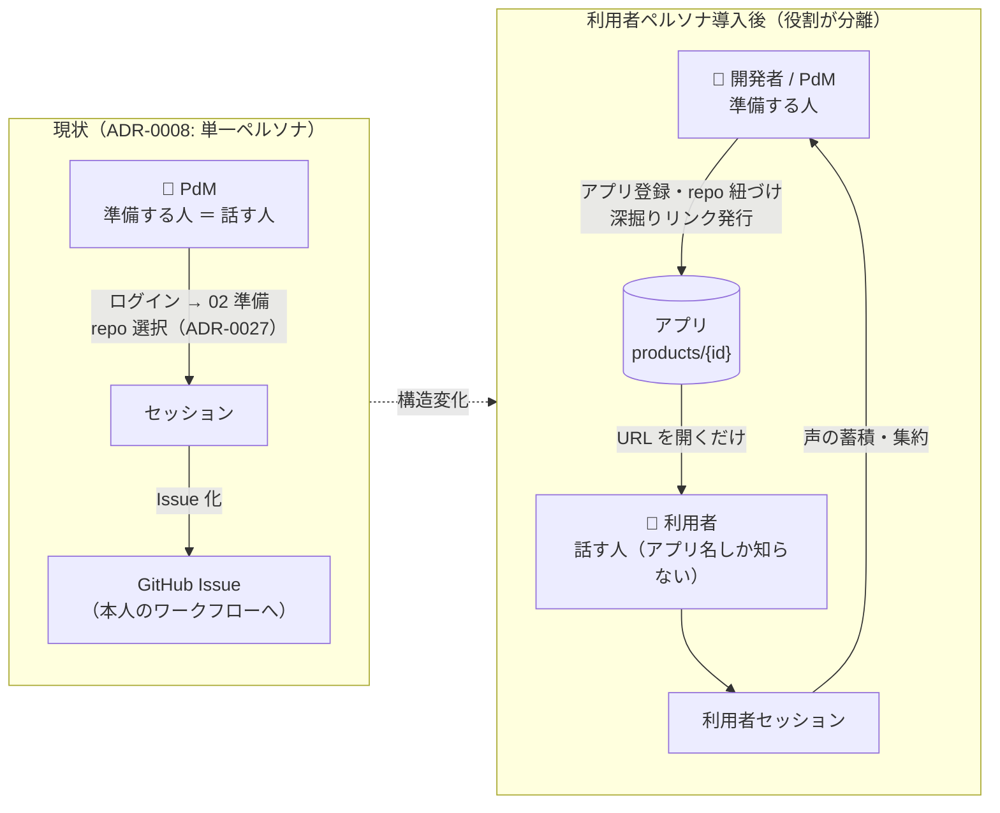
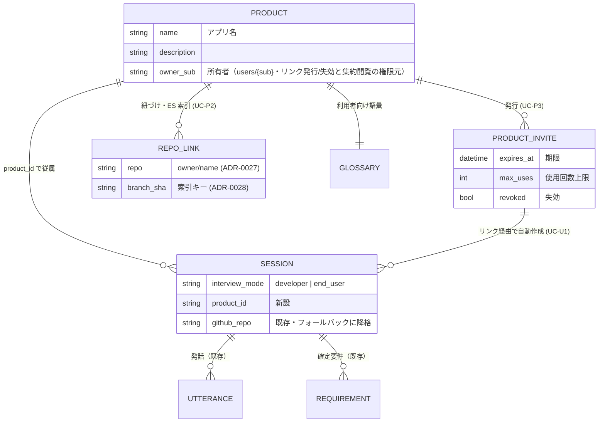
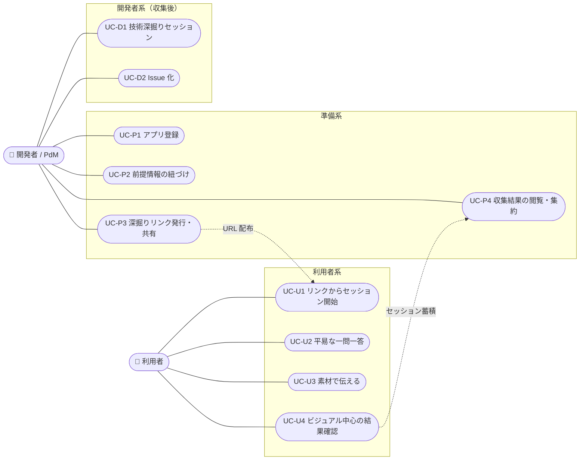
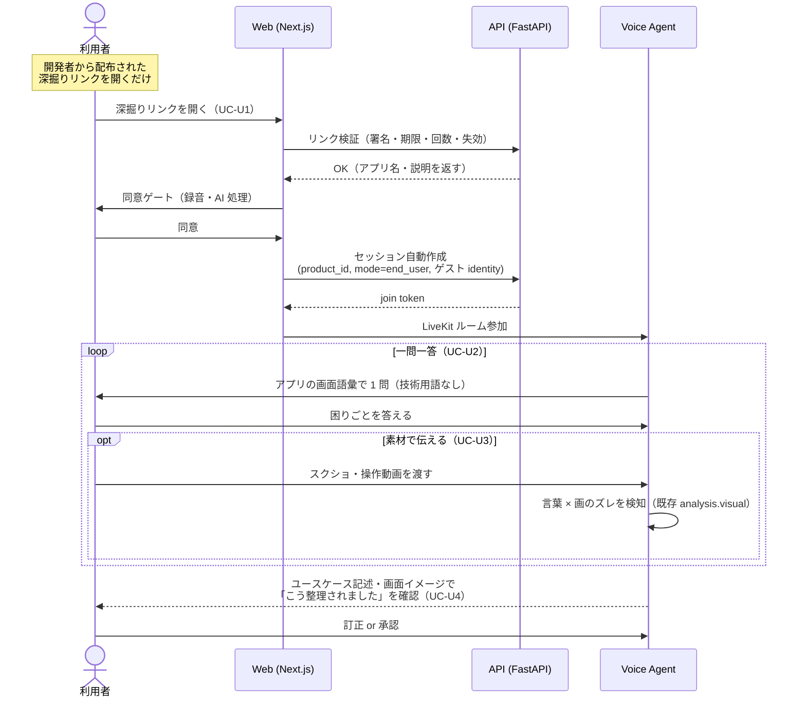
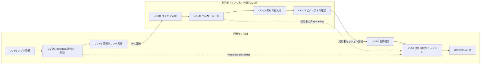
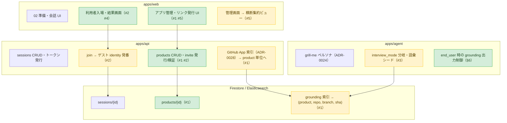
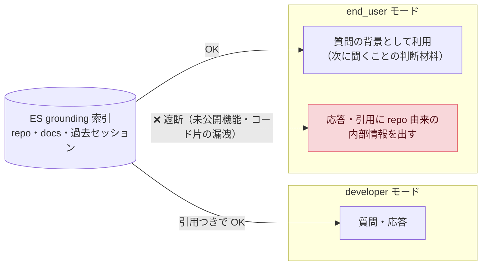

# ペルソナ別ユースケース — 開発者と利用者の分離

> 状態: **Draft（探索中・未決定）**。本書はユースケースの落とし込みであり、設計判断はまだ ADR にしていない。
> 決定が必要な論点は [§7](#7-adr-に切り出すべき決定) に列挙する。関連: ADR-0008（プロダクトコンセプト）/
> ADR-0027（セッション単位 repo 選択）/ ADR-0028（GitHub App 連携・ES 索引）/ ADR-0012（Google ログイン）/
> ADR-0024（grill-me インタビューペルソナ）。
>
> 後続文書: [要件定義](product-enduser-requirements.md) / [実装計画](product-enduser-implementation-plan.md)。

## 1. 出発点 — なぜ分けるのか

現状の SANBA は「セッションを準備する人＝インタビューされる人」という単一ペルソナ
（社内 PdM の 1:1 壁打ち、ADR-0008）を前提にしている。02 準備で本人が GitHub リポジトリを
選び（ADR-0027）、本人が Google ログインし（ADR-0012）、成果物は GitHub Issue として
本人のワークフローに返る。

しかし「アプリの利用者」に要件を引き出す場面では、**準備する人と話す人が分離する**。
これが最大の構造変化であり、以下のペルソナ差がすべてここから派生する。

| 観点 | 開発者 / PdM | 利用者 |
|---|---|---|
| 知っているもの | GitHub リポジトリ・技術構成 | **アプリ名だけ** |
| 知らないもの | 現場・利用実態 | リポジトリ・技術用語 |
| 持ち込む入力 | 設計課題・仮説 | 解像度の荒い困りごと・要望 |
| 期待する成果物 | 技術設計に入れる構造化要件・Issue | **ビジュアルイメージ・ユースケース** |
| 入口 | ログインして自分で 02 準備 | **発行された URL を開くだけ** |
| 対話の語彙 | 技術用語 OK | アプリの画面に出てくる言葉のみ |

## 2. 新しいドメイン概念

ユースケースを成立させるために必要な語（確定したらユビキタス言語に追加する）。

| 用語（仮） | 識別子（仮） | 定義 |
|---|---|---|
| アプリ | `product` / `products/{id}` | 深掘りの対象となるプロダクト。名前・説明・紐づけリポジトリ・ドキュメント・利用者向け語彙を持つ。**セッションはアプリに従属する**（現状の `SessionMeta.github_repo` 直持ちを一段持ち上げる）。 |
| 深掘りリンク | standing invite / `product_invite` | アプリに紐づく再利用可能な署名付き URL。利用者はこれを開くだけでセッションを開始できる。期限・使用回数・失効を持つ。既存のセッション単位 `invite`（`POST /api/sessions/join`）のアプリ版。 |
| インタビュー・モード | `interview_mode` | `developer` / `end_user`。質問の語彙・深掘り軸・成果物の形式を切り替えるプロファイル。ADR-0024 の grill-me ペルソナは developer モードの実装にあたる。 |
| 利用者向け語彙 | product glossary | 「利用者に見えている言葉」（画面名・機能の呼び名）の辞書。end_user モードのエージェントはこの語彙で話し、技術用語を使わない。 |

概念間の関係（既存モデルとの接続）:

`SESSION` / `UTTERANCE` / `REQUIREMENT` は既存モデル（`sessions/{id}` 配下）のままで、
新設するのは `PRODUCT`（と付随する invite / repo link / glossary）と、セッション側の
`product_id` / `interview_mode` の 2 フィールドだけに収める。

## 3. ユースケース一覧

どのアクターがどのユースケースを担うか（UML ユースケース図相当）:

### 準備系（開発者 / PdM が行う）

- **UC-P1 アプリ登録**: アプリ名・説明・利用者向け語彙を登録し `products/{id}` を作る。
- **UC-P2 前提情報の紐づけ**: GitHub リポジトリ・ドキュメントをアプリに紐づけ ES に索引する。
  ADR-0027/0028 の仕組み（GitHub App・(repo, branch, sha) 索引・秘匿レダクト）をセッション単位から
  **アプリ単位に持ち上げて再利用**する。
- **UC-P3 深掘りリンクの発行・共有**: アプリに対する深掘りリンクを発行し、期限・上限を設定して
  利用者に配る（メール・アプリ内バナー等、配布手段は SANBA の外）。失効・再発行ができる。
- **UC-P4 収集結果の閲覧・集約**: 複数の利用者セッションを横断して、困りごとのテーマ・頻度を
  集約して見る。ここから UC-D1（技術深掘り）に引き継ぐ。

### 利用者系（アプリ名しか知らない人が行う）

- **UC-U1 リンクからセッション開始**: 深掘りリンクを開く → 同意ゲート（録音・AI 処理）→
  セッション自動作成 → そのまま会話開始。**Google ログインを要求しない**（ゲスト入場）。
  02 準備は本人には見せない — 準備は開発者側が UC-P1〜P3 で済ませている。
- **UC-U2 平易な一問一答**: end_user モードで、アプリの画面語彙だけを使った一問一答。
  「いつ・どの画面で・何をしようとして・何に困ったか」を具体化する方向に深掘りする
  （非機能・MoSCoW のような開発語彙は内部分類に留め、本人には見せない）。
- **UC-U3 素材で伝える**: 困っている画面のスクリーンショット・操作動画を渡す。
  既存の素材フロー（05 素材・`analysis.visual`）をそのまま流用。言葉×画の矛盾検知が
  「言っていることと見えている画面のズレ」として利用者にも効く。
- **UC-U4 ビジュアル中心の結果確認**: セッション終了時に本人へ返すのは、要件リストではなく
  「こういう場面でこう困っている」のユースケース記述と、可能なら改善後の画面イメージ
  （design/README §3.6 の生成プレビュー — 未採用機能。採用するなら ADR）。
  「あなたの声はこう整理されました」の確認と訂正の機会を返す。

利用者の一連の体験（UC-U1 → U4）をシーケンスで示す。**利用者にはログインも 02 準備も見せない**:

### 開発者系（収集後）

- **UC-D1 利用者セッションを前提にした技術深掘り**: 開発者が developer モードでセッションを開始
  すると、同じアプリの利用者セッション群が grounding として呼び戻される（既存の
  過去セッション呼び戻し・`kind="context"` の自然な拡張）。「利用者はこの画面のここで
  詰まっている」を引用しながら技術設計の要件を固める。
- **UC-D2 Issue 化**: 確定要件を GitHub Issue へ（既存 `/export`。アプリの紐づけリポジトリが既定になる）。

## 4. フロー（全体像）

利用者の声（U 系）と技術的前提（P2 の索引）が **UC-D1 で合流する**のがこの分離の価値。
どちらか片方なら既存 SANBA / 既存の grill-me で足りる。

## 5. 既存実装とのギャップ

| # | ギャップ | 現状 | 必要な変更 |
|---|---|---|---|
| 1 | アプリ実体が無い | `SessionMeta.github_repo` をセッションが直接持つ（ADR-0027） | `products/{id}` を新設し、セッションに `product_id`。repo 解決は product 経由（セッション個別指定はフォールバックで残す） |
| 2 | 入口がログイン前提 | Google OIDC（ADR-0012）＋セッション単位 invite | アプリ単位の深掘りリンク → join token 交換。ゲスト participant identity の発番（出所メタは維持） |
| 3 | インタビューが開発者語彙 | grill-me ペルソナ単一（ADR-0024） | `interview_mode` によるプロンプト・語彙・深掘り軸の分岐。利用者向け語彙のシード |
| 4 | 成果物が Issue のみ | `/export` → GitHub Issue | 利用者向けビュー（ユースケース記述・画面イメージ）。生成プレビューの採否判断 |
| 5 | 横断ビューが無い | 管理画面はセッション単位の要件承認（ADR-0014） | アプリ配下のセッション横断の集約ビュー（管理画面の拡張） |

変更がどのコンポーネントに落ちるか（緑＝新設、黄＝既存の拡張、白＝既存のまま）:

## 6. セキュリティ・運用上の論点

- **深掘りリンクは事実上の匿名入口**。署名・期限・使用回数上限・失効に加え、
  レート制限と abuse 対策（同一リンクからの大量セッション作成）が必須。
  会話は PII を含みうるので、同意ゲート（既存 `consent_acknowledged`）は省略しない。
- **grounding の漏洩方向**: end_user モードのセッションが private リポジトリの索引を引くと、
  内部情報（未公開機能・コード片）が質問や応答に混ざりうる。end_user モードでは
  repo grounding を「質問生成の背景」に限定し、引用として表に出さない等の出力制御が要る。
- **ゲストの保持期間**: ログインなしで集めた会話の TTL・削除導線（既存 30 日 TTL の適用範囲を明確化）。

grounding の情報が流れてよい方向（end_user モードでは repo 索引を「表に出さない」）:

## 7. ADR に切り出すべき決定

1. **product エンティティの導入**とセッションの従属（ADR-0027 の repo 解決の持ち上げ）。
2. **深掘りリンクとゲスト入場**（ADR-0012 のログイン原則に対する例外の設計）。
3. **インタビュー・モード**の導入（ADR-0024 の拡張。プロンプト・語彙・成果物の分岐点をどこに置くか）。
4. **利用者向け成果物**（生成プレビュー採用可否 — design/README §3.6 の保留の決着）。
5. **ADR-0008 との整合**: MVP ペルソナは「社内 PdM の 1:1 壁打ち」。利用者ペルソナは
   これを置き換えるのではなく「PdM が現場の声を集める道具」としての拡張と位置づけるか、
   コンセプト自体を改訂するか。
6. **ユーザー管理の最小化と org 非導入**（方針あり・ADR で確定する）:
   - ユーザー管理は**最小限を今**。product に `owner_sub` を持たせ、役割は
     product owner ＋ 既存 admin（`ADMIN_EMAILS`, ADR-0014）の 2 値で開始する。
     ユーザー管理画面・招待フロー・ロールモデルは作らない。
   - **利用者はユーザー化しない**。ゲスト入場（出所メタ＋TTL）のままにする。
     アカウント作成を求めた瞬間に「URL を開くだけ」の価値が壊れるため。
   - **オーガニゼーション（テナント）管理は作らない**。デプロイ単位＝1 チームを既定とし
     （ADR-0027 の allowlist と同じ前提）、複数チーム同居の需要が立ったら別 ADR。
     ただし後から挿せるように、(a) 認可判定（sub → product）を API に一点集約、
     (b) アプリ名のグローバル一意性やリンク URL の連番など「テナント 1 つ」前提の
     作りを避ける — の 2 点だけ今の設計で担保する。

## 8. 段階導入案

各段が単独でデプロイ可能・価値を持つように切る（CLAUDE.md: production-ready を保つ）。

- **Stage 1 — アプリ実体と深掘りリンク**: `products` 新設（`owner_sub` による所有と
  API 一点の認可判定を含む）・リンク発行・リンクからのセッション自動作成
  （モードはまだ developer のみ）。既存ペルソナのまま「準備の再利用」だけでも価値がある。
- **Stage 2 — 利用者モード**: ゲスト入場・end_user プロンプト・利用者向け語彙・grounding 出力制御。
- **Stage 3 — 利用者向け成果物と集約**: ビジュアル/ユースケース中心の結果画面、
  アプリ横断の集約ビュー、UC-D1 の呼び戻し接続。

```mermaid
flowchart LR
  subgraph S1["Stage 1 — アプリ実体と深掘りリンク"]
    direction TB
    S1a["products 新設（UC-P1）"]
    S1b["repo 紐づけの product 持ち上げ（UC-P2）"]
    S1c["リンク発行 → セッション自動作成（UC-P3/U1 の骨格）"]
    S1v["✅ 単独価値: 準備の再利用<br/>（モードは developer のみでも成立）"]
  end
  subgraph S2["Stage 2 — 利用者モード"]
    direction TB
    S2a["ゲスト入場（UC-U1 完成）"]
    S2b["end_user プロンプト・語彙（UC-U2）"]
    S2c["grounding 出力制御（§6）"]
    S2v["✅ 単独価値: 利用者から声を集められる"]
  end
  subgraph S3["Stage 3 — 成果物と集約"]
    direction TB
    S3a["ビジュアル結果画面（UC-U4）"]
    S3b["横断集約ビュー（UC-P4）"]
    S3c["利用者の声 → 技術深掘り接続（UC-D1）"]
    S3v["✅ 単独価値: 声→設計の一気通貫"]
  end
  S1 --> S2 --> S3
```

各 Stage の終端（✅）が「デプロイして意味がある状態」。次の Stage を待たずに出せる。
