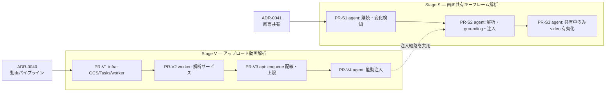

# 実装計画 — アップロード動画解析と画面共有キーフレーム解析

> 状態: **Draft**。設計判断は [ADR-0040](../adr/0040-uploaded-video-async-analysis.md)（動画パイプライン）と
> [ADR-0041](../adr/0041-screen-share-keyframe-analysis.md)（画面共有）。
> 各 PR は単独で lint / test / build（`just check` 相当）が通り、デプロイ可能な状態を保つ（CLAUDE.md）。

## 0. 確定済みの方針（ヒアリング 2026-07-06）

| 論点 | 決定 |
|---|---|
| 動画解析の実行基盤 | 最初から本格基盤（GCS + Cloud Tasks）。段階導入はしない |
| ワーカー配置 | **専用 Cloud Run サービス**（`apps/worker` を新設。API 同居ではない） |
| 想定動画 | 短い画面録画（〜5分）。上限 **10分 / 200MB** で明示的に弾く |
| 画面共有 | **ハイブリッド**（Gemini Live 転送は維持 + 変化検知キーフレーム解析を並走） |
| キーフレームのコスト制御 | 知覚ハッシュ差分の変化検知 + 最短間隔 + セッション上限枚数の二重ガード |
| 対話への利用 | **能動プッシュ + RAG**（grounding 投入に加え、解析完了をエージェントへ注入して深掘り質問を打たせる） |

## 1. 全体の依存関係

Stage V と Stage S は独立に着手できるが、PR-V4 の「解析結果をライブ会話へ注入する」仕組みを
PR-S2 が共用するため、注入部分は Stage V を先行させる。

## 2. Stage V — アップロード動画解析

### PR-V1: infra — GCS バケット・Cloud Tasks・worker サービス（規模 M・要 infra レビュー）
- `infra/terraform/`:
  - `google_storage_bucket`（素材用。uniform access・非公開・lifecycle 削除を Firestore `materials` TTL と整合）。
  - `google_cloud_tasks_queue` `video-analysis`（リトライ上限・バックオフ設定）。
  - Cloud Run service `worker`（`cloud_run.tf` の api/web/agent と同形。invoker = Cloud Tasks 用 SA のみ）。
  - SA/IAM: worker SA（バケット `objectViewer`・Firestore・Vertex AI user）、API SA に `cloudtasks.enqueuer` とバケット書き込み。
  - env 配線: api に `GCS_BUCKET` / `ENABLE_VIDEO_ANALYSIS` / `VIDEO_TASKS_QUEUE` / `WORKER_URL`、worker に接続情報一式。
- CI/CD: worker の build/deploy を既存のデプロイワークフローに追加（コンテナは非 root・最小ベース）。
- **注意**: `GCS_BUCKET` を配線した時点で画像アップロードも in-memory から GCS 保存に切り替わる（既存 `AssetStore` の挙動。意図した改善だが動作確認対象に含める）。

### PR-V2: worker — 解析サービス本体（規模 L）
- `apps/worker/` 新設（Python 3.12 / `uv` / FastAPI。`apps/api` の構成に倣う）:
  - `POST /tasks/analyze-video`（Cloud Tasks OIDC push 受け口）: payload = `session_id` / `asset_id` / `gcs_uri`。
  - 冪等ガード: `materials.status` が `analyzing` 以外なら skip（Cloud Tasks の task 名も `asset_id` 由来で重複排除）。
  - 実長検証: メタデータから 10 分超を `failed`（理由付き）に。
  - 解析: Gemini 2.5 Flash に映像+音声を渡す（Vertex 経路は `Part.from_uri(gs://…)`、GenAI API 経路は Files API / 20MB 未満 inline）。プロンプトは `analyze_image`（`apps/api/src/sanba_api/vision.py`）の観察抽出を動画向けに拡張: 転写・シーン観察・要件候補・矛盾候補をタイムスタンプ付きで構造化出力。
  - grounding 投入: `index_context(session_id, chunks, f"asset:{asset_id}")` 相当。**設計点**: `ingestion.py` の indexer は `apps/api` 内にあるため、worker から使う形（`packages/sanba_shared` への移設 or worker 内に同等モジュール）を PR 内で決める。移設が本命（重複実装を作らない）。
  - 永続化: `save_material(status="done", extracted=N)` / 失敗時 `failed`（`packages/sanba_shared/repository.py` 既存 API）。
  - publish: ADR-0023 のサーバ identity パターンで `analysis.progress` / `analysis.visual`。API 側ヘルパの共用（shared への移設）を検討。
- 観測性: span（`sanba.asset.*`）、`sanba_video_analysis_total{result}`・処理時間ヒストグラム、structlog、Langfuse トレース。
- テスト: 単体（実長検証・冪等 skip・チャンク整形）、結合（モック Gemini + Firestore エミュレータ + ES）。

### PR-V3: api — enqueue 配線と上限（規模 S）
- `apps/api/src/sanba_api/main.py:2204` の動画分岐を置換: `enable_video_analysis=true` なら GCS 保存後に Cloud Tasks へ enqueue し `status=analyzing` / `analysis_pending=True` を返す（フラグ false は現挙動を維持）。
- サイズ上限 200MB を動画に適用（既存 413 経路）。`apps/web/lib/api.ts` のエラーメッセージに上限値を明記。
- ローカル開発: Cloud Tasks エミュレータは公式に無いため、`local_direct_dispatch` 設定で API から worker エンドポイントを直接呼ぶバイパスを用意（compose に worker を追加）。
- テスト: enqueue 分岐・上限・フラグ OFF 退行の単体。

### PR-V4: agent — 解析結果の能動注入（規模 M）
- `apps/agent/src/sanba_agent/main.py`: room のデータチャネル（topic `sanba.events`）で `analysis.visual`（source=`asset:`）を購読し、要約・要件候補・矛盾候補を会話コンテキストへ注入 → エージェントが動画内容への深掘り質問を生成できるようにする。
- `prompts/interview.py`: 「アップロード素材の解析結果が届いたら内容に触れて深掘りする」誘導を追記。
- 注入は既存の背景注入方針（ADR-0037 の `AnalysisScheduler` / prefetch パターン）に揃える。ルームが無い場合は skip（grounding 側で担保）。
- テスト: フェイクイベント → 注入内容の単体、Langfuse 評価データセットに「動画解析を踏まえた質問」ケースを追加。

## 3. Stage S — 画面共有キーフレーム解析

### PR-S1: agent — トラック購読と変化検知（規模 M・フラグ既定 OFF）
- `apps/agent/src/sanba_agent/`: `Track.Source.SCREEN_SHARE` の映像トラックを明示購読（カメラは対象外）し、フレームを取得。
- dHash 差分の変化検知 + 最短間隔（既定 10 秒）+ セッション上限（既定 60 枚）でキーフレームを採択。
- `config.py` に `enable_screen_keyframe_analysis`（既定 false）・間隔・上限・しきい値を追加。
- メトリクス `sanba_screen_keyframes_total{decision=analyzed|throttled|unchanged|capped}`。
- テスト: 変化検知・ガード条件の単体（フレーム列のフィクスチャで決定的に）。

### PR-S2: agent — キーフレーム解析・永続化・注入（規模 M）
- 採択フレームを `gemini_vision_model` で解析（画面観察向けプロンプト: 画面名・UI 要素・操作フロー・ドメイン用語・要件候補）。
- `index_context(source="screen:{session_id}:{ts}")` へ投入 + 視覚要件経路（`note_visual_requirement` 相当の永続化、`source_speaker="screen-share"`）+ `analysis.visual` publish。
- PR-V4 の注入経路を共用し、直近 transcript / 記録済み視覚要件との重複を抑制してから会話へ注入。
- テスト: フェイク映像トラック → 解析 → grounding 投入の結合、重複抑制の単体。

### PR-S3: agent — 共有中のみ映像入力を有効化（規模 S）
- ADR-0004 の宿題。画面共有トラックの開始/終了に連動して Gemini Live への映像入力を切り替え、常時 ON をやめる。
- ADR-0004 に「本宿題は ADR-0041 で引き取り」の追記。
- E2E: Playwright で画面共有 → 要件候補が UI に出るシナリオを追加。

## 4. 実装時に決める残論点

| 論点 | 現時点の見立て |
|---|---|
| grounding indexer / publish ヘルパの worker からの利用 | `packages/sanba_shared` へ移設が本命。PR-V2 で確定 |
| 動画の実長取得方法 | まず GCS メタ + コンテナメタデータで安価に判定し、取れない形式は Gemini 応答のメタで補完。ffprobe 同梱は最終手段（イメージ肥大） |
| キーフレーム既定値（10 秒 / 60 枚 / しきい値） | メトリクス実測で調整。初期値は保守的に |
| `analysis.visual` の `conflicts`（言葉×画の突合） | ADR-0023 時点から空のまま。本計画では枠だけ維持し、突合は別 ADR で扱う |
| 中尺動画（10 分超）対応 | スコープ外。必要になったら worker にセグメント分割を足す（分離済みなので拡張点は確保されている） |
