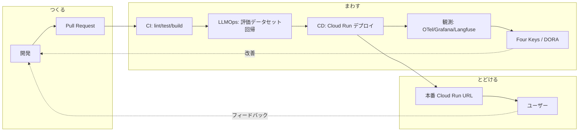

# DevOps サイクル — つくる・まわす・とどける

> 本ハッカソン最大の差別化軸。「動くものをつくる」で終わらせず、**継続的に改善して届ける**仕組みを実装する。

## 全体像



## 1. CI/CD（まわす）

- **CI** (`.github/workflows/ci.yml`): push/PR で lint（ruff/biome）・型チェック（mypy/tsc）・単体&結合テスト・Docker ビルド。
- **LLM 評価** (`.github/workflows/llm-eval.yml`): プロンプト変更時に Langfuse のデータセットで回帰評価。スコア低下で fail。
- **CD** (`.github/workflows/deploy.yml`): main マージで Cloud Build → Cloud Run へデプロイ。Workload Identity Federation で鍵レス認証。

## 2. IaC（とどける基盤）

- `infra/terraform/` で Cloud Run / Firestore / Artifact Registry / Secret Manager / Monitoring を宣言的に管理。
- 環境は `dev` / `prod` をワークスペースで分離。

## 3. 可観測性（Observability）

- **トレース**: OpenTelemetry で API・Agent・ADK ツール呼び出しを分散トレース。ローカルは Tempo、本番は Cloud Trace。
- **メトリクス**: Prometheus（ローカル）/ Cloud Monitoring（本番）。音声往復レイテンシ・トークン消費・エラー率。
- **ログ**: Loki（ローカル）/ Cloud Logging（本番）。構造化ログ。
- **ダッシュボード**: Grafana にレイテンシ・コスト・DORA を集約。

## 4. LLMOps（AIの継続的改善）

| 項目 | 仕組み |
|---|---|
| プロンプト管理 | `apps/agent/src/sanba_agent/prompts/` でバージョン管理 + Langfuse Prompts |
| トレース | 全 LLM 呼び出しを Langfuse に送信（入出力・レイテンシ・コスト） |
| 評価データセット | 代表的なヒアリングシナリオを `evaluation.DEFAULT_SCENARIOS` / Langfuse Datasets 化 |
| 回帰テスト | `llm-eval` ワークフローが `python -m sanba_agent.evaluation` を実行。ルーブリック採点で順序関係・閾値を検証し劣化を検出（ADR-0005） |
| オンライン評価 | セッション終了時に `score_session` が LLM-as-a-judge で採点し Langfuse に記録 |

## 5. Four Keys / DORA（開発生産性）

`infra/four-keys/` で GitHub の deployment / PR / incident イベントを収集し、

- **デプロイ頻度**
- **変更のリードタイム**
- **変更失敗率**
- **平均復旧時間 (MTTR)**

を BigQuery + Grafana で可視化する。**指標はハックせず**、ボトルネック発見と改善議論のために使う（佐藤将高CTO「数値に影響しないようにハックするのではなく、ボトルネックを定量化して認識を揃えることが本質」）。

## 6. オートスケール / コスト

- Cloud Run の `min-instances` / `max-instances` と concurrency を設定（`infra/terraform`）。
- 音声セッションは長時間接続のため、ワーカーの同時実行数と graceful shutdown を調整。
- 予算アラートを Terraform で宣言。Langfuse でセッションあたり推論コストを可視化。

## 7. ローカル開発

```bash
just up      # 全スタック起動
just test    # 単体/結合テスト
just lint    # lint + 型チェック
just logs    # ログ追従
```

> `just` 未導入なら `make`（同名ターゲット）でも可。`justfile` が標準。
