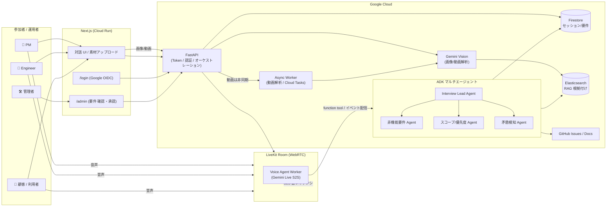
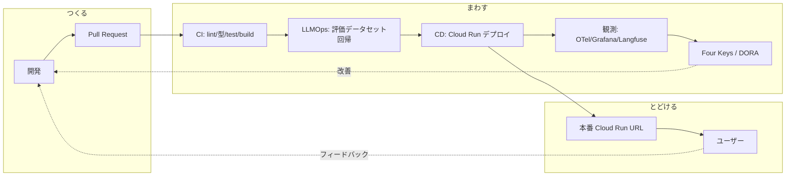

# ProtoPedia 作品ページ原稿 — SANBA

> **これは ProtoPedia（提出先）の作品ページに貼るための原稿**です。DevOps × AI Agent Hackathon 2026 の
> 一次審査は「ProtoPedia ページ＋リポジトリ」でほぼ決まる（`docs/hackathon/judging-criteria-strategy.md §5.5`）。
> README と内容を揃えつつ、審査軸（課題の新規性 / 解決策の有効性＝エージェントの必然性 / 実装品質・拡張性 /
> DevOps サイクル）を各セクションで踏むよう構成している。
>
> **使い方**: ProtoPedia の作品説明欄にこの本文を貼る。ProtoPedia は Mermaid を描画しないため、
> §アーキテクチャ / §DevOps の図は **`docs/hackathon/assets/architecture.png` / `devops-cycle.png` に書き出し済み**
> なので、そのまま画像アップロードすればよい（再生成手順は `submission-checklist.md` STEP②-b）。
> `{{...}}` は貼付前に実値へ差し替える。

---

## 作品名

**SANBA（産婆）— 解像度高く、要件を生み出す音声マルチエージェント**

## タグ / 使用技術

`Cloud Run` `Gemini Live API` `Google ADK` `Gemini Vision` `LiveKit` `Firestore` `Elasticsearch`
`Terraform` `GitHub Actions` `OpenTelemetry` `Langfuse` `Four Keys / DORA` `Next.js` `FastAPI`

## 一言サマリ（キャッチ）

> **「動くもの」ではなく「届くもの」を。** AI に丸投げするのではなく、**人と AI の協働で、聞く・話す・描く・見るを重ねながら要件の解像度を上げる**音声インタビュー・エージェント。名前の由来は、相手の中にある答えを問いで引き出す「**産婆術（Socratic maieutics）**」。

---

## 1. 原体験 — なぜ作ったか（課題の新規性）

生成 AI で「**コードを書く時間**」は劇的に短くなった。ボトルネックは前工程の **要件定義** に移っている（Findy 佐藤将高氏「インテリジェント開発時代」）。ところが要件定義の現場はいまも属人的だ。

- 聞くべきことを**聞き漏らす**（暗黙の前提・エッジケース・"やめた選択肢"）。
- 関係者が増える（PM・エンジニア・デザイナー・顧客）ほど**認識がズレる**。
- ヒアリングの議事録・要件ドキュメント化が**重く、属人的**。

OSS の AI スキル [`grill-me`](https://github.com/stevegsax/grill-me)（一問一答で要件を引き出す "容赦ないインタビュアー"）が話題になった。SANBA はこの発想を **音声 speech-to-speech** に載せ、**専門エージェントの協調**と **DevOps サイクル全体**（つくる・まわす・とどける）へ拡張した、本番運用品質の要件定義エージェントである。

**対象ユーザー（狭く深く）**
- 受託・SES の**要件ヒアリング**（顧客とエンジニアが同席するキックオフ）。
- 社内の**機能企画**（PM・エンジニア・デザイナーの三者会議）。
- **個人開発者の壁打ち**（1:1 で `grill-me` 流に要件を引き出す＝Phase 1 の MVP）。
- **アプリの利用者**（PdM が発行した深掘りリンクを開くだけで対話が始まる。利用者はリポジトリや技術用語を知らなくてよい／ADR-0031・0032）。

## 2. なぜ「AI エージェント」でなければならないか（解決策の有効性）

単発の LLM 呼び出しでは解けない。SANBA は**自律的に複数ステップを判断・実行**する：

- 会話の流れを読んで **次に聞くべき問い** を自律的に決める（質問計画）。
- 回答の **矛盾・抜け・曖昧さ** を検知して掘り下げる（自己検証ループ）。
- 非機能要件・スコープ/優先度・矛盾検知など**専門サブエージェントが協調**する（ADK マルチエージェント）。
- 画像・動画を **Gemini Vision** で観察し、「**言葉 × 画の矛盾**」を検知する（マルチモーダル／ADR-0004）。
- 確定要件を **Firestore / GitHub Issue** に構造化して書き出す（Tool Use）。

> チャットボット（人間が逐一指示する）でも、1 回投げて終わる要約タスクでもない。**タスク分解 → 計画 → 実行 → 検証 → 自己修正**のループと、**Lead + Sub エージェント協調**を、本番の音声パイプライン上で回す。

## 3. システムアーキテクチャ（GCP サービスとデータフロー）

> ProtoPedia には書き出し済み PNG（`docs/hackathon/assets/architecture.png`）を貼る。以下は元の Mermaid。

**主要 GCP サービス**: Cloud Run（api / web / agent / worker）・Firestore・Cloud Storage・Secret Manager・Cloud Tasks・Cloud Trace / Logging・Vertex AI（Gemini Live / Vision / Reasoning、本番はキーレス）。

## 4. DevOps サイクル（つくる・まわす・とどける）— 本ハッカソン最大の差別化

> ProtoPedia には書き出し済み PNG（`docs/hackathon/assets/devops-cycle.png`）を貼る。

- **つくる**: マルチエージェント（ADK）× マルチモーダル（Gemini Vision）× 音声 S2S（Gemini Live + LiveKit）。
- **まわす**:
  - **CI**（`ci.yml`）= lint / 型 / 単体・結合テスト / Docker ビルド。
  - **LLMOps**（`llm-eval.yml`）= プロンプト変更時に Langfuse データセットで**回帰評価**、劣化で fail（ADR-0005）。
  - **CD**（`deploy.yml`）= main マージで「terraform apply → build → Cloud Run デプロイ」を順序保証つき自動実行。**Workload Identity Federation でキーレス**（ADR-0026）。
  - **観測性** = OpenTelemetry 分散トレース（Cloud Trace）＋ 構造化ログ（Cloud Logging）＋ Langfuse（LLM トレース・評価）。
  - **Four Keys / DORA** = デプロイ頻度・リードタイム・変更失敗率・MTTR を BigQuery + Grafana で自己計測（`infra/four-keys/`）。**指標はハックせず**ボトルネック発見に使う。
- **とどける**: Cloud Run（api/web は scale-to-zero、agent は常駐ワーカー）＋ Global LB + Managed SSL、Terraform IaC、予算アラート、Artifact Registry cleanup、SBOM + SLSA provenance 署名（供給網検証）。

## 5. 設計判断とやめた選択肢（実装品質・拡張性）

意思決定はすべて **ADR（設計判断記録）** に残している（[`docs/adr/`](https://github.com/godhuu0505/sanba/tree/main/docs/adr)）。抜粋：

| 判断 | 採用 | やめた選択肢 | ADR |
|---|---|---|---|
| 実行基盤 | **Cloud Run** | GKE（運用過剰） | 0006 |
| 音声 I/O | **Gemini Live + LiveKit** | 独立 STT/TTS のカスケード | 0006 / 0039 |
| エージェント | **ADK（root + subagent + agent-as-tool）** | 単発 Gemini 呼び出し | 0002 |
| RAG | **Elasticsearch ハイブリッド（BM25+ベクトル）** | ベクトルのみ | 0003 |
| 動画解析 | **非同期ワーカー（Cloud Tasks push）** | 音声ループ内で同期実行 | 0040 / 0046 |
| CD | **main マージで自動 apply（WIF キーレス）** | 手動デプロイ | 0026 |

## 6. 「人間が品質に責任を持つ」

AI は下書き・自動化を担うが、**設計判断とレビューは人間が行う**（`CLAUDE.md` 原則1）。管理画面（`/admin`）で AI 生成要件を人間が**編集・承認/却下**して初めて確定する（承認で 30 日 TTL を解除して永続化）。指標（Four Keys）は見栄えのために**ハックしない**。

## 7. デモ動画

> {{ここに 1 分デモ動画を埋め込む}}（絵コンテ＝`docs/hackathon/demo-video-script.md`）。
> Before/After と、エージェントが自律的に問い・検知・要件化する様子が一目で分かる構成。

## 8. ロードマップ

1. **Phase 1 — 1:1 完成**（MVP）: 1 人 × 1 エージェントの音声要件インタビュー。
2. **Phase 2 — 多人数**: 複数参加者の発話識別・司会・要約・合意形成。
3. **Phase 3 — 多エージェント協調**: 専門サブエージェントが並行して論点を深掘り。

## 9. リンク

- **GitHub（公開リポジトリ）**: <https://github.com/godhuu0505/sanba>
- **デプロイ URL（審査員がその場で触れる）**: {{ https://youken.sanba.net が稼働していることを確認して掲載 }}
- **アーキテクチャ / ADR**: <https://github.com/godhuu0505/sanba/tree/main/docs>

---

> _解像度高く、生み出す。_ — SANBA はその「誕生」に立ち会う。
