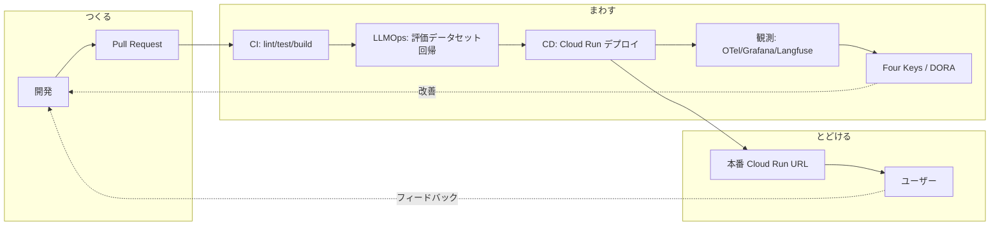

# DevOps サイクル — つくる・まわす・とどける

> 本ハッカソン最大の差別化軸。「動くものをつくる」で終わらせず、**継続的に改善して届ける**仕組みを実装する。

## 全体像



## 1. CI/CD（まわす）

- **CI** (`.github/workflows/ci.yml`): push/PR で lint（ruff/biome）・型チェック（mypy/tsc）・単体&結合テスト・Docker ビルド。
- **LLM 評価** (`.github/workflows/llm-eval.yml`): プロンプト変更時に Langfuse のデータセットで回帰評価。スコア低下で fail。
- **CD** (`.github/workflows/deploy.yml`): main マージで「マイグレーション（`infra/terraform` 変更時の terraform apply）→ イメージビルド → Cloud Run デプロイ」を順序保証つきで自動実行（ADR-0026）。Workload Identity Federation で鍵レス認証。
- **IaC の plan/apply** (`.github/workflows/terraform.yml`): PR で `terraform plan` を自動コメント（人間レビュー）。apply は main マージで `deploy.yml` から自動、または手動 dispatch（ロールバック用）。

## 2. IaC（とどける基盤）

- `infra/terraform/` で Cloud Run / Firestore / Artifact Registry / Secret Manager / Monitoring を宣言的に管理。
- 環境は `dev` / `prod` をワークスペースで分離。

## 3. 可観測性（Observability）

> **AS-IS / TO-BE**: 「OpenTelemetry 一本化」は方針（TO-BE）で、現状アプリが OTLP で実送信しているのは
> **トレースのみ**。メトリクス・ログの OTLP 配線は今後の課題（Collector・IAM 側の受け皿は先行整備済み）。
> 信号ごとの実配線は [architecture-analysis.md §10](../reference/architecture-analysis.md) の表が一次情報。

- **トレース**（✅ 実配線）: OpenTelemetry で API・Agent・ADK ツール呼び出しを分散トレース。ローカルは Tempo、本番は Cloud Trace。
- **メトリクス**（⚠️ 計画）: カウンタは OTel API で定義済みだが MeterProvider 未設定のため現状 no-op。MeterProvider/Reader を足せば Prometheus（ローカル）/ Cloud Monitoring（本番）へ流れる。観測対象は音声往復レイテンシ・トークン消費・エラー率。
- **ログ**（✅ ただし経路は stdout）: structlog の構造化ログを stdout に出し、本番は Cloud Logging が自動収集。Loki への OTLP ログ送信（ローカル）は未配線。
- **ダッシュボード**: Grafana にレイテンシ・コスト・DORA を集約（メトリクス配線後に完全化）。

## 4. LLMOps（AIの継続的改善）

| 項目 | 仕組み |
|---|---|
| プロンプト管理 | `apps/agent/src/sanba_agent/prompts/` でバージョン管理 + Langfuse Prompts |
| トレース | 全 LLM 呼び出しを Langfuse に送信（入出力・レイテンシ・コスト） |
| 評価データセット | 代表的なヒアリングシナリオを `evaluation.DEFAULT_SCENARIOS` / Langfuse Datasets 化 |
| 回帰テスト | `llm-eval` ワークフローが `python -m sanba_agent.evaluation` を実行。ルーブリック採点で順序関係・閾値を検証し劣化を検出（ADR-0005） |
| オンライン評価 | セッション終了時に `score_session` が LLM-as-a-judge で採点し Langfuse に記録 |

## 5. Four Keys / DORA（開発生産性）

`infra/four-keys/` で GitHub の deployment / PR / incident イベントを収集し、

- **デプロイ頻度**
- **変更のリードタイム**
- **変更失敗率**
- **平均復旧時間 (MTTR)**

を BigQuery + Grafana で可視化する。**指標はハックせず**、ボトルネック発見と改善議論のために使う（佐藤将高CTO「数値に影響しないようにハックするのではなく、ボトルネックを定量化して認識を揃えることが本質」）。

## 6. オートスケール / コスト

- Cloud Run の `min-instances` / `max-instances` と concurrency を設定（`infra/terraform`）。
- 音声セッションは長時間接続のため、ワーカーの同時実行数と graceful shutdown を調整。
- 予算アラートを Terraform で宣言。Langfuse でセッションあたり推論コストを可視化。

## 7. ローカル開発

アプリ必須スタックと補助スタックを二層に分離している（ADR-0009）。

```bash
just up        # アプリ最小構成 (web/api/agent/livekit/firestore/elasticsearch)
just verify    # 疎通スモークテスト
just up-full   # 補助スタックも重ねて全部入り (+ observability / langfuse / four-keys)
just test      # 単体/結合テスト
just lint      # lint + 型チェック
just logs      # ログ追従
just down      # 停止
```

> `just` 未導入なら `uv tool install rust-just`。`justfile` が唯一のエントリポイント。
> 詳細な手順・疎通確認・トラブルシュートは [`local-dev.md`](local-dev.md)。

## 8. 本番デプロイのコスト設計

- **Cloud Run**: api/web は `cpu_idle` + `min=0` で scale-to-zero（リクエスト時のみ課金）。
  agent は常駐ワーカーのため `agent_min_instances` で制御する。**Terraform 変数の既定は 1 だが、CI 経由デプロイ
  （`terraform.yml`）は GitHub Variable `AGENT_MIN_INSTANCES` 未設定時に `0` へ上書きする**ため、初期構築した
  本番環境はワーカー非常駐（LiveKit を実接続したら `AGENT_MIN_INSTANCES=1` を設定して常駐させる）。
- **CI/CD**: 変更のあった app だけビルド&デプロイ（paths-filter）、Buildx GHA キャッシュ、
  `concurrency` で古い実行をキャンセル。env/secret は Terraform が設定し CI は画像差し替えのみ。
- **Secret Manager**: 機微情報は Terraform が宣言。本番は Vertex AI でキーレス（API キー不要）。
- **Artifact Registry**: cleanup policy で直近 N 個のみ保持しストレージ課金を抑制。
- **予算アラート**: `google_billing_budget` を Terraform で宣言（`monthly_budget_jpy`）。
