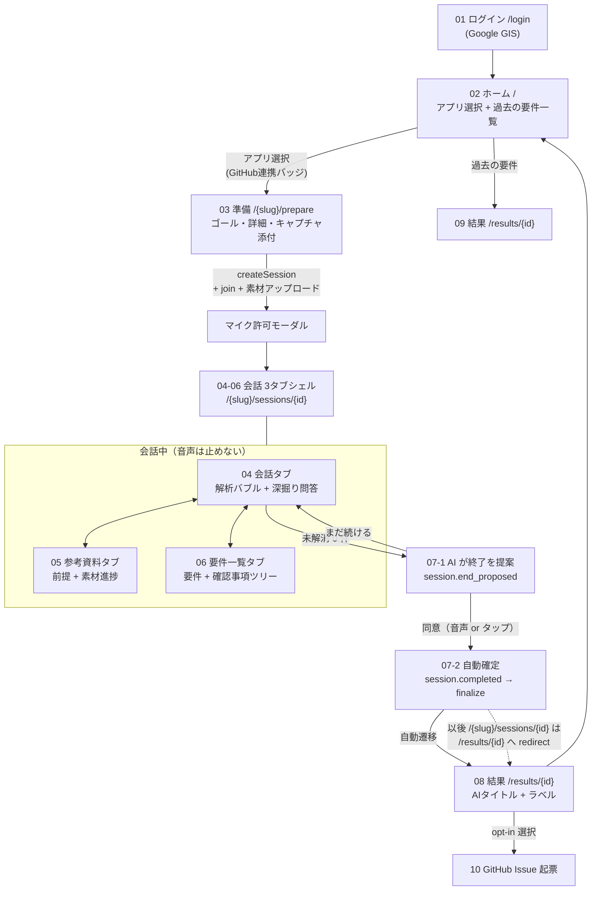
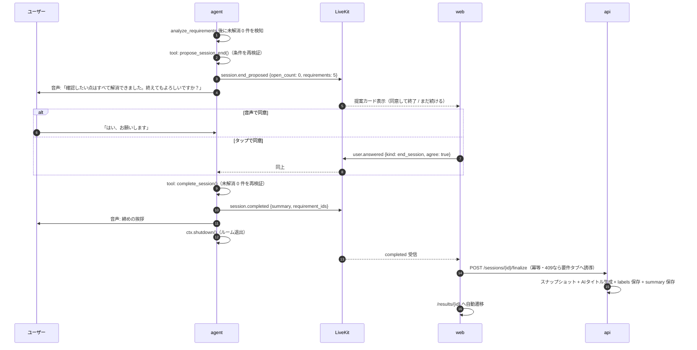
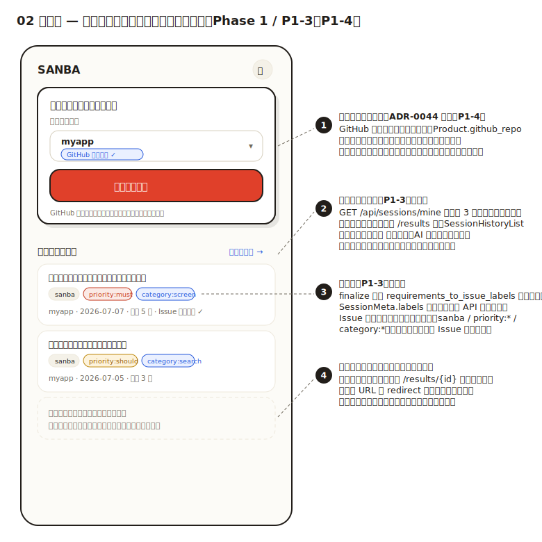
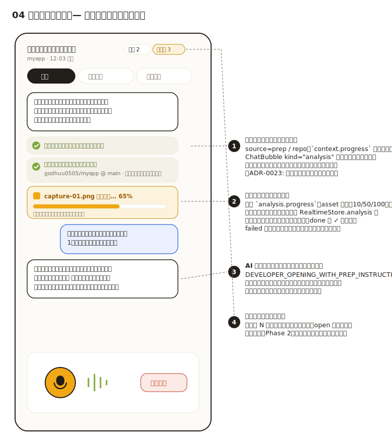
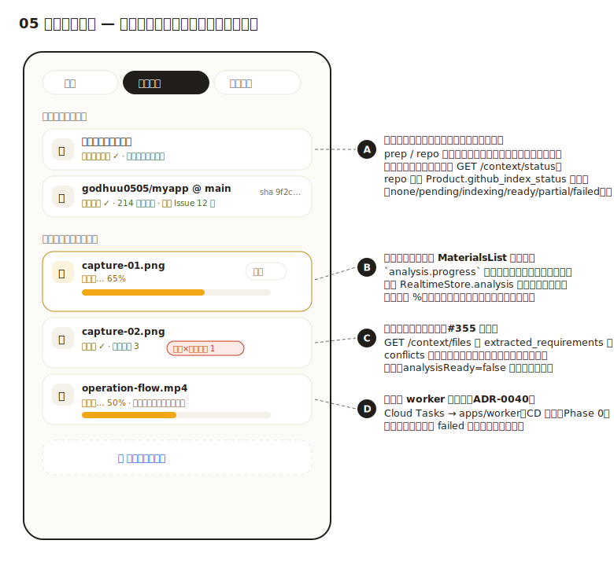
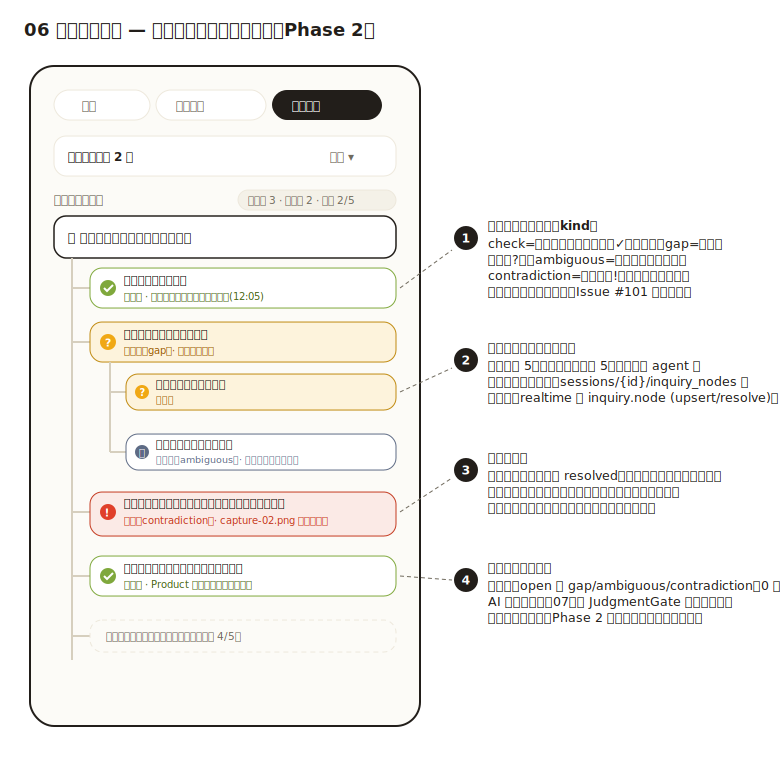
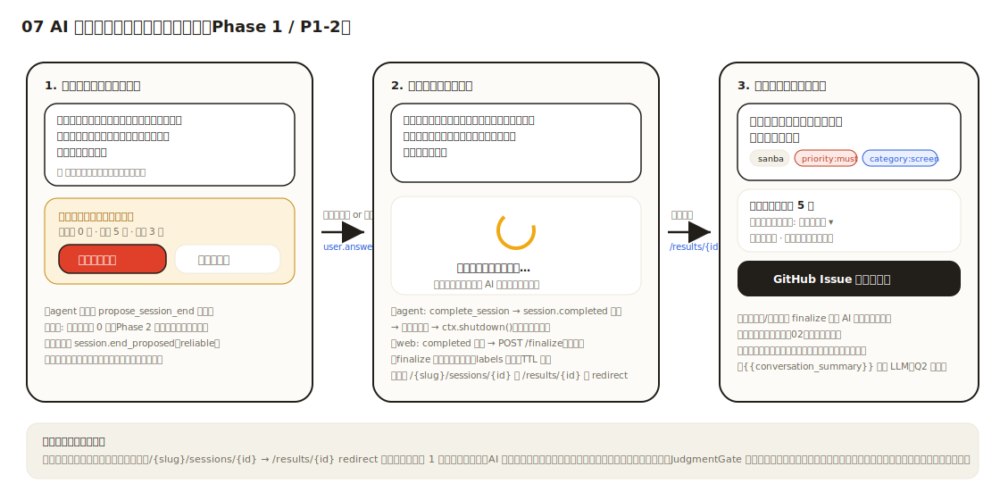
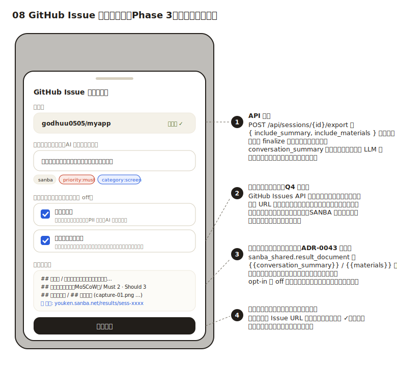

# ハッピーパス詳細設計 — 画面設計・ユーザーフロー・契約定義（2026-07-07）

[`happy-path-gap-analysis-and-plan.md`](happy-path-gap-analysis-and-plan.md) の Phase 0〜3 を、画面・イベント契約・データモデル・PR 分割まで具体化する。画面モックは `assets/happy-path/*.svg`（SANBA デザイントークン準拠: ADR-0025/0033「白い紙×原色」）。

## 1. ユーザーフロー全体図



- 03→04 の遷移でセッション URL に入るが、実体は EntryFlow のメモリ内接続（現行維持）。リロードは結果画面へ落ちる（既存ガード）。
- 07 のユーザー起点終了（終了ボタン → JudgmentGate）は従来どおり併存する。

## 2. 会話開始シーケンス（HP4/HP5: 3 種の裏解析と解析バブル）

```mermaid
sequenceDiagram
    autonumber
    participant W as web (会話画面)
    participant A as api (FastAPI)
    participant AG as agent (音声worker)
    participant WK as worker (動画解析)
    participant LK as LiveKit sanba.events

    W->>A: POST /sessions → POST /sessions/join
    W->>LK: ルーム接続（マイク許可済み）
    par 素材アップロード（webが逐次実行）
        W->>A: POST /context/file (capture-01.png)
        A->>LK: analysis.progress {asset, received 10%}
        A->>A: Gemini Vision 解析（画像は同期）
        A->>LK: analysis.progress {asset, analyzing 50%}
        A->>LK: analysis.progress {asset, done 100%} + analysis.visual
        Note over A,WK: 動画は Cloud Tasks → worker が同経路で publish
    and agent 起動（同時）
        AG->>AG: SessionMeta 読込 → prep premise を同期シード
        AG->>LK: context.progress {source: prep, done}
        AG->>AG: Product.github_index_status 読込
        alt 索引済み (ready)
            AG->>LK: context.progress {source: repo, reused}
        else indexing 中
            AG->>LK: context.progress {source: repo, running}
            loop 5秒間隔・最長3分
                AG->>AG: product 再読込
            end
            AG->>LK: context.progress {source: repo, done|failed}
        end
        AG->>W: 音声: ゴール要約 → 認識合わせ → 深掘り開始
    end
    LK-->>W: 各イベント → ChatHistory の解析バブル + 参考資料タブに反映
    Note over W: 解析完了前は準備情報から深掘り。<br/>analysis.visual 到着で agent が論点を追加（枝分かれ）
```



原則（ADR-0023/0037 を維持）:
- **フェイク進捗を出さない**。リポジトリは準備・連携時に索引済みなので「索引済みを利用（reused）」と正直に表示する。
- **音声への非同期割り込みはしない**。解析完了は (1) 次のツール返答 (2) 検知カード (3) 動画のみ穏当注入、の既存 3 経路のまま。バブルは表示のみで発話を遮らない。

## 3. AI 主導終了シーケンス（HP8）



設計判断:
- **finalize は web（owner の ID トークン）から呼ぶ**。agent に finalize 権限を足すより、既存の認可経路（`require_user` + owner 検証）と冪等 finalize を再利用する方が変更が小さく安全。agent は `session.completed` の発行と退出のみ担う。
- ユーザーが同意せず退出した場合は従来フロー（未確定のまま results で JudgmentGate 相当の表示）。
- end_user（ゲスト）モードでは終了提案はするが finalize は走らせない（ゲストは finalize 不可の既存制約を維持）。

## 4. realtime 契約の追加（`docs/design/realtime-contract.md` へ反映）

### 4.1 `context.progress`（新規・reliable）

prep / repo の読み込み状態。asset の進捗は既存 `analysis.progress` を使い、重複させない。

```json
{
  "v": 1, "type": "context.progress", "seq": 124, "ts": 1751871000000,
  "session_id": "sess-xxxx",
  "source": "prep" | "repo",
  "label": "ゴールとゴール詳細" | "godhuu0505/myapp@main",
  "stage": "running" | "done" | "reused" | "partial" | "failed",
  "detail": "214 ファイル · 直近 Issue 12 件" 
}
```

- 発行者: agent（接続時）。seq は ADR-0021 の共有 reliable 空間から予約。
- `reused` = 既存索引を利用（進捗バーなし・✓ 表示）。`running` のみ不定プログレス表示（pct は捏造しない）。
- ハイドレーション: 新設 `GET /api/sessions/{id}/context/status` → `{ prep: {...}, repo: {...} }`。

### 4.2 `session.end_proposed`（新規・reliable）

```json
{
  "v": 1, "type": "session.end_proposed", "seq": 240, "ts": ...,
  "session_id": "sess-xxxx",
  "open_count": 0, "requirement_count": 5, "material_count": 3
}
```

- web は提案カードを表示。「まだ続ける」はローカルで閉じるのみ（イベント不要）。「同意して終了」は既存 `user.answered` を `{kind: "end_session", agree: true}` で送る。

### 4.3 `session.completed`（既存・web 側の扱いを変更）

- 現行: 保存のみで UI は無反応。
- 変更: `ConversationSessionView` が `state.completed` を監視 → `finalizeSession()`（冪等）→ `/results/{id}` へ遷移。finalize 409（未解消残）時は要件一覧タブへ誘導しトースト表示（提案条件と finalize 条件の競合レース対策）。

### 4.4 `inquiry.node`（Phase 2・reliable）

```json
{
  "v": 1, "type": "inquiry.node", "seq": 310, "ts": ...,
  "session_id": "sess-xxxx",
  "op": "upsert" | "resolve" | "drop",
  "node": {
    "id": "nq-a1", "parent_id": "nq-root", "depth": 1,
    "kind": "check" | "gap" | "ambiguous" | "contradiction",
    "text": "通知設定の保存タイミング",
    "status": "open" | "resolved" | "dropped",
    "origin": "conversation" | "analysis" | "prep" | "material",
    "confidence": 0.7,
    "refs": ["utt-039"],
    "created_seq": 310, "resolved_seq": null
  }
}
```

## 5. データモデル変更（`packages/sanba_shared`）

### 5.1 Phase 1

| 対象 | 変更 |
|------|------|
| `SessionMeta` | `labels: list[str] = []`（finalize 時に `requirements_to_issue_labels` の算出値を保存）、`conversation_summary: str \| None`（finalize 時に Gemini で 400 字以内生成・保存。タイトル生成 `titles.py` と同じ fail-open 方針） |
| `GET /api/sessions/mine` | `labels` / `exported_issue_url` を応答に追加 |
| `GET /api/sessions/{id}/context/files` | 各素材に `extracted_requirements` / `conflicts` を含める（#355） |
| `GET /api/sessions/{id}/context/status` | 新設（prep / repo のスナップショット） |
| `result_document.py` | `{{conversation_summary}}` プレースホルダ追加（保存済み値の機械挿入。LLM は finalize 時の 1 回のみ = Q2 ハイブリッド決定） |

### 5.2 Phase 2（ADR-0059 として実装・リリース済み）

> 以下は当初の設計案。**実装は [ADR-0059](../adr/0059-inquiry-logic-tree.md) と
> [realtime-contract.md §3/§4](../reference/realtime-contract.md) が正本**で、案から次の点が確定した:
> `evidence_utterance_id` → **`refs: list[str]`**、**`confidence: float` を追加**（剪定順に使用）、origin は
> `check_item` を持たず check ノードは coverage 経路が生成、`detections` は**互換期間なしのクリーンカット
> オーバー**で撤去（決定④）。実体は `packages/sanba_shared/src/sanba_shared/inquiry.py` の `InquiryTree`。

Firestore: `sessions/{id}/inquiry_nodes/{node_id}`

```
id: str                     parent_id: str | None（None=ルート）
kind: check|gap|ambiguous|contradiction
text: str                   status: open|resolved|dropped
confidence: float(0..1)     depth: int (1..5)
origin: conversation|analysis|prep|material
refs: list[str]             created_seq: int    resolved_seq: int | None
```

制約（`sanba_shared` の `InquiryTree` でサーバ強制）:
- `depth <= 5`。超過は上限内に収まる最も深い祖先へ付け替える（`_clamp_parent`）。
- 同一 `parent_id` の open 子ノード `<= 5`。超過時は **`confidence` 最小の open 子を `dropped` に丸める**。
- 確認観点（`check_points`）は coverage 判定経路が `kind=check` のノードとして open/resolve する。
- 既存 `detections` は**クリーンカットオーバー**で撤去し `inquiry.node` へ一本化（未リリースのため互換期間なし / 決定④）。
- `JudgmentGate` / 終了提案の「未解消」= `open` かつ `kind∈{contradiction,gap,check}` のゲートノード数（ambiguous は advisory）。

## 6. 画面設計（モック + コンポーネント対応）

### 02 ホーム — アプリ選択 + 過去の要件一覧



| 変更 | コンポーネント | 内容 |
|------|--------------|------|
| GitHub 連携バッジ | `EntryFlow.tsx`（home） | `product.github_repo` の有無で「GitHub 連携済み ✓」チップ。未連携は準備画面で連携導線（ゲートにはしない） |
| 過去の要件一覧 | `EntryFlow.tsx` + `sanba/SessionHistoryList` 共用 | `fetchMySessions` 直近 3 件。タイトル + ラベルチップ + メタ行。「すべて見る →」で `/results` |
| ラベルチップ | `SessionRow` | `labels` を最大 3 個表示（sanba / priority:* / category:*）。溢れは `+N` |

### 04 会話タブ — 解析バブル



| 変更 | コンポーネント | 内容 |
|------|--------------|------|
| 解析バブル | `ChatHistory.tsx` + `sanba/ChatBubble.tsx` に `kind="analysis"` variant | 淡い紙面（`--sanba-surface-strong`）のシステムバブル。発話バブルと時系列混在 |
| prep/repo バブル | 新 store slice `contextProgress` | `context.progress` を写像。done/reused=萌黄✓、running=不定プログレス、failed=朱+参考資料タブ導線 |
| 素材バブル | 既存 `RealtimeStore.analysis` を selector で写像 | 素材ごとに 1 バブル。progressbar（10/50/100 の実段階のみ）。done で「抽出要件 N・矛盾 N」のサマリに変化し、タップで `MaterialDetailSheet` |
| 表示位置 | `selectChatItems`（新 selector） | transcript と解析バブルを seq/ts でマージソート。バブルの再描画は状態変化時のみ（メモ化） |

### 05 参考資料タブ — 前提セクション + 進捗同期



| 変更 | コンポーネント | 内容 |
|------|--------------|------|
| 「セッションの前提」 | `MaterialsList.tsx` 上部に新セクション | prep / repo 行（`contextProgress` slice を参照）。repo 行は sha 短縮表示 |
| 進捗の同一ソース化 | `selectors.ts` | 会話バブルと同じ store を参照（判定ロジックの 2 箇所分散も本 PR で解消: `selectMiniStatus` に一本化） |
| 再接続復元 | `useRealtimeSession.ts` | `GET /context/status` + 拡張 `GET /context/files` をハイドレーションに追加（#355） |

### 06 要件一覧タブ — 確認事項ロジックツリー（Phase 2）



| 変更 | コンポーネント | 内容 |
|------|--------------|------|
| ツリービュー | `DeepDiveList.tsx` → 新 `InquiryTree.tsx` | インデント + 罫線でネスト表現（最大 5 階層なのでモバイルでも 16px×5 で収まる）。ノードは kind 別アイコン+色（check=萌黄✓ / gap=山吹? / ambiguous=藍鼠〜 / contradiction=朱!） |
| ヘッダ集計 | `RequirementsTab.tsx` | 「未解消 N · 解消済 M · 深さ d/5」。枝上限接近時は「枝 4/5」を表示 |
| 解消の根拠 | ノード詳細（タップで展開） | `refs`（`utterance_id` 配列）から該当発話の時刻・抜粋を表示 |
| 手動操作 | ノードの「不要」 | `user.inquiry_drop` を送信し誤検知を剪定（人間の品質責任）。resolve は会話駆動で手動 resolve は無し（決定⑥） |
| 判定への接続 | `JudgmentGate.tsx` / `selectGateCount` | 未解消 = `open` かつ `kind∈{contradiction,gap,check}` のゲートノード数（ambiguous は advisory / 決定⑤） |

### 07 AI 主導終了フロー



| 変更 | コンポーネント | 内容 |
|------|--------------|------|
| 終了提案カード | 新 `EndProposalCard.tsx`（会話タブ下部に固定表示） | `session.end_proposed` 受信で表示。「同意して終了」（朱 CTA）/「まだ続ける」。音声同意でも同カードは消える（completed 受信で遷移） |
| 自動確定 | `ConversationSessionView.tsx` | `state.completed` 監視 → `finalizeSession()`（冪等）→ 遷移。中間状態「要件をまとめています…」を表示 |
| agent ツール | `main.py` に `propose_session_end` / `complete_session` を追加 | 両ツールとも未解消 0 件をサーバ側データで再検証（プロンプト任せにしない）。`VOICE_AGENT_INSTRUCTIONS` に終了提案の発話規範を追記し、`test_prompts.py` で assert |

### 08 GitHub Issue 起票シート（Phase 3）



| 変更 | コンポーネント | 内容 |
|------|--------------|------|
| 起票シート | `ResultView.tsx` の Issue ボタン → 新 `IssueExportSheet.tsx` | タイトル・ラベル（編集可）+ opt-in チェック 2 つ（既定 off = Q4 決定）+ プレビュー |
| API | `POST /export` に `include_summary` / `include_materials` | 要約は保存済み `conversation_summary` を使用（起票時 LLM 呼び出しなし）。素材はファイル名+観察サマリ+`/results/{id}` リンク |
| 起票済み表示 | `SessionMeta.exported_issue_url` 保存 | 結果画面・過去一覧に「起票済み ✓」。再起票は確認ダイアログ |

## 7. PR 分割計画（1 PR = レビュー可能な 1 機能）

| # | PR | 内容 | 依存 |
|---|----|------|------|
| P0-a | `fix(agent): 分析を専用スレッドへ隔離` | `_run_analysis` → `asyncio.to_thread`、span 計測込み（#375） | なし |
| P0-b | `feat(infra): Cloud Trace 直送の observability 配線` | ADR-0051 の実装（#376）。ADR を Accepted 化 | なし |
| P0-c | `ci: apps/worker を deploy.yml に配線` | paths-filter + deploy ジョブ（ADR-0040 残） | なし |
| P0-d | `fix(api+web): product_id 永続化 / 空文字 repo 継承 / 再接続詳細復元` | #315 / 空文字エッジ / #355（context/files 拡張） | なし |
| P1-a | `feat(realtime+web): context.progress と会話内解析バブル` | §4.1 + 04/05 画面。契約ドキュメント更新 | P0-d |
| P1-b | `feat(agent+web): AI 主導のセッション終了` | §3 + §4.2/4.3 + 07 画面 | P1-a（イベント基盤共用） |
| P1-c | `feat(api+web): ホーム過去一覧・ラベル・要約保存` | §5.1 labels/summary + 02 画面 + `{{conversation_summary}}` | なし（並行可） |
| P2-a | `docs(adr): 確認事項ロジックツリー` | §5.2 の ADR 起票・レビュー | P1 完了後 |
| P2-b以降 | モデル→agent ツール→realtime→UI の 3〜4 PR | ADR 確定後に分割 | P2-a |
| P3-a | `feat(api+web): Issue 起票の opt-in 同梱` | §6 08 画面 + export 拡張 | P1-c（summary 保存） |

## 8. 受け入れ基準（E2E シナリオ）

ハッピーパス一気通貫（Playwright + 実 creds のスモーク）:
1. Google ログイン → ホームで GitHub 連携済みアプリを選択 → 準備でゴール「アカウント設定画面を作りたい」+ 詳細 + キャプチャ 2 枚添付 → 開始。
2. 会話タブに「ゴール読込 ✓」「索引利用 ✓」「capture-01.png 解析中→✓」のバブルが seq 順で出る。参考資料タブの進捗と %・状態が一致する。
3. AI が最初にゴール確認から話し始め、解析完了後にキャプチャ由来の論点（例: 画面要素の矛盾）を追加で確認する。
4. 未解消 0 件になると AI が終了を提案し、「同意して終了」タップ（または音声同意）で自動確定 → `/results/{id}` へ遷移。以後セッション URL は結果へ redirect。
5. 結果画面に AI タイトル・ラベルが表示され、ホームの過去一覧にも同じものが出る。
6. Issue 起票シートで「会話の要約」「参考資料のサマリ」を on にして起票 → Issue にラベル・要約・素材サマリ・結果画面リンクが載る。
7. 途中でリロードしても素材の解析詳細・前提状態が復元される（#355）。

観測性（CLAUDE.md 原則 3）: 新規経路すべてに span/構造化ログを通す — `context.progress` 発行、終了提案〜finalize、summary 生成、export opt-in。ダッシュボードは `session_scored` と並べて終了到達率（提案→同意→finalize 完了）を計測する。
