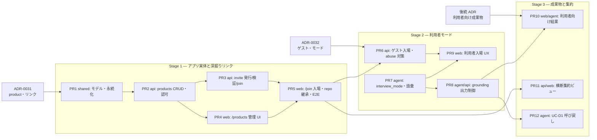

# 実装計画 — アプリ実体・深掘りリンク・利用者モード

> 状態: **Draft**。要件は [product-enduser-requirements.md](../reference/product-enduser-requirements.md)（FR/NFR 番号を参照）、
> 背景は [personas-and-use-cases.md](../explanation/personas-and-use-cases.md)。
> 各 PR は単独で lint / test / build（`just check` 相当）が通り、デプロイ可能な状態を保つ（CLAUDE.md）。

## 0. 先行タスク — ADR 起票

実装前に設計判断を確定する（ステータス Proposed で起票 → レビュー → Accepted で着手）。

| ADR | 内容 | 対応する論点（personas §7） | ブロックする対象 |
|---|---|---|---|
| [ADR-0031](../adr/0031-product-entity-and-invite-links.md)（**起票済み・Proposed**） | product エンティティ・所有（owner_sub）・深掘りリンク。org 非導入と将来挿入余地の担保もここに明記 | 1, 2 の前半, 6 | Stage 1 全体 |
| [ADR-0032](../adr/0032-guest-join-and-enduser-mode.md)（**起票済み・Proposed**） | ゲスト入場（ログイン原則 ADR-0012 の例外）と `interview_mode`・grounding 出力制御 | 2 の後半, 3 | Stage 2 全体 |
| 後続 ADR（未起票 — Stage 3 着手前に採番。0033 は UI デザイン刷新 v2 に使用済み） | 利用者向け成果物（ユースケース記述）と生成プレビューの採否（design/README §3.6 の保留の決着） | 4 | Stage 3 の FR-3.1 |
| — | ADR-0008 との整合（「PdM が現場の声を集める道具」としての拡張と位置づけ）は ADR-0031 の「影響」節で README / roadmap 改訂として扱う | 5 | — |

## 1. 全体の依存関係

Stage 内は PR1→PR2 以外おおむね並行可能。Stage の境界は「デプロイして意味がある状態」
（personas §8）で切ってあり、次 Stage を待たずにリリースする。

## 2. Stage 1 — アプリ実体と深掘りリンク

### PR1: shared — Product / ProductInvite モデルと永続化（規模 S）
- `packages/sanba_shared/src/sanba_shared/models.py`:
  `Product`（name / description / owner_sub / glossary / github_* — 既存 `SessionMeta` の
  github_* 節と同じ形）、`ProductInvite`（scope / expires_at / max_uses / use_count / revoked）、
  `SessionMeta` に `product_id: str | None = None` と
  `interview_mode: str = "developer"`（Stage 2 で使用、モデルは先に固める）。
- `packages/sanba_shared/src/sanba_shared/repository.py`:
  products / invites の CRUD と、`use_count` のトランザクション増分 API（FR-1.6 の AC）。
- テスト: モデル検証・invite 消費の同時実行（emulator）・旧文書互換（`product_id` 欠落）。

### PR2: api — products CRUD と認可の一点集約（規模 M）
- `apps/api/src/sanba_api/products.py`（新規）: ルータと
  `require_product_owner(sub, product)` 認可ヘルパー（NFR-6。admin は `ADMIN_EMAILS` 判定を再利用）。
- `apps/api/src/sanba_api/main.py`: `POST/GET /api/products*` 配線（§6 の表）。
- repo 紐づけ: 既存 `POST /api/sessions/{id}/github` の実装（`repo_indexing.py` 経由）を
  product 向けに再利用し、`GITHUB_REPO_ALLOWLIST` 判定を一貫適用（NFR-2）。
- 観測性: `product_created` 等の構造化ログ＋スパン（FR-1.7）。
- テスト: 認可（owner 以外 403）・allowlist・索引の (repo, branch, sha) 再利用。

### PR3: api — 深掘りリンクの発行・検証・join（規模 M）
- `apps/api/src/sanba_api/auth.py` の HMAC 署名パターンに倣い、product invite トークン
  （product_id + invite_id + 期限）を実装。**invite_id はランダム**（NFR-6）。
- `POST /api/products/join`: 署名検証 → Firestore の invite 文書照合（失効・期限・
  `max_uses` トランザクション消費）→ セッション自動作成（`product_id` 従属・repo 継承
  FR-1.4）→ 既存 join token（`auth.py`）発行。Stage 1 はログイン必須のまま。
- 発行・一覧・失効エンドポイント（FR-1.5）。
- テスト: 期限切れ / 失効 / 回数超過 / 改ざんの各異常系、同時 join での上限厳守。

### PR4: web — /products 管理 UI（規模 M）
- `apps/web/app/products/page.tsx`・`products/[id]/page.tsx`: 一覧・登録・repo 紐づけ
  （02 準備の repo 選択 UI を流用）・リンク発行/失効・発行済み URL のコピー。
- `apps/web/lib/api.ts` にクライアント追加。認可は表示制御のみ（判定の源泉は API）。

### PR5: web — /join/[token] 入場と E2E（規模 M）
- `apps/web/app/join/[token]/page.tsx`: 検証 → セッション自動作成 → 会話画面へ。
  期限切れ・失効の明確なエラー画面（FR-1.6 AC）。
- 02 準備をスキップする経路の整理（product 従属セッションは準備入力済み扱い）。
- E2E（Playwright）: アプリ登録 → リンク発行 → 入場 → 会話開始の一本道。
- **Stage 1 リリース判定**: この PR のマージ・デプロイで「準備の再利用」価値が出る。

## 3. Stage 2 — 利用者モード

### PR6: api — ゲスト入場と abuse 対策（規模 M）
- `POST /api/products/join`: invite の `scope=end_user` はログイン不要に（ADR-0032 の
  例外設計に従う）。ゲスト identity `guest:{random}` を発番し participant identity へ（FR-2.1）。
  セッション `owner_sub` は product owner。
- レート制限（リンク単位・IP 単位、Firestore カウンタ。既定値は `config.py`）（FR-2.6）。
- ゲストセッションの TTL 適用の明確化（FR-2.7）。
- 設定フラグ `guest_join_enabled`（既定 off）で段階リリース。
- テスト: 匿名 join の権限最小性（他セッションへのアクセス不可）・429。

### PR7: agent — interview_mode 分岐と利用者向け語彙（規模 M）
- `apps/agent/src/sanba_agent/prompts/interview.py`: end_user モードのシステムプロンプト
  （「いつ・どの画面で・何をしようとして・何に困ったか」軸、技術用語・MoSCoW 露出禁止、
  一問一答＋推奨回答例は維持）。
- `apps/agent/src/sanba_agent/main.py`: セッション文書から `interview_mode` と product
  glossary を読み、instructions にシード（ADR-0028 の repo 要約シードと同じ機械的組み立て）。
- CI 回帰評価データセット: end_user モードの評価データセットを CI 回帰に載せる（FR-2.8。ADR-0005 の枠組み）。
- テスト: プロンプト整形の単体、モード別の instructions スナップショット。
- **注記（PR2/PR3 からの引き継ぎ）**: agent の grounding 参照（`search_grounding` /
  過去セッション呼び戻し）は現状**セッションスコープのみ**。product の repo 索引は
  `prod-*` の product スコープに入るため、配下セッションから product スコープの索引を
  引く配線（retrieval のスコープ拡張）がこの PR か PR12 までに必要。PR3 の repo 継承は
  `github_summary`（初期シード）までは効くが、深掘り検索は未配線。

### PR8: agent/api — grounding 出力制御（規模 S〜M）
- `apps/agent/src/sanba_agent/retrieval.py` / `prompts/interview.py`: end_user モードでは
  repo 由来（`kind` が repo 索引系）の passage を引用イベント・応答文へ出さない。
  質問計画の背景としての利用は許可（FR-2.5 / NFR-2）。
- 結合テスト: end_user セッションの引用・応答に repo 由来が混ざらないこと。

### PR9: web — 利用者入場 UX（規模 M）
- `/join/[token]`: ゲスト経路（ログインボタンを出さない）・利用者向け同意ゲート文言
  （保持期間明示、FR-2.2/2.7）。
- `/sessions/[id]`: end_user モードで検知カード等の文言を利用者向けに切替（FR-2.3/2.4）。
- E2E: シークレットウィンドウ（未ログイン）でリンク → 同意 → 会話開始。
- **Stage 2 リリース判定**: `guest_join_enabled=true` で利用者から声を集められる。

## 4. Stage 3 — 成果物と集約

### PR10: 利用者向け結果画面（規模 M・利用者向け成果物 ADR 待ち）
- セッション終端でユースケース記述（いつ・どの画面で・困りごと・望む結果）を生成・表示し、
  訂正・承認を受ける（FR-3.1）。`RequirementScroll`（MoSCoW ボード）は end_user では出さない。

### PR11: 横断集約ビュー（規模 M）
- `GET /api/products/{id}/sessions`（owner / admin）と `/products/[id]` 配下の集約表示
  （FR-3.2）。テーマ集約は既存 ES 索引の類似検索を流用し、新しい分析基盤は足さない。

### PR12: UC-D1 呼び戻し（規模 S）
- developer モードのセッション開始時、同一 `product_id` の利用者セッション由来 passage を
  過去セッション呼び戻し（ADR-0003）の対象に加える（FR-3.3）。

## 5. テスト・検証戦略（CLAUDE.md のテスト方針に対応）

| 層 | 対象 |
|---|---|
| 単体 | invite 署名/期限/回数、認可ヘルパー、モデル互換、プロンプト整形（モード分岐） |
| 結合 | API ↔ Firestore emulator（invite 消費のトランザクション、product 継承）、agent の grounding 出力制御 |
| E2E（Playwright） | Stage 1: 登録→発行→入場→会話開始。Stage 2: 未ログインでの同フロー |
| LLM 回帰（CI シナリオデータセット） | end_user ペルソナ（技術用語なし・一問一答維持・画面語彙使用）のデータセット |
| セキュリティ | 各 PR で `/security-review`。特に PR3（トークン設計）・PR6（匿名入口）・PR8（漏洩遮断） |

## 6. リスクと緩和

| リスク | 緩和 |
|---|---|
| 匿名入口の悪用（大量セッション・コスト増） | `guest_join_enabled` 既定 off・レート制限・`max_uses`・失効。コストは Cloud Monitoring + Billing で監視（既存 NFR） |
| end_user プロンプトの品質が出ない（技術用語が漏れる等） | PR7 で評価データセットを先に作り、しきい値で CI 回帰。glossary シードで語彙を固定 |
| repo 情報の露出漏れ | PR8 を独立 PR にし、結合テストで機械的に検証。`/security-review` 重点対象 |
| 既存 02 準備フローの回 regress | `product_id` None の旧経路をテストで固定（NFR-5）。E2E は既存経路も回す |
| Stage 3 が生成プレビューの ADR 待ちで停滞 | FR-3.1 はユースケース記述（テキスト）だけで成立する設計にし、画像生成は追加要素に分離 |
