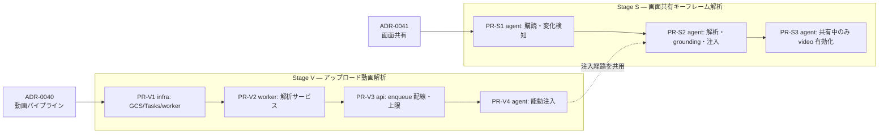

# 実装計画 — アップロード動画解析と画面共有キーフレーム解析

> 状態: **Draft**。設計判断は [ADR-0040](../adr/0040-uploaded-video-async-analysis.md)（動画パイプライン）と
> [ADR-0041](../adr/0041-screen-share-keyframe-analysis.md)（画面共有）。
> 各 PR は単独で lint / test / build（`just check` 相当）が通り、デプロイ可能な状態を保つ（CLAUDE.md）。

## 0. 確定済みの方針（ヒアリング 2026-07-06）

| 論点 | 決定 |
|---|---|
| 動画解析の実行基盤 | 最初から本格基盤（GCS + Cloud Tasks）。段階導入はしない |
| ワーカー配置 | **専用 Cloud Run サービス**（`apps/worker` を新設。API 同居ではない） |
| 想定動画 | 短い画面録画（〜5分）。上限 **10分 / 200MB** で明示的に弾く |
| 画面共有 | **ハイブリッド**（Gemini Live 転送は維持 + 変化検知キーフレーム解析を並走） |
| キーフレームのコスト制御 | 知覚ハッシュ差分の変化検知 + 最短間隔 + セッション上限枚数の二重ガード |
| 対話への利用 | **能動プッシュ + RAG**（grounding 投入に加え、解析完了をエージェントへ注入して深掘り質問を打たせる） |

## 1. 全体の依存関係

Stage V と Stage S は独立に着手できるが、PR-V4 の「解析結果をライブ会話へ注入する」仕組みを
PR-S2 が共用するため、注入部分は Stage V を先行させる。

## 2. Stage V — アップロード動画解析

### PR-V1: infra — GCS バケット・Cloud Tasks・worker サービス（規模 M・要 infra レビュー）

> 状態: **実装済み**（`infra/terraform/media.tf`）。`terraform fmt -check -recursive` 通過。
> `validate`/`plan` は CI（`.github/workflows/terraform.yml`）で確認する。worker Cloud Run service は
> `enable_video_analysis`（既定 false）で段階導入 — worker image が CI で push 可能になってから true にする。
> 署名付き URL 署名権限（runtime SA への `iam.serviceAccountTokenCreator`）は直送を実装する PR-V3 で追加する。

- `infra/terraform/`:
  - `google_storage_bucket`（素材用。uniform access・非公開・lifecycle 削除を Firestore `materials` TTL と整合）。
  - `google_cloud_tasks_queue` `video-analysis`（リトライ上限・バックオフ・**dispatch deadline を worker timeout と揃えて明示**）。
  - Cloud Run service `worker`（`cloud_run.tf` の api/web/agent と同形。invoker = Cloud Tasks 用 SA のみ。**request timeout は既定 5 分でなく 15 分目安を明示** — 10 分動画の Gemini 解析が 5 分を超えると 504 → 無駄リトライになる）。
  - SA/IAM: worker SA（バケット `objectViewer`・Firestore・Vertex AI user）、API SA に `cloudtasks.enqueuer` とバケットの**読み書き + list/delete**（既存 `DELETE /context/file/{asset_id}` が `AssetStore.delete()` で prefix list + blob delete を行うため。バケットスコープの `objectAdmin` 相当）。
  - env 配線: api に `GCS_BUCKET` / `ENABLE_VIDEO_ANALYSIS` / `VIDEO_TASKS_QUEUE` / `WORKER_URL`、worker に接続情報一式。
- CI/CD: worker の build/deploy を既存のデプロイワークフローに追加（コンテナは非 root・最小ベース）。
- **注意**: `GCS_BUCKET` を配線した時点で画像アップロードも in-memory から GCS 保存に切り替わる（既存 `AssetStore` の挙動。意図した改善だが動作確認対象に含める）。

### PR-V2: worker — 解析サービス本体（規模 L）

> 状態: **実装済み**。共有移設（`sanba_shared.grounding` / `sanba_shared.media`）+ `apps/worker` +
> `ci.yml` の worker ジョブ + テスト（worker 11 / shared media 4 / api 全 273 退行なし）。
> ruff / mypy / pytest 通過。**publish（`analysis.progress` / `analysis.visual`）と deploy.yml の
> worker build・service ゲート解除・`enable_video_analysis` フラグ立ては PR-V3 に集約**した
> （worker を実際に有効化・enqueue する PR でまとめて配線する方が安全なため）。素材の
> `analyzing`→`done`/`failed` 遷移はハイドレーション GET で web に反映される（ADR-0023 の二層目）。

**移設（shared へ完全移設・重複ゼロ）**
- `sanba_shared/grounding.py`: `ContextIndexer`（config 注入・PII masker 注入）・`chunk_text` を
  `apps/api` から移設。`apps/api/ingestion.py` は settings/pii を束ねる薄いアダプタ + `extract_text_from_upload` のみ残す。
- `sanba_shared/media.py`: `analyze_image` を移設し `analyze_video`（タイムスタンプ付き観察）を追加。
  `apps/api/vision.py` は薄いアダプタに。
- `sanba_shared/repository.py`: `get_material` を追加（冪等・破棄競合チェック用）。

**worker（`apps/worker/`・Python 3.12 / `uv` / FastAPI）**
  - `POST /tasks/analyze-video`（Cloud Tasks OIDC push 受け口）: payload = `session_id` / `asset_id` / `gcs_uri`。
  - 冪等ガード: `materials.status` が `analyzing` 以外なら skip。task 名は **`session_id` + `asset_id`** 由来（`asset_id` は内容ハッシュなので、同一動画を別セッションに上げると衝突して 2 件目が抑止される。ADR-0040 §3）。
  - 破棄との競合: `save_material` / `index_context` の**書き込み直前に material の存在を再確認**し、解析中に破棄された素材を復活させない（ADR-0040 §3）。
  - 失敗確定: 恒久エラーは即 failed + 2xx。一時エラーは `X-CloudTasks-TaskRetryCount` で最終試行を判定し、最終なら failed 化してから 2xx、それ以外は 5xx でリトライ（Cloud Tasks は枯渇後にハンドラを呼ばないため）。保険として `analyzing` 長時間滞留を failed 化する reconcile をハイドレーション時に実施。
  - 実長検証: メタデータから 10 分超を `failed`（理由付き）に。
  - 解析: Gemini 2.5 Flash に映像+音声を渡す（Vertex 経路は `Part.from_uri(gs://…)`、GenAI API 経路は Files API / 20MB 未満 inline）。プロンプトは `analyze_image`（`apps/api/src/sanba_api/vision.py`）の観察抽出を動画向けに拡張: 転写・シーン観察・要件候補・矛盾候補をタイムスタンプ付きで構造化出力。
  - grounding 投入: `index_context(session_id, observations, f"asset:{asset_id}")`（共有 `ContextIndexer`）。
  - 永続化: `save_material(status="done", extracted=N)` / 失敗時 `failed`（既存 API に merge 更新）。
  - 副作用は差し込み可能（`analyze` / `fetch_bytes`）にして GCP 無しで単体テスト。
- 観測性: `sanba_video_analysis_total{result}` カウンタ・処理時間ヒストグラム（otel 未設定でも no-op）、structlog。
- テスト: 単体（実長超過 / 冪等 skip / 破棄競合 / ローカル bytes 上限 / リトライ枯渇 semantics / 観察整形）。
- **PR-V3 へ持ち越し**: `analysis.progress` / `analysis.visual` の publish（サーバ identity。ADR-0023）、
  `analyzing` 長時間滞留の reconcile リーパー、deploy.yml の worker build + service ゲート解除。

### PR-V3: api/web — 動画の GCS 直送アップロードと enqueue 配線（規模 M）

> 状態: **実装済み**（api/web/Terraform + テスト）。api 304 テスト（新規 video pipeline 10 含む・退行なし）、
> ruff/mypy/format、web tsc/eslint/SessionView 15 通過。**本番有効化（フラグ立て + worker service 作成 +
> deploy）は `deploy.yml` の migrate→build 順による新規サービスのブートストラップ制約と課金開始のため、
> 意図的な手動 apply として手順化**した（[`docs/how-to/enable-video-analysis.md`](../how-to/enable-video-analysis.md)）。

- **動画は署名付き URL でブラウザから GCS へ直送**（ADR-0040 §2。Cloud Run の HTTP/1 request 上限 32MiB のため multipart 不可）:
  - `POST …/context/file/upload-init`: 署名付き PUT URL 発行（`x-goog-content-length-range` で 200MB 強制）+ `materials(status=uploading)`。api はバイト列を経由しないため `asset_id` は upload 単位の uuid（内容ハッシュではない。ADR-0040 の md5 導出からの簡素化 — 動画の再アップロード冪等性は捨て、task 名 `session+asset` で重複排除は維持）。
  - `POST …/context/file/upload-complete`: GCS オブジェクト検証（サイズ）→ `status=analyzing` → progress publish → enqueue。
  - `apps/web/lib/api.ts` の `uploadContextFile` を動画のみ直送に分岐。動画解析が無効（upload-init 409）なら従来 multipart「準備中」へフォールバック。画像は既存 multipart 維持。
  - multipart 経由の小さめ動画（≤25MB）も、有効時は store + enqueue する。
- サイズ上限は **kind 別**: `max_video_asset_bytes`（200MB）を新設、画像は `max_asset_bytes`（25MB）維持。
- enqueue（`tasks.py`）: 本番 = Cloud Tasks（OIDC = worker_invoker_sa）、ローカル = `local_direct_dispatch`、未設定 = no-op（fail-open）。差し込み可能で単体テスト。
- reconcile: GET context/files で `analyzing` 滞留（`analyzing_since` 超過）を `failed` 化するリーパー。
- Terraform: 直送署名のため runtime SA に `iam.serviceAccountTokenCreator`（on self）を付与。
- テスト: enqueue 経路選択・upload-init/complete・kind 別上限・reconcile・フラグ OFF 退行。
- **PR-V3 に含めなかったもの**（本番有効化の手順へ）: `enable_video_analysis` の自動フラグ立て、worker service ゲート解除、deploy.yml の worker build（ブートストラップ順の制約）。`analysis.visual` の worker publish は PR-V4（agent 注入）に集約。ローカルの fake-gcs-server compose は将来の補強。

### PR-V4: agent — 解析結果の能動注入（規模 M）
- `apps/agent/src/sanba_agent/main.py`: room のデータチャネル（topic `sanba.events`）で `analysis.visual`（source=`asset:`）を購読し、要約・要件候補・矛盾候補を会話コンテキストへ注入 → エージェントが動画内容への深掘り質問を生成できるようにする。
- `prompts/interview.py`: 「アップロード素材の解析結果が届いたら内容に触れて深掘りする」誘導を追記。
- 注入は既存の背景注入方針（ADR-0037 の `AnalysisScheduler` / prefetch パターン）に揃える。ルームが無い場合は skip（grounding 側で担保）。
- テスト: フェイクイベント → 注入内容の単体、Langfuse 評価データセットに「動画解析を踏まえた質問」ケースを追加。

## 3. Stage S — 画面共有キーフレーム解析

### PR-S1: agent — トラック購読と変化検知（規模 M・フラグ既定 OFF）
- `apps/agent/src/sanba_agent/`: `Track.Source.SCREEN_SHARE` の映像トラックを明示購読（カメラは対象外）し、フレームを取得。
- dHash 差分の変化検知 + 最短間隔（既定 10 秒）+ セッション上限（既定 60 枚）でキーフレームを採択。
- `config.py` に `enable_screen_keyframe_analysis`（既定 false）・間隔・上限・しきい値を追加。
- メトリクス `sanba_screen_keyframes_total{decision=analyzed|throttled|unchanged|capped}`。
- テスト: 変化検知・ガード条件の単体（フレーム列のフィクスチャで決定的に）。

### PR-S2: agent — キーフレーム解析・永続化・注入（規模 M）
- 採択フレームを `gemini_vision_model` で解析（画面観察向けプロンプト: 画面名・UI 要素・操作フロー・ドメイン用語・要件候補）。
- `index_context(source="screen:{session_id}:{ts}")` へ投入 + 視覚要件経路（`note_visual_requirement` 相当の永続化、`source_speaker="screen-share"`）。
- realtime 契約に **`analysis.screen`** を追加して publish（ADR-0041。既存 `analysis.visual` は `parse.ts` の `REQUIRED_FIELDS` で `asset_id` 必須のため流用不可）。`realtime-contract.md` §3・`parse.ts`・`store.ts` の反映先を同 PR で更新。
- PR-V4 の注入経路を共用し、直近 transcript / 記録済み視覚要件との重複を抑制してから会話へ注入。
- テスト: フェイク映像トラック → 解析 → grounding 投入の結合、重複抑制の単体。

### PR-S3: agent — 共有中のみ映像入力を有効化（規模 S）
- ADR-0004 の宿題。画面共有トラックの開始/終了に連動して Gemini Live への映像入力を切り替え、常時 ON をやめる。
- ADR-0004 に「本宿題は ADR-0041 で引き取り」の追記。
- E2E: Playwright で画面共有 → 要件候補が UI に出るシナリオを追加。

## 4. 実装時に決める残論点

| 論点 | 現時点の見立て |
|---|---|
| grounding indexer / publish ヘルパの worker からの利用 | `packages/sanba_shared` へ移設が本命。PR-V2 で確定 |
| 動画の実長取得方法 | まず GCS メタ + コンテナメタデータで安価に判定し、取れない形式は Gemini 応答のメタで補完。ffprobe 同梱は最終手段（イメージ肥大） |
| 直送アップロードの詳細（resumable vs 単純 PUT・バケット CORS・中断時の掃除） | PR-V3 で確定。`status=uploading` のまま滞留した material は reconcile で掃除 |
| キーフレーム既定値（10 秒 / 60 枚 / しきい値） | メトリクス実測で調整。初期値は保守的に |
| `analysis.visual` の `conflicts`（言葉×画の突合） | ADR-0023 時点から空のまま。本計画では枠だけ維持し、突合は別 ADR で扱う |
| 中尺動画（10 分超）対応 | スコープ外。必要になったら worker にセグメント分割を足す（分離済みなので拡張点は確保されている） |
