# SANBA アーキテクチャ & インフラ徹底解析

> 本書はリポジトリ実装（`apps/` / `infra/terraform/` / `docker-compose*.yml` / `.github/workflows/`）を
> 静的に解析し、**どのコンポーネントが・どの Google Cloud / 外部サービスを・どのタイミングでどう使うか**を
> 複数の図で示す。既存の [`docs/reference/architecture.md`](architecture.md) が「設計判断（なぜ）」を記すのに対し、
> 本書は「実態（何が・どこで・いつ）」の写像に徹する。

- 解析対象リビジョン: `apps/agent` / `apps/api` / `apps/web` / `packages/sanba_shared` / `infra/terraform` / 補助スタック
- 凡例:
  - 🟦 Google Cloud マネージドサービス
  - 🟩 外部 SaaS / OSS（非 GCP、またはセルフホスト）
  - ⬜ 自前アプリ（コンテナ）

---

## 0. 30 秒サマリ

- **実行基盤は Cloud Run 4 サービス**（`sanba-web` / `sanba-api` / `sanba-agent` / `sanba-worker`）。GKE は不採用（ADR-0006）。`sanba-worker` はアップロード動画の非同期解析（ADR-0040）を担う。
- **音声は LiveKit Cloud（WebRTC SFU）+ Gemini Live（speech-to-speech）** の二層。低遅延の対話層と、ADK マルチエージェントの分析層を分離。
- **状態は Firestore**（セッション/要件/発話/検知/質問。TTL で自動失効）、**素材は Cloud Storage**（`materials` バケットを `media.tf` でプロビジョニング済み、ADR-0040）、**RAG 根拠付けは Elasticsearch**（BM25 + Gemini embedding の kNN ハイブリッド）。
- **AI は二経路切替**: 本番は **Vertex AI（キーレス・実行 SA の `aiplatform.user`）**、ローカルは **AI Studio（`GOOGLE_API_KEY`）**。
- **公開は Global 外部 Application Load Balancer + Serverless NEG + Google 管理 SSL + Cloud DNS**（`https://youken.sanba.net`）。
- **CI/CD は GitHub Actions + Workload Identity Federation（鍵レス）→ Artifact Registry → `gcloud run deploy`**。env/secret/scale は Terraform 管理。
- **可観測性は OpenTelemetry を方針**とする。現状アプリが OTLP で送るのは**トレースのみ**（本番→Cloud Trace、ローカル→Collector→Tempo→Grafana）。メトリクスは MeterProvider 未設定で no-op、ログは stdout→Cloud Logging。**LLMOps も Google Cloud ネイティブ**（品質スコアは構造化ログ→Cloud Logging/Cloud Monitoring、回帰評価は Gemini judge の CI データセット。ADR-0051）。
- **外部コネクタ（GitHub 起票）は既定 OFF**。デモ経路に影響しない。

---

## 1. システム全体構成（コンポーネント俯瞰）

参加者・運用者から、Cloud Run 上の 4 アプリ、外部リアルタイム/AI/検索サービス、永続化までの一枚絵。

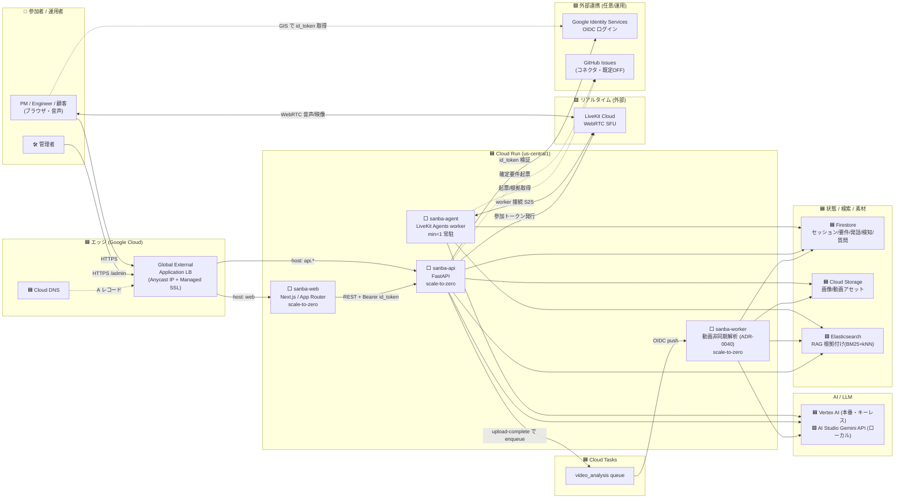

---

## 2. 利用している Google Cloud サービス一覧

`infra/terraform/main.tf` の `google_project_service`（有効化 API）と各リソース定義から抽出した**実利用サービス**。

| # | サービス | API | 役割（このプロジェクトでの使われ方） | 定義箇所 |
|---|---|---|---|---|
| 1 | **Cloud Run** | `run.googleapis.com` | `sanba-web`/`sanba-api`/`sanba-agent`/`sanba-worker` の実行基盤。web/api/worker は `min=0`+`cpu_idle=true`（scale-to-zero）、agent は `cpu_idle=false`（常駐ワーカー）。agent の `min` は **Terraform 変数の既定こそ `1` だが、CI 経由デプロイ（`terraform.yml`）は `AGENT_MIN_INSTANCES` 未設定時に `0` へ上書き**＝GitHub Actions で初期構築した環境はワーカー非常駐（LiveKit 投入後に Variable で `1` に上げる） | `cloud_run.tf` / `media.tf` / `terraform.yml` |
| 2 | **Firestore (Native)** | `firestore.googleapis.com` | セッション/要件/発話/検知/現在質問の永続化。`utterances`/`requirements`/`questions` に `expireAt` TTL を設定し保持期間後に自動削除 | `main.tf` |
| 3 | **Artifact Registry** | `artifactregistry.googleapis.com` | コンテナイメージ（`api`/`web`/`agent`/`worker`）格納。cleanup policy で直近 N 個のみ保持しストレージ課金抑制 | `main.tf` |
| 4 | **Cloud Tasks** | `cloudtasks.googleapis.com` | `video_analysis` キュー。api が upload-complete 時に 1 動画 = 1 タスクを enqueue、OIDC 付きで `sanba-worker` に push（ADR-0040） | `media.tf` |
| 5 | **Secret Manager** | `secretmanager.googleapis.com` | `session-signing-secret`/`livekit-*`/`elasticsearch-api-key`/`google-api-key` を Cloud Run に注入。terraform は「箱と参照」のみ管理し**値は管理外**（`gcloud secrets versions add` で投入） | `secrets.tf` |
| 6 | **Vertex AI** | `aiplatform.googleapis.com` | 本番の Gemini 実行経路（**キーレス**＝実行 SA の `roles/aiplatform.user`）。Live/推論/Vision/Embedding | `main.tf` / `variables.tf` |
| 7 | **Cloud Trace** | `cloudtrace.googleapis.com` | OpenTelemetry の**トレース**送信先（本番）。`observability.py` が設定するのは `OTLPSpanExporter` のみ＝現状 OTLP で出るのはトレースだけ。SA に `roles/cloudtrace.agent` | `main.tf` |
| 8 | **Cloud Monitoring** | `monitoring.googleapis.com` | SA に `roles/monitoring.metricWriter` は付与済みだが、**アプリは MeterProvider を未設定**のためメトリクス・カウンタは現状 no-op（API は定義のみ。将来 MeterProvider/Reader を足すと有効化される） | `main.tf` |
| 9 | **Cloud Logging** | `logging.googleapis.com` | 構造化ログ（structlog→**stdout 経由**で Cloud Logging が自動収集。OTLP ログ経路ではない）+ LB アクセスログ。SA に `roles/logging.logWriter` | `main.tf` / `domain.tf` |
| 10 | **Cloud Storage** | `storage.googleapis.com` | Terraform リモート state（GCS backend）に加え、`media.tf` が `materials` バケットと `GCS_BUCKET` env・worker/api 実行 SA への Storage 権限を定義済み（ADR-0040）。マルチモーダル素材バケットは `storage.py` が `GCS_BUCKET` 設定時に使う実装 | `main.tf`（state）/ `media.tf`（バケット・IAM）/ `storage.py`（実装） |
| 11 | **Cloud Load Balancing (Compute)** | `compute.googleapis.com` | Global 外部 Application LB（`EXTERNAL_MANAGED`）+ Serverless NEG + Global Anycast IP + URL map + Google 管理 SSL 証明書。`domain != ""` のときだけ作成 | `domain.tf` |
| 12 | **Cloud DNS** | `dns.googleapis.com` | マネージドゾーン + A レコード（LB IP）。`manage_dns=true` のとき。DNSSEC 対応 | `domain.tf` |
| 13 | **Cloud Billing Budgets** | `billingbudgets.googleapis.com` | 月次予算アラート（50/90/100%）。コストガードレール | `main.tf` |
| 14 | **IAM / Resource Manager** | `iam`/`cloudresourcemanager.googleapis.com` | 最小権限の実行 SA `sanba-runtime` と project IAM バインディング | `main.tf` |
| 15 | **IAM Credentials / STS** | `iamcredentials`/`sts.googleapis.com` | **Workload Identity Federation**（GitHub Actions の鍵レス認証） | `main.tf` / `deploy.yml` |

> 補足: README の技術スタック表は CI/CD に「Cloud Build」も挙げるが、**実際の `deploy.yml` は docker buildx + GHA キャッシュでビルドし `gcloud run deploy` する**（Cloud Build は使っていない）。AI は **Vertex AI（本番）/ AI Studio Gemini API（ローカル）** の二経路。

### GCP サービスの利用マップ（誰が叩くか）

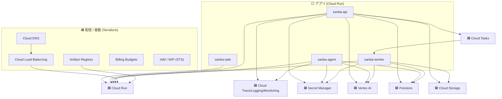

---

## 3. 音声対話の二層構造（リクエストフロー / sequence）

「低遅延の対話層（Gemini Live）」と「多段推論の分析層（ADK）」を分けるのが SANBA の核（ADR-0002 / 0006）。

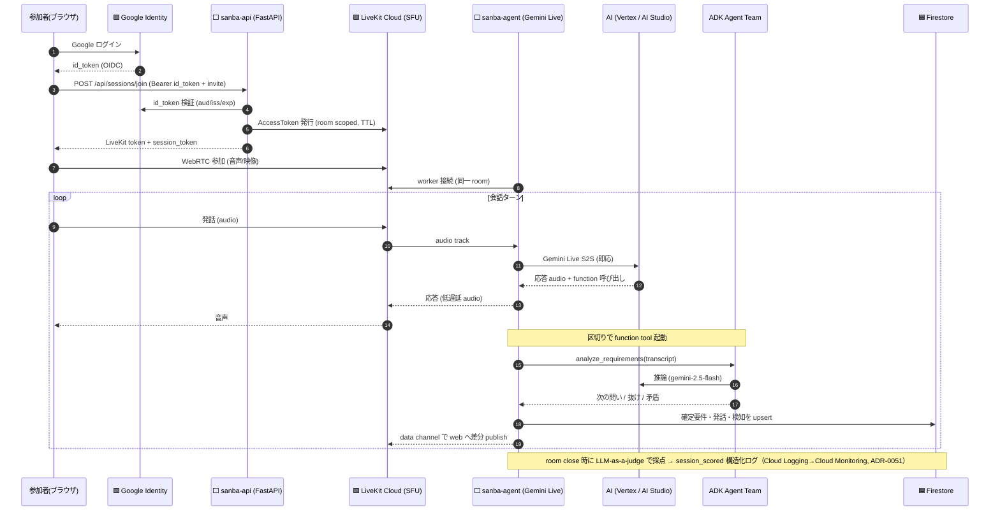

**ポイント**: API は「トークン発行と認可の門番」。実際の音声ストリームは**ブラウザ ↔ LiveKit ↔ agent** で直接流れ、API は経由しない（低遅延の要）。

---

## 4. ADK マルチエージェント・トポロジ

`apps/agent/src/sanba_agent/tools/analysis.py` → `agent_team.py`。Voice Agent から `agent-as-a-tool` で呼ばれ、内部は `sub_agent` 協調。

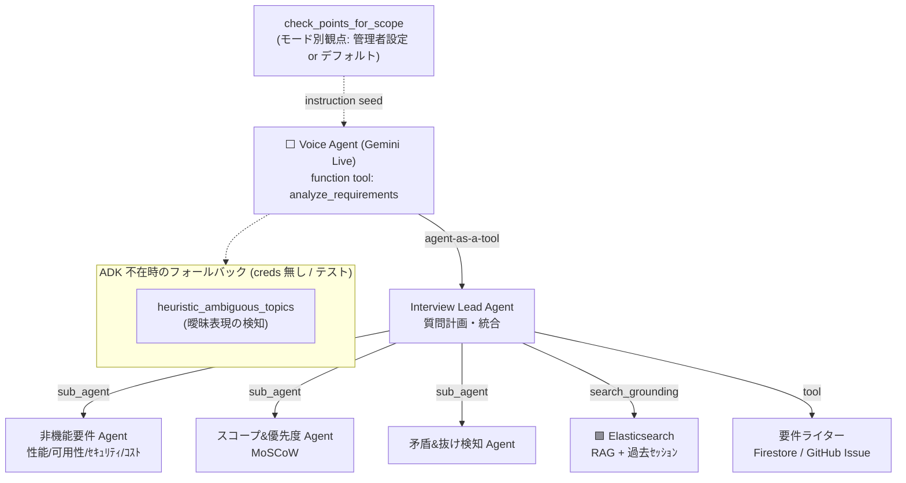

> 実装の堅牢性: `analyze_transcript()` は ADK ランタイム/creds が無ければ**ヒューリスティック結果に必ずフォールバック**し、ローカル・CI が鍵なしで動く。
>
> 観点のカバレッジ: 会話で必ず確認する観点は、ハードコードの NFR gap 検知ではなく **モード別の check-points**（product 管理者設定、未設定ならモード別デフォルト）を instruction にシードして担う（ADR-0055）。

---

## 5. リアルタイム配信とハイドレーション（WebRTC data channel + REST スナップショット）

会話の差分は **LiveKit data channel**（低遅延 push）で web に流し、リロード/途中参加は **REST GET でスナップショット復元**する二重化（ADR-0021）。

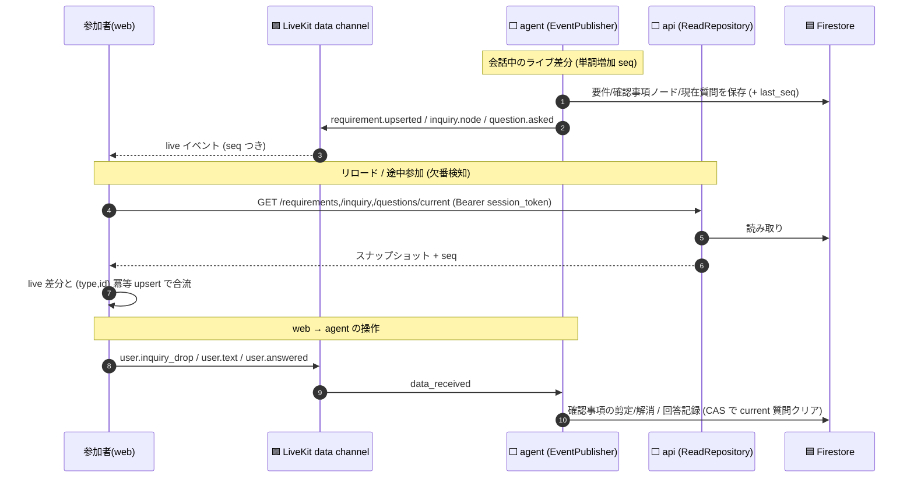

API 側にも `apps/api/src/sanba_api/realtime.py` の `AnalysisPublisher` があり、素材アップロードの解析進捗を LiveKit に publish できる（次節）。ただしこの publish は **`ENABLE_REALTIME_PUBLISH`（既定 OFF・Terraform の Cloud Run env にも未注入）が有効なときだけ**で、無効時は `NullSender` で no-op になる（web は `GET /context/files` のハイドレーションで状態を復元する）。

---

## 6. マルチモーダル素材アップロード（画像/動画解析フロー）

`POST /api/sessions/{id}/context/file`（`apps/api/.../main.py` + `vision.py` + `storage.py`）。**3 つの外部サービスがこの 1 リクエスト内で順に使われる**。

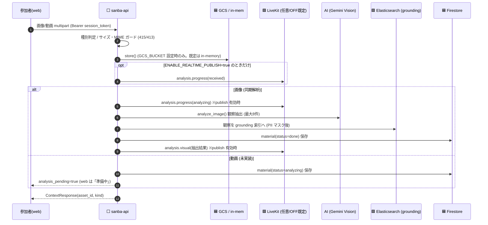

> **配置の前提（誤読防止）**: `GCS への保存`は `GCS_BUCKET` 設定時のみ（既定は in-memory・現 Terraform では未プロビジョニング）、`LiveKit への進捗 publish`は `ENABLE_REALTIME_PUBLISH=true` のときだけ（既定 OFF）。**Gemini Vision・Elasticsearch・Firestore はこのリクエストの本筋**で、解析・索引・メタ保存は publish の有無に依らず実行される（web はリロード時に `GET /context/files` で状態復元）。
> 削除 `DELETE .../context/file/{asset_id}` は **保存バイナリ + Firestore メタ + ES 索引チャンク**を一括取り消し（#245 真の破棄）。GCS/ES 未接続時は in-memory フォールバックで安全動作。

---

## 7. 外部サービス連携マップ（**いつ・どこで・どう使うか**）

ユーザの問い「外部サービスはどのタイミングでどのような配置でどう使っているか」への中核回答。

### 7-1. タイミング × 配置 × 用途の一覧

| 外部サービス | 種別 | 呼ぶ主体（配置） | 呼ぶタイミング | 認証 / 経路 | 未設定時の挙動 |
|---|---|---|---|---|---|
| **LiveKit Cloud** | 🟩 WebRTC SFU | ブラウザ ↔ SFU ↔ agent worker。api はトークン発行のみ | join 時（token）/会話中（音声・映像・data channel 常時） | api key/secret（Secret Manager）。token は room scoped・TTL 付き | ローカルは `livekit-server --dev`（devkey）にフォールバック |
| **Gemini Live** | AI(S2S) | agent worker | 会話の全音声ターン（常時・低遅延） | Vertex(キーレス) / AI Studio(`GOOGLE_API_KEY`) | **フォールバック無し（唯一の例外）**: 鍵なしでは worker は起動するが会話は成立しない（要設定） |
| **Gemini 推論** | AI | agent（ADK内）/ evaluation | 区切りでの `analyze_requirements`、セッション採点 | 同上 | ADK/採点ともヒューリスティックにフォールバック |
| **Gemini Vision** | AI | api | 画像アップロード時（同期） | 同上 | 観察抽出は空配列（落とさない） |
| **Gemini Embedding** | AI | agent/api（retrieval） | grounding への index/search 時 | 同上 | embedding=None → BM25/語重なりのみ |
| **Elasticsearch** | 🟩 検索 | agent / api | 発話・要件・観察の index、`search_grounding` | URL + API key | in-memory 語重なりフォールバック |
| **Firestore** | 🟦 状態 | agent / api | セッション/要件/発話/検知/質問の読み書き（常時） | ADC / 実行 SA `datastore.user` | エミュレータ or in-memory |
| **Cloud Storage** | 🟦 素材 | api | 画像/動画アップロード・削除時（`GCS_BUCKET` 設定時のみ） | ADC / 実行 SA（※現 Terraform にバケット・env・Storage 権限とも未定義） | in-memory dict フォールバック（＝既定挙動） |
| **Google Identity** | 🟩 認証 | api（検証）/ web（取得） | セッション作成・join・/admin・/mine の各 API 入口 | OIDC id_token をサーバ検証 | `AUTH_DEV_BYPASS=true` で固定 dev identity |
| **GitHub Issues** | 🟩 連携 | api(`/export`) / agent(grounding) | 確定要件の起票、README/Issue の根拠取り込み | PAT（`GITHUB_TOKEN`） | **既定 OFF**（デモ経路に無影響） |
| **Cloud Logging / Cloud Monitoring（LLM 品質）** | 🟦 LLMOps | agent(evaluation) | room close 時に `session_scored` 構造化ログを出力 → ログベースメトリクスで集計（ADR-0051） | ADC / 実行 SA（`logging.logWriter` / `monitoring.metricWriter`） | LLM 採点はヒューリスティックにフォールバック（ログ自体は常時出力） |
| **OTel Collector → Cloud Ops** | 🟦/🟩 可観測 | agent / api | **現状は span（トレース）のみ**を OTLP 送信（設定時）。メトリクスは MeterProvider 未設定で no-op、ログは stdout→Cloud Logging 経由 | OTLP endpoint | endpoint 空なら送信スキップ |

### 7-2. 「会話 1 セッション」の時系列での外部サービス発火

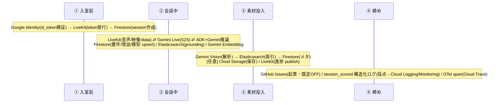

**読み筋**: 外部サービスは「入口で認証（Google）」「会話中は常時リアルタイム（LiveKit + Gemini Live + Firestore + ES）」「素材投入時に同期解析（Vision + ES + Firestore。GCS 保存と LiveKit 進捗 publish は任意）」「締めで外部連携（GitHub 起票）と品質スコアの構造化ログ出力」という**4 つのタイミング帯**に明確に分かれる。**Gemini Live を唯一の例外として**、外部依存はおおむね未設定時フォールバックを持ち、最小構成（`just up`）が鍵なしで**起動**する（ただし音声会話を実際に通すには Gemini の認証情報が必須）。

---

## 8. ネットワーク / 公開構成（Load Balancer ルーティング）

`infra/terraform/domain.tf`。`domain != ""` のときだけ LB 一式を作る。host ベースで web/api/redirect を 1 証明書・1 Anycast IP に集約。

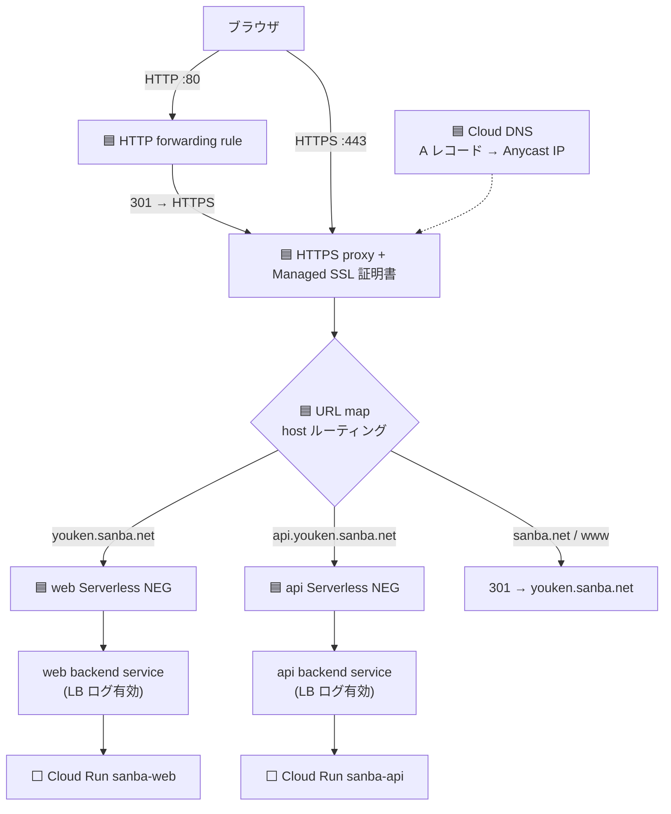

- **agent はプライベート**（`allUsers` invoker を付けない）。public は web/api のみ。
- 証明書は A レコードが LB IP を指してから Google が自動発行。`apex モード`と`subdomain モード`を変数で切替可能。
- `EXTERNAL_MANAGED`（Global 外部 ALB）を選ぶ理由は **Cloud Armor(WAF)/Cloud CDN への拡張余地**（production-ready）。

---

## 9. CI/CD パイプライン（`.github/workflows/`）

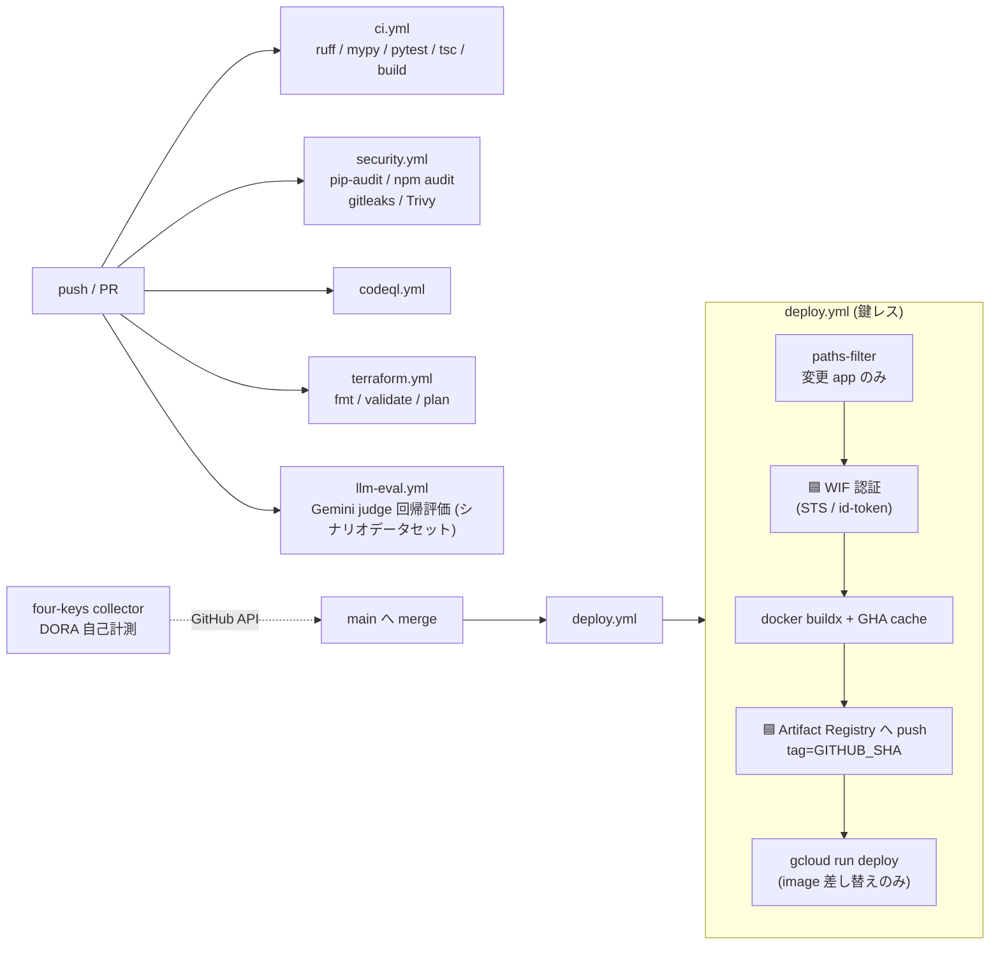

- **認証は Workload Identity Federation（鍵レス）**。SA キー JSON を GitHub Secrets に置かない（`iamcredentials`/`sts`）。
- **env / secret / scale は Terraform が唯一管理**。`deploy.yml` は `--image` 差し替えのみ（既存設定を保持）。
- 変更のあった app だけビルド（`paths-filter`）＝ Actions 分 / AR ストレージ節約。
- サプライチェーン: GitHub 製以外の Action は **commit full SHA でピン**（CLAUDE.md 規約 / `deploy.yml` で実施）。

---

## 10. 可観測性スタック（OpenTelemetry 一本化）

新規処理は必ず観測性を通す方針（CLAUDE.md 原則3）。ただし**現状アプリが OTLP で実際に送るのはトレース（span）のみ**である点に注意。メトリクス・カウンタは OTel API で定義済みだが MeterProvider 未設定で no-op、ログは structlog→stdout 経由で収集される（OTLP ログ経路ではない）。下図の Prometheus/Loki への破線は **Collector 側の受け口は用意済みだが、アプリからの送信はまだ配線されていない**ことを示す。

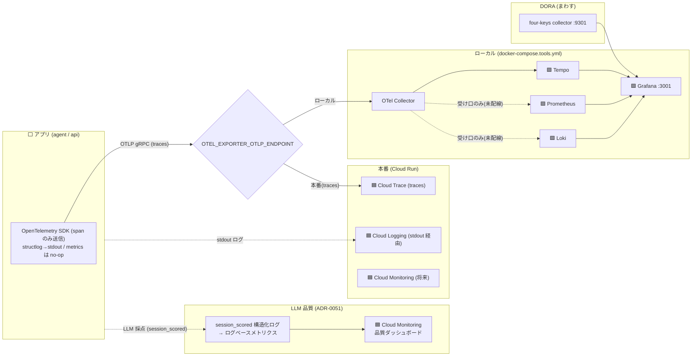

| シグナル | 現状の実配線 | ローカル出力先 | 本番出力先 |
|---|---|---|---|
| トレース | ✅ アプリ→OTLP span | OTel Collector → Tempo → Grafana | Cloud Trace |
| メトリクス | ⚠️ カウンタ定義のみ（MeterProvider 未設定で no-op） | Collector に Prometheus 受け口はあるが未送信 | `metricWriter` 権限はあるが未送信（将来） |
| ログ | ✅ structlog→stdout | docker logs（Collector の Loki 受け口は未送信） | Cloud Logging（自動収集）+ LB アクセスログ |
| LLM 品質 | ✅ `session_scored` 構造化ログ | docker logs（stdout） | Cloud Logging→ログベースメトリクス→Cloud Monitoring |
| DORA | ✅ | four-keys collector → Grafana | four-keys（GitHub API 読み） |

> つまり「OpenTelemetry 一本化」は**方針**であり、現状の実装で OTLP を通っているのはトレースのみ。メトリクス/ログの OTLP 配線は今後の課題（Collector・IAM 側の受け皿は先に用意してある）。

---

## 11. データモデルと保持（Firestore + TTL）

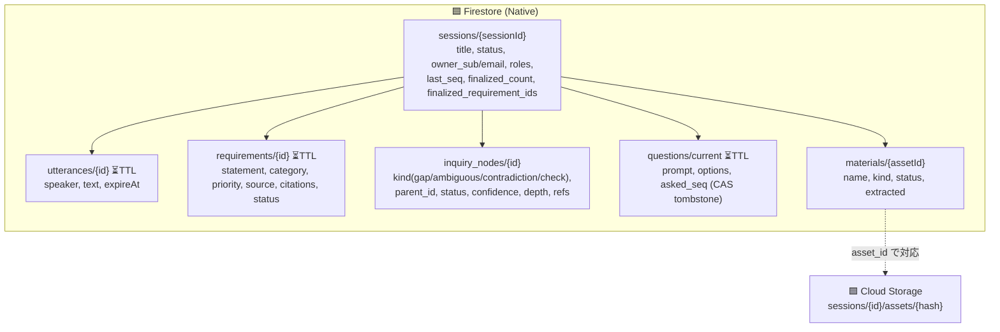

- **TTL**: `utterances`/`requirements`/`questions` は `expireAt`（`DATA_RETENTION_DAYS`、既定30日）で自動失効。PII を含みうる未回答質問が発話 TTL を迂回して残らないよう `questions` にも TTL（ADR-0020）。
- **承認した要件は TTL 解除**して成果物として保全（管理画面 / ADR-0014）。
- **PII マスク**: `MASK_PII_BEFORE_INDEX=true` で grounding/永続化の前にマスク（issue #10）。

---

## 12. セキュリティ / IAM / シークレット

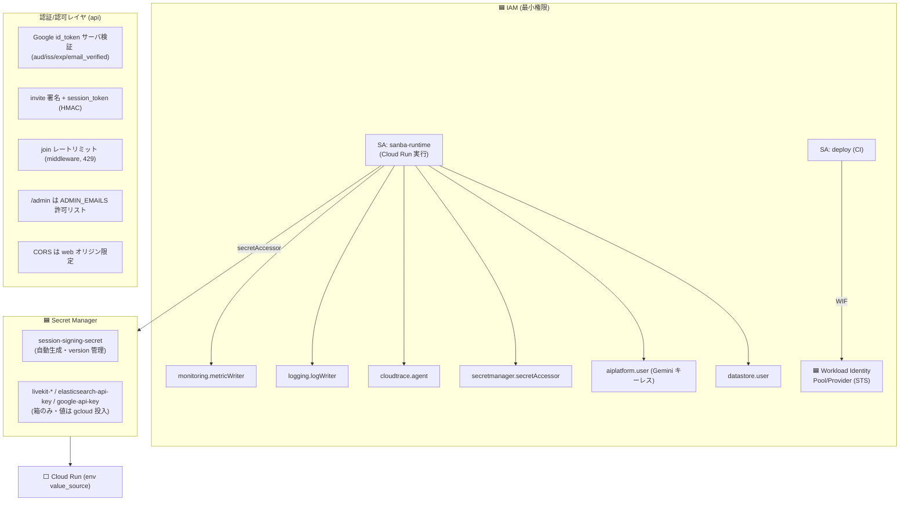

- **キーレス Gemini**: 本番は `use_vertexai=true` ＝ `google-api-key` を Secret に置かず実行 SA の `aiplatform.user` で認証。
- **シークレットの単一置き場**: 値は Secret Manager のみ。terraform state にも GitHub Secrets にも残さない（`session-signing-secret` のみ例外的に自動生成）。
- **public は web/api のみ**、agent は非公開。CI は WIF で鍵レス。コンテナは非 root・最小ベース（CLAUDE.md）。

---

## 13. 環境差分（ローカル compose ↔ 本番 Cloud Run）

同じコンテナが環境変数だけで「フォールバック ↔ マネージド」を切り替える（PoC で止めず production-ready / ADR-0009）。

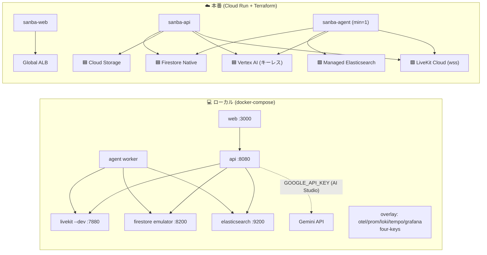

| 観点 | ローカル | 本番 |
|---|---|---|
| LiveKit | `livekit-server --dev`（devkey） | LiveKit Cloud（`wss://`、Secret Manager 鍵） |
| AI 経路 | AI Studio（`GOOGLE_API_KEY`） | Vertex AI（キーレス・ADC） |
| 状態 | Firestore エミュレータ / in-memory | Firestore Native + TTL |
| 素材 | in-memory dict | Cloud Storage |
| 検索 | ES コンテナ / 語重なり in-memory | Managed Elasticsearch |
| 認証 | `AUTH_DEV_BYPASS=true`（素通し） | Google id_token サーバ検証 |
| 可観測性 | OTel→Grafana スタック（overlay） | OTel→Cloud Trace/Logging/Monitoring |
| 公開 | localhost | Global ALB + Managed SSL + Cloud DNS |

---

## 付録: 主要ファイル索引

| 関心事 | ファイル |
|---|---|
| 音声 worker / function tools | `apps/agent/src/sanba_agent/main.py` |
| ADK チーム呼び出し / ヒューリスティック | `apps/agent/src/sanba_agent/tools/analysis.py`, `agent_team.py` |
| RAG grounding（ES + embedding） | `apps/agent/src/sanba_agent/retrieval.py` |
| LLM 採点（session_scored ログ） | `apps/agent/src/sanba_agent/evaluation.py` |
| API 全エンドポイント | `apps/api/src/sanba_api/main.py` |
| 画像解析（Gemini Vision） | `apps/api/src/sanba_api/vision.py` |
| 素材保存（Cloud Storage） | `apps/api/src/sanba_api/storage.py` |
| Google ログイン検証 | `apps/api/src/sanba_api/auth_google.py` |
| リアルタイム publish | `apps/api/src/sanba_api/realtime.py` |
| Cloud Run / Firestore / SA / 予算 | `infra/terraform/main.tf` |
| Cloud Run サービス定義 | `infra/terraform/cloud_run.tf` |
| Secret Manager | `infra/terraform/secrets.tf` |
| LB / NEG / SSL / DNS | `infra/terraform/domain.tf` |
| デプロイ（WIF→AR→Cloud Run） | `.github/workflows/deploy.yml` |
| 可観測性設定 | `infra/observability/` |
| ローカル最小/全部入り | `docker-compose.yml` / `docker-compose.tools.yml` |
</content>
