# 画面一覧（apps/web）

`apps/web/app` 配下の全ルートを洗い出した画面インベントリ。キャプチャは開発モード
（`NEXT_PUBLIC_GOOGLE_CLIENT_ID` 未設定）で `next dev` を起動し、`/api/**` をモックした
Playwright（モバイル幅 420px）で撮影したもの。データはすべてダミー。

## 画面一覧

| # | パス | 画面名 | 認証 | 概要 |
|---|------|--------|------|------|
| 1 | `/` | ホーム（会話の入口） | 要 | 対象アプリを選んで会話を始めるエントリー画面（`EntryFlow` の `home` ステップ） |
| 2 | `/login` | ログイン | 公開 | Google ログイン。開発モードでは bypass ボタンが表示される |
| 3 | `/products` | アプリ管理（一覧・登録） | 要 | 会話対象アプリの登録フォームと登録済み一覧 |
| 4 | `/products/[id]` | アプリ詳細 | 要 | 基本情報・語彙・出力フォーマット・確認項目・前提リポジトリ・メンバー・会話リンク・削除 |
| 5 | `/[slug]/prepare` | セッション準備 | 要 | 役割・ゴール・参考資料・同意を入力して会話を開始する（`EntryFlow` の `prepare` ステップ） |
| 6 | （`/[slug]/prepare` から遷移） | 会話開始（ConversationStart） | 要 | セッション作成後の開始確認。マイク許可 → LiveKit ルーム接続へ進む |
| 7 | `/results` | 過去の要件一覧 | 要 | 自分のセッション履歴の一覧 |
| 8 | `/results/[id]` | 要件詳細 | 要 | ゴール・要件カード・未確認事項・結果ドキュメント出力・会話ログ・GitHub Issue 作成 |
| 9 | `/settings` | アカウント設定 | 要 | プロフィール・データ保持・GitHub 連携・ログアウト |
| 10 | `/join/[token]` | ゲスト参加（同意） | 公開 | 会話リンクからの参加。録音・AI 処理の同意を得てから開始 |
| 11 | `/member-invites/[token]` | メンバー招待の承諾 | 公開 | メール招待の承諾・辞退 |
| 12 | `/design` | デザインカタログ | 公開 | `components/sanba` の UI コンポーネント一覧（開発用） |

## リダイレクトのみのルート

| パス | 挙動 |
|------|------|
| `/prepare` | `/` へリダイレクト（旧 URL 互換） |
| `/sessions/[id]` | `/results/[id]` へリダイレクト（旧 URL 互換） |
| `/[slug]/sessions/[id]` | slug の所有を確認後 `/results/[id]` へリダイレクト。非所有なら `AccessErrorScreen` |

## キャプチャ

### 1. ホーム `/`

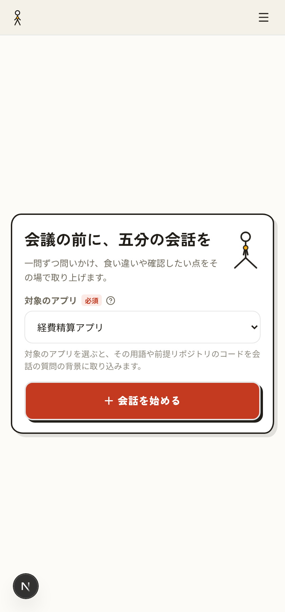

### 2. ログイン `/login`

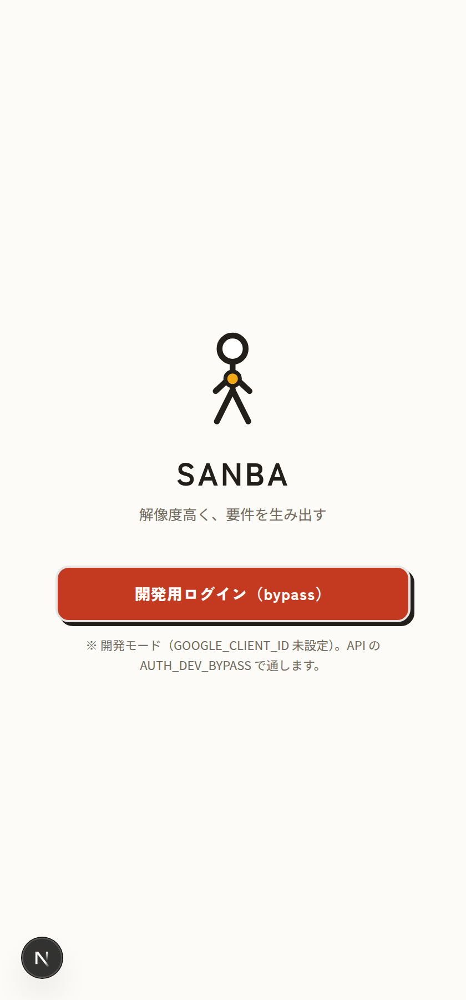

### 3. アプリ管理 `/products`

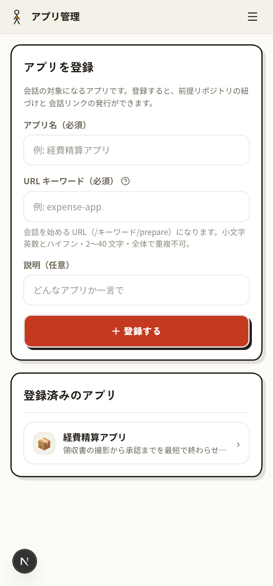

### 4. アプリ詳細 `/products/[id]`

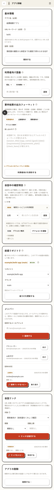

### 5. セッション準備 `/[slug]/prepare`

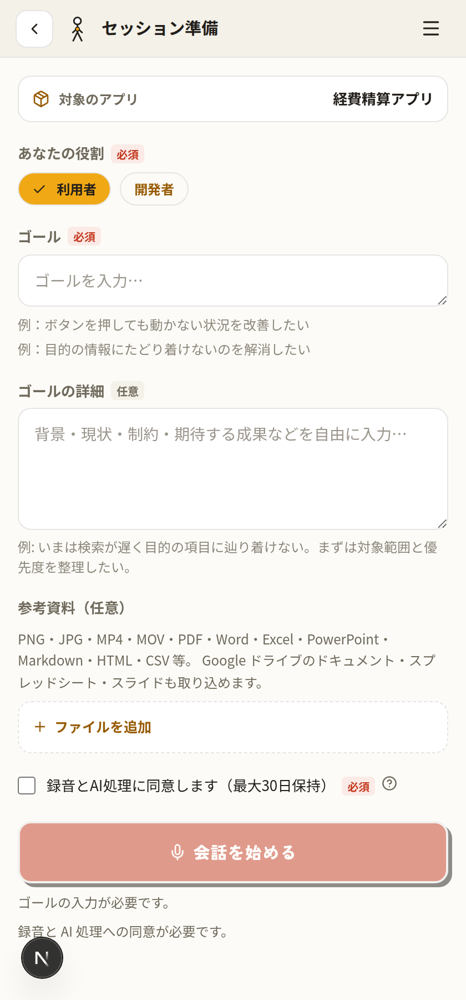

### 6. 会話開始（ConversationStart）

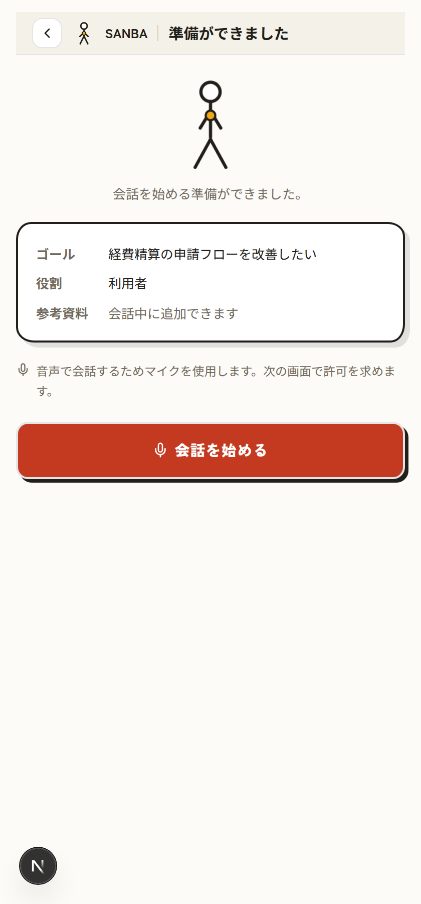

### 7. 過去の要件一覧 `/results`

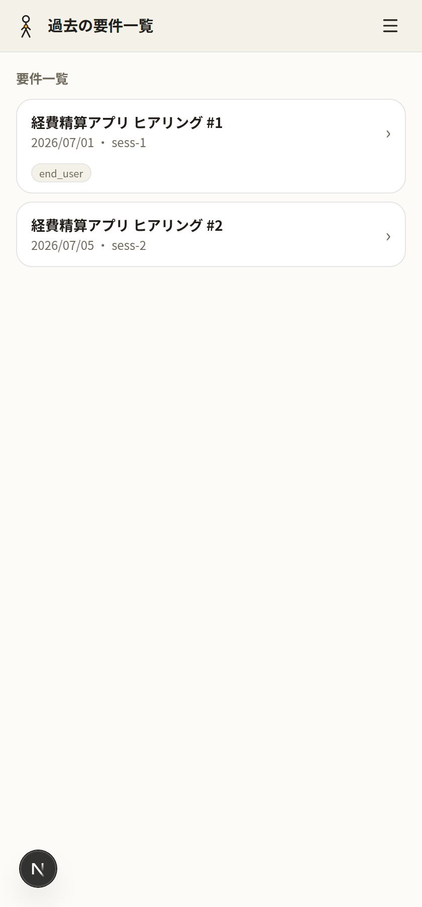

### 8. 要件詳細 `/results/[id]`

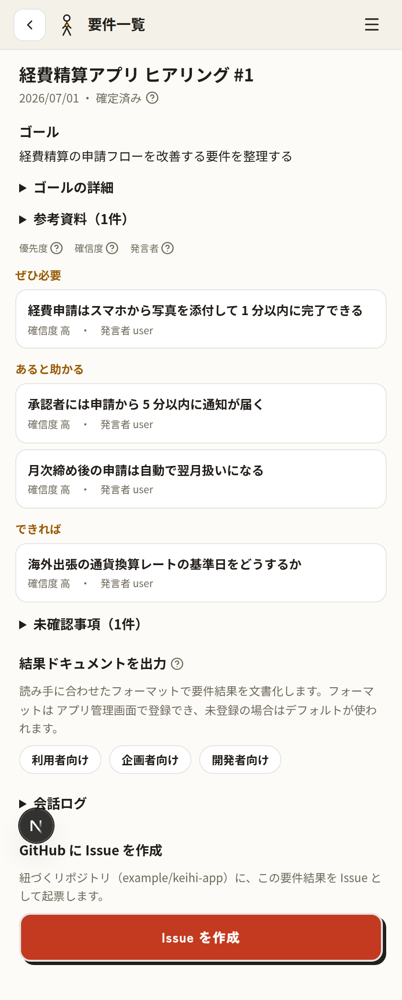

### 9. アカウント設定 `/settings`

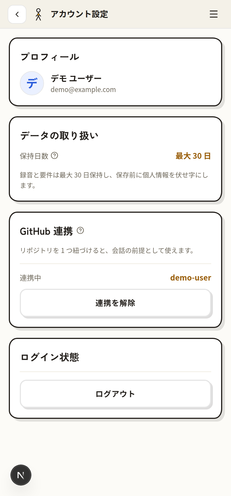

### 10. ゲスト参加 `/join/[token]`

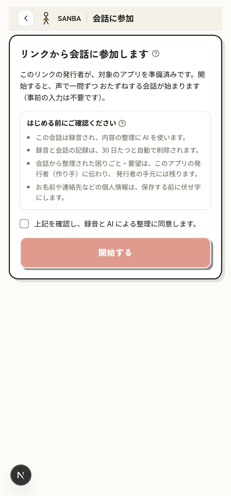

### 11. メンバー招待 `/member-invites/[token]`

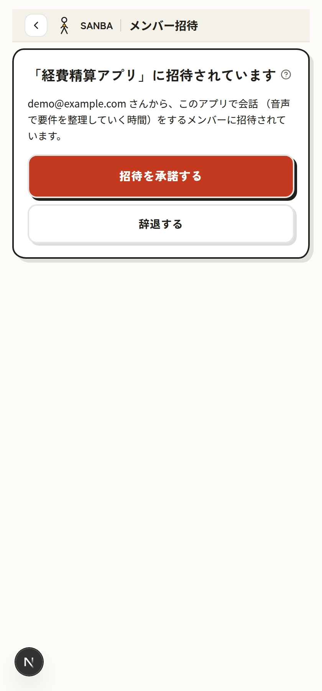

### 12. デザインカタログ `/design`

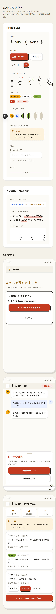
