# 画面一覧（apps/web）

`apps/web/app` 配下の全ルートを洗い出した画面インベントリ。キャプチャは開発モード
（`NEXT_PUBLIC_GOOGLE_CLIENT_ID` 未設定）で `next dev` を起動し、`/api/**` をモックした
Playwright で撮影したもの（モバイルは 420px、PC は 1440px。`screens/pc-*.png` と
`screens/15-session-pc.png` が PC 撮影）。データはすべてダミー。

## 画面一覧

| # | パス | 画面名 | 認証 | 概要 |
|---|------|--------|------|------|
| 1 | `/` | ホーム（会話の入口） | 要 | 対象アプリを選んで会話を始めるエントリー画面（`EntryFlow` の `home` ステップ） |
| 2 | `/login` | ログイン | 公開 | Google ログイン。開発モードでは bypass ボタンが表示される |
| 3 | `/products` | アプリ管理（一覧・登録） | 要 | 会話対象アプリの登録フォームと登録済み一覧 |
| 4 | `/products/[id]` | アプリ詳細 | 要 | 基本情報・語彙・出力フォーマット・確認項目・前提リポジトリ・メンバー・会話リンク・削除 |
| 5 | `/[slug]/prepare` | セッション準備 | 要 | 役割・ゴール・参考資料・同意を入力して会話を開始する（`EntryFlow` の `prepare` ステップ） |
| 6 | （`/[slug]/prepare` または `/join/[token]` から遷移） | 会話開始（ConversationStart） | 要（`/join/[token]` 経由のゲスト参加は公開） | セッション作成後の開始確認。マイク許可 → LiveKit ルーム接続へ進む |
| 7 | `/results` | 過去の要件一覧 | 要 | 自分のセッション履歴の一覧 |
| 8 | `/results/[id]` | 要件詳細 | 要 | ゴール・要件カード・未確認事項・結果ドキュメント出力・会話ログ・GitHub Issue 作成 |
| 9 | `/settings` | アカウント設定 | 要 | プロフィール・データ保持・GitHub 連携・ログアウト |
| 10 | `/join/[token]` | ゲスト参加（同意） | 公開 | 会話リンクからの参加。録音・AI 処理の同意を得てから開始 |
| 11 | `/member-invites/[token]` | メンバー招待の承諾 | 要 | メール招待の承諾・辞退。未ログイン時はログイン画面へリダイレクト |
| 12 | `/design` | デザインカタログ | 開発のみ | `components/sanba` の UI コンポーネント一覧。本番環境（`NODE_ENV=production`）では `notFound()` を返すため到達不可 |
| — | （特殊） | 404 Not Found | 公開 | `not-found.tsx`。404 時に表示されるグローバルエラー画面 |
| — | （特殊） | グローバルエラー | 公開 | `error.tsx`。未捕捉の例外時に表示されるグローバルエラー画面。本番では詳細メッセージを非表示 |

## リダイレクトのみのルート

| パス | 挙動 |
|------|------|
| `/prepare` | `/` へリダイレクト（旧 URL 互換） |
| `/sessions/[id]` | `/results/[id]` へリダイレクト（旧 URL 互換） |
| `/[slug]/sessions/[id]` | slug の所有を確認後 `/results/[id]` へリダイレクト。非所有なら `AccessErrorScreen` |

## キャプチャ

### 1. ホーム `/`

### 2. ログイン `/login`

### 3. アプリ管理 `/products`

### 4. アプリ詳細 `/products/[id]`

### 5. セッション準備 `/[slug]/prepare`

### 6. 会話開始（ConversationStart）

### 7. 過去の要件一覧 `/results`

### 8. 要件詳細 `/results/[id]`

### 9. アカウント設定 `/settings`

### 10. ゲスト参加 `/join/[token]`

### 11. メンバー招待 `/member-invites/[token]`

### 12. デザインカタログ `/design`

### 13. 404 Not Found（`not-found.tsx`）

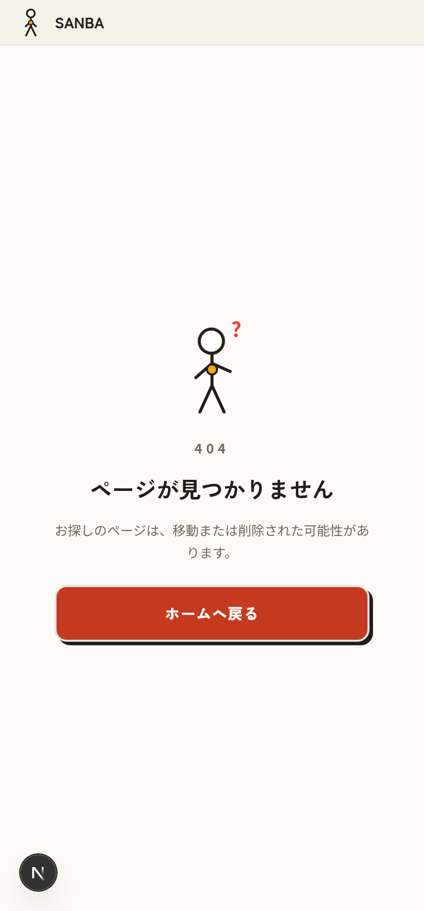

### 14. グローバルエラー（`error.tsx`）

開発モードで撮影したため、本番では表示されないエラーメッセージ欄が含まれる。

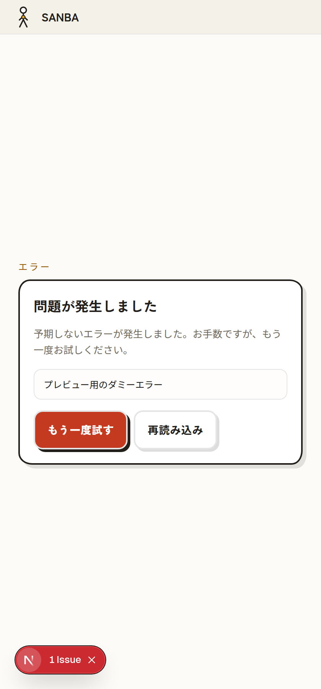

## PC（lg 以上）のレイアウト

1440px で撮影。ログイン後の画面（ホーム・過去の要件一覧・アプリ管理・アプリ詳細・セッション準備・
要件詳細・アカウント設定）は `AppShell` が lg 以上で常設サイドバー＋中央寄せコンテンツになる。
公開系（ログイン・ゲスト参加・404）は中央寄せの単カラム。メンバー招待 `/member-invites/[token]` も単カラムだが要認証（未ログイン時はログイン画面へリダイレクト）。

セッション中の会話画面は lg 以上で 2 カラム表示になる。左カラムは音声状態に連動した
サンバのイラストとステータス、右カラムは会話履歴・参考資料・要件一覧のタブ。

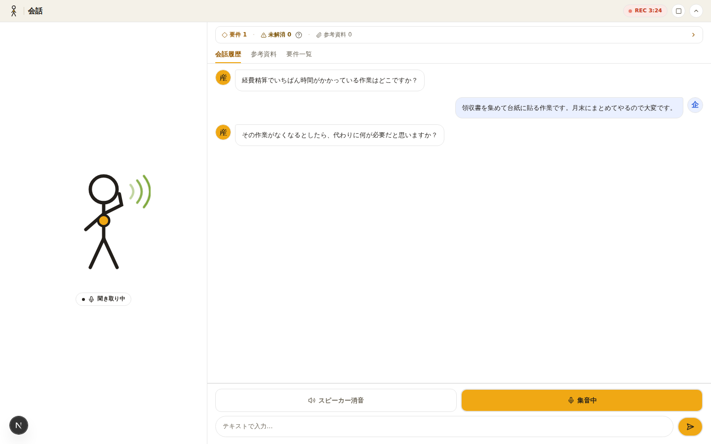

### 各画面の PC 表示

| 画面 | キャプチャ |
|------|-----------|
| ホーム `/` | 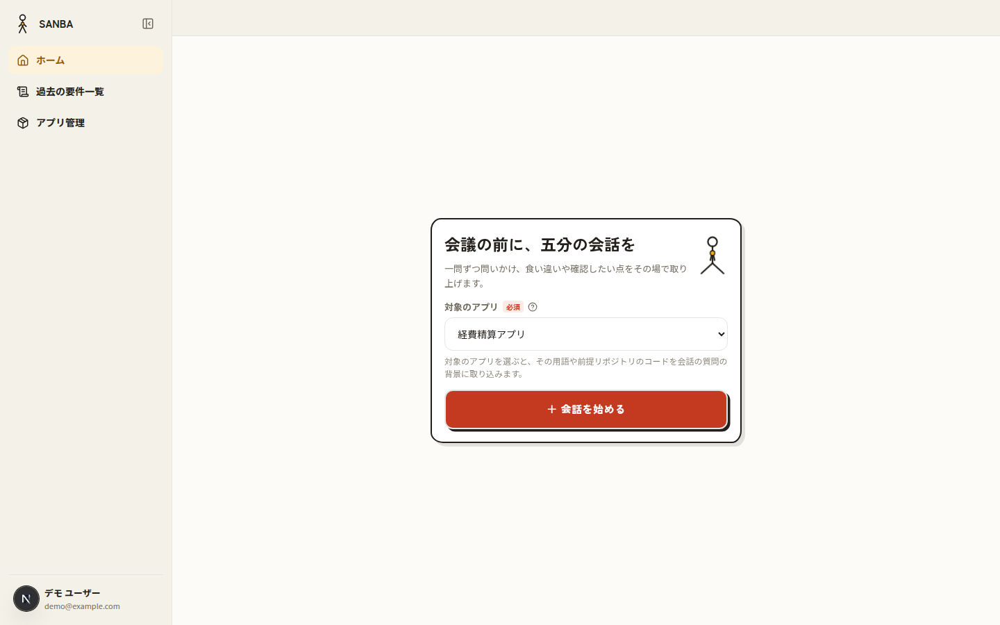 |
| ログイン `/login` | 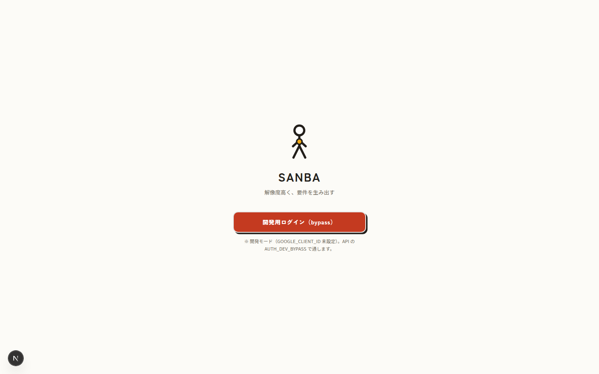 |
| アプリ管理 `/products` | 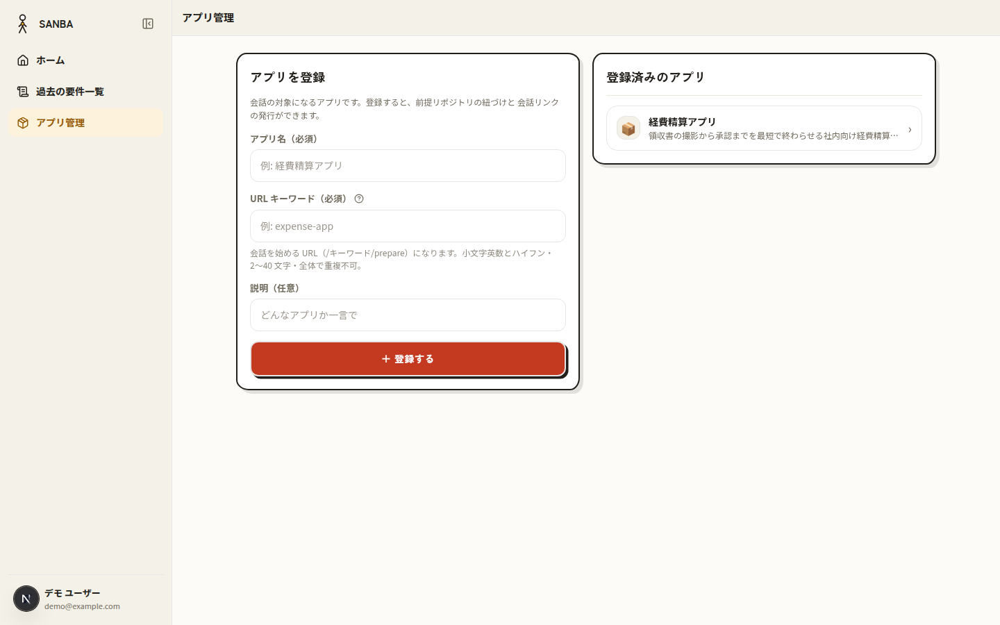 |
| アプリ詳細 `/products/[id]` | 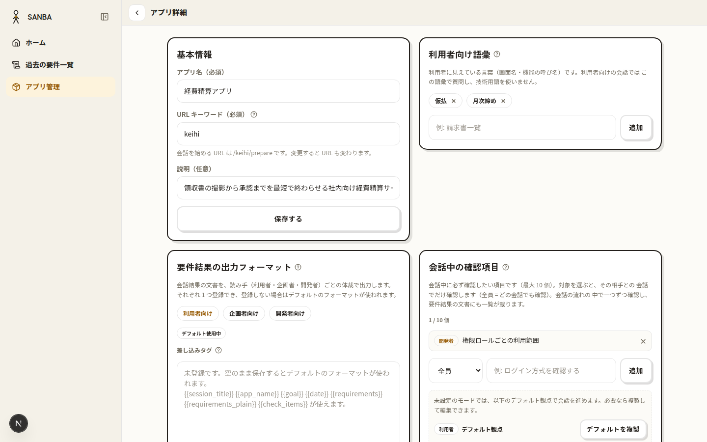 |
| セッション準備 `/[slug]/prepare` | 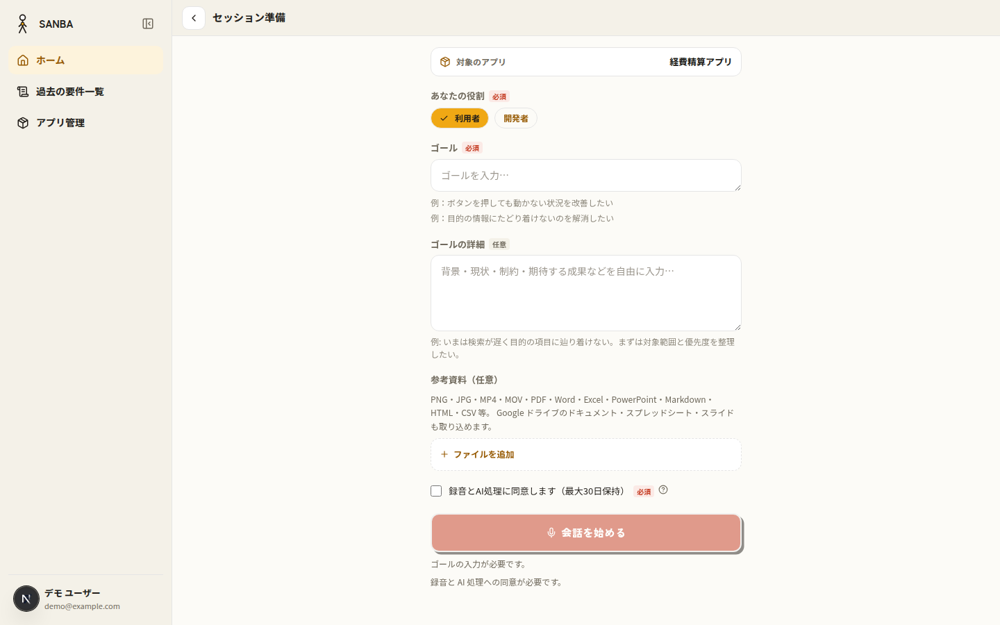 |
| 過去の要件一覧 `/results` | 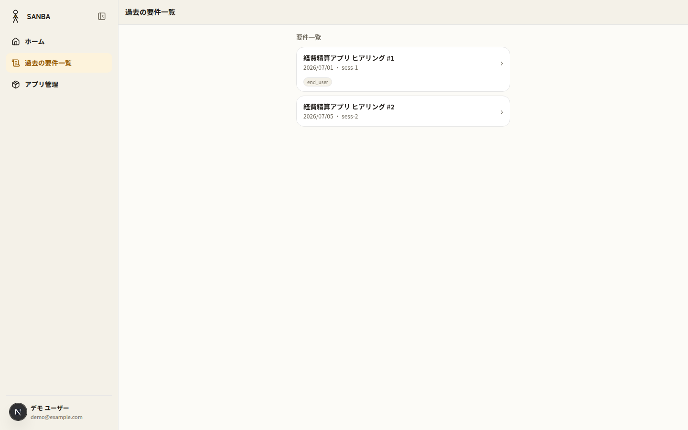 |
| 要件詳細 `/results/[id]` | 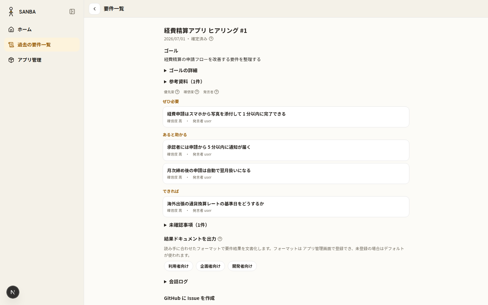 |
| アカウント設定 `/settings` | 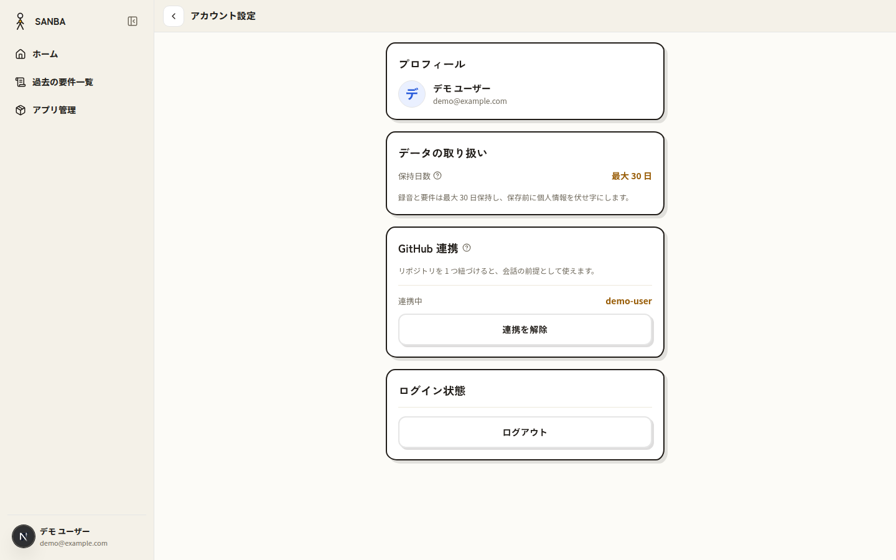 |
| ゲスト参加 `/join/[token]` | 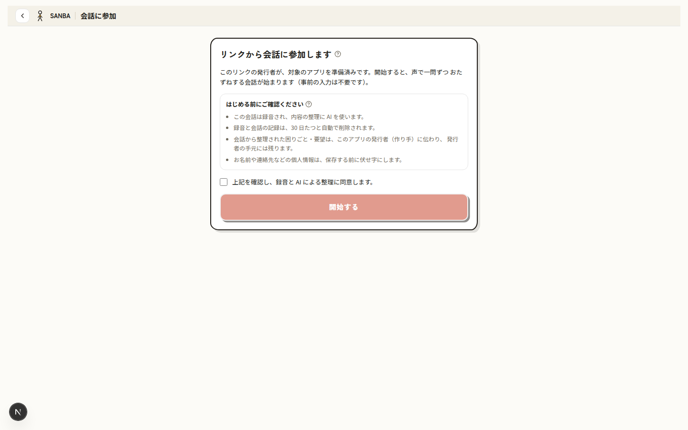 |
| メンバー招待 `/member-invites/[token]` | 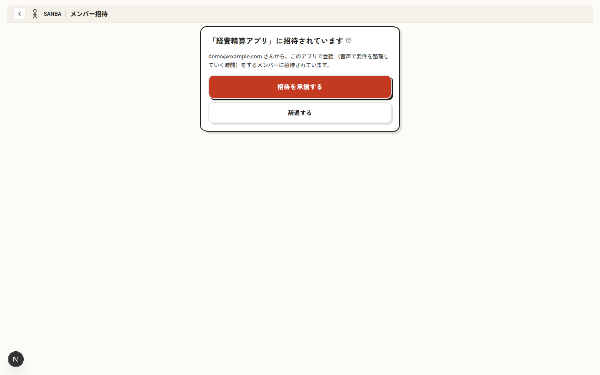 |
| 404 Not Found | 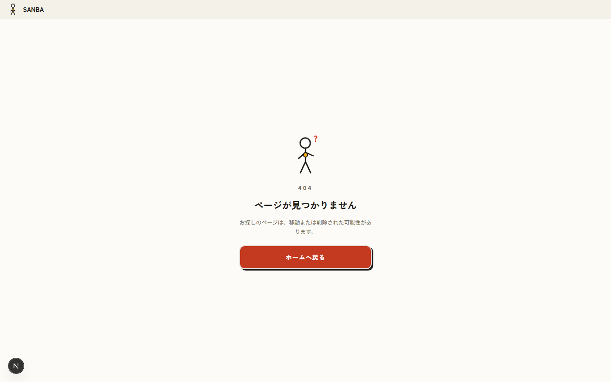 |
